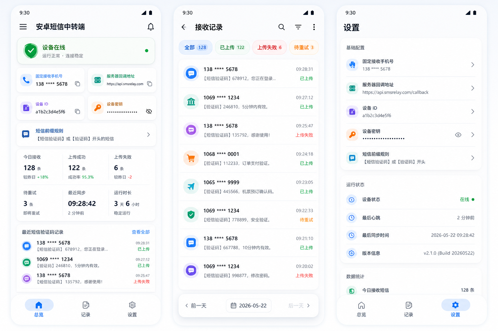

# 扫码用户端开发规划（更新版）

## 1. 目标

扫码用户端负责完成这条链路：

`实体名牌二维码 -> 基本信息展示 -> 访问验证引导 -> 安卓短信中转验证成功 -> 查看健康档案/用药/量表`

当前版本不再以“云短信下发验证码”为主流程，而是以“固定号码 + 安卓短信中转端”作为正式方案。扫码端只负责：

- 发起验证会话
- 展示发送短信指令
- 轮询验证状态
- 验证通过后放行敏感信息

## 2. 设计依据

本端的验证引导和状态表达，必须与安卓短信中转端设计统一：



统一要求：

- 视觉语言采用 Google 最新 Material 3 风格。
- 大圆角卡片、充足留白、浅色背景、低对比阴影。
- 状态色与安卓端一致：
  - 成功：绿色
  - 上传中/处理中：蓝色
  - 待重试/等待发送：橙色
  - 失败：红色
- 文案统一使用“发送验证短信”“等待短信回传”“验证成功”“验证失败”“待重试”。

## 3. 扫码端界面更新要求

### 3.1 `BasicInfoPage.tsx`

- 首屏继续直接展示老人基础救助信息。
- “查看健康档案”“查看主要用药”“查看量表记录”点击后，不直接弹出传统短信验证码输入框。
- 应跳转到新的验证引导页，展示：
  - 固定接收手机号
  - 需发送的短信内容
  - 本次随机验证码
  - 有效期倒计时

### 3.2 `SmsVerifyPage.tsx`

该页改成“短信发送引导 + 验证状态轮询页”，不再以“用户手动输入验证码”为主。

页面结构必须包含：

1. 顶部状态卡
   - 标题：`发送验证短信`
   - 副文案：`请使用当前手机向固定号码发送本次验证短信`
   - 状态点：等待中 / 已验证 / 已过期
2. 指令卡
   - 固定接收手机号
   - 本次短信内容，例如：`SL 483921`
   - “复制短信内容”按钮
   - “复制手机号”按钮
3. 操作引导卡
   - 第一步：打开短信
   - 第二步：向固定号码发送页面给出的验证内容
   - 第三步：返回页面等待验证成功
4. 状态进度区
   - 等待回传
   - 回传成功
   - 内容不匹配
   - 已超时，请重新发起
5. 兜底入口
   - 重新生成验证码
   - 返回基本信息

### 3.3 `HealthArchivePage.tsx` / `MedicationPage.tsx` / `ScaleSummaryPage.tsx`

- 顶部必须显示“本次查看已通过短信验证”的已验证状态条。
- 状态条文案要与安卓端“已上传/已处理”风格一致。
- 页面不显示任何“请输入验证码”的旧逻辑残留。

## 4. 源码结构与重点文件

```text
src/
  api/
    scanApi.ts
    smsApi.ts
  features/
    verification/
      verificationStore.ts
      verificationService.ts
  hooks/
    useQrToken.ts
    useScanBasicInfo.ts
    useProtectedArchive.ts
  pages/
    BasicInfoPage.tsx
    SmsVerifyPage.tsx
    HealthArchivePage.tsx
    MedicationPage.tsx
    ScaleSummaryPage.tsx
```

关键调整：

- `smsApi.ts`
  - 不再只保留“发送验证码/校验验证码”语义。
  - 需要增加“创建短信验证会话”“查询验证状态”接口封装。
- `verificationStore.ts`
  - 增加 `sessionId`、`messageBody`、`receiverPhone`、`expiresAt`、`verifyStatus`。
- `verificationService.ts`
  - 负责创建会话、定时轮询、超时处理、重试处理。
- `SmsVerifyPage.tsx`
  - 改成状态型页面，而不是输入型页面。

## 5. 后端对接

扫码端需要按以下接口规划更新：

```text
POST /api/scan/resolve
POST /api/sms-relay/session
GET  /api/sms-relay/session/{sessionId}/status
POST /api/sms-relay/session/{sessionId}/retry
GET  /api/scan/archive
GET  /api/scan/medications
GET  /api/scan/scales
```

返回字段至少包括：

- `sessionId`
- `receiverPhone`
- `messageBody`
- `expiresAt`
- `status`

## 6. 与安卓短信中转端的联动口径

扫码端页面文案必须明确：

- 不是系统给用户发短信
- 而是用户向固定号码发送系统指定内容
- 验证通过后，系统会记录本次访问手机号和查询记录

页面不得把该流程写成“实名验证”或“运营商实名认证”。

## 7. 验收标准

- 用户扫码后可以看到基础信息。
- 点击敏感信息入口后，进入短信发送引导页。
- 页面能展示固定接收手机号和随机短信内容。
- 页面能轮询显示：等待中、成功、失败、过期。
- 验证成功后才可查看健康档案、用药、量表。
- 本次查看手机号和查看记录由后端留痕。
- 验证页面的视觉风格、状态标签、卡片组织方式，与 `android_sms_relay_google_style.png` 的设计语言一致。
