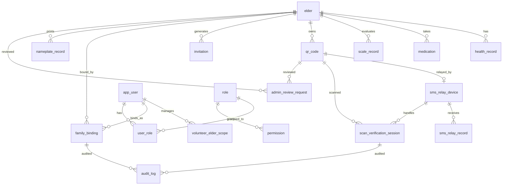

# SilverLink Care（智联名牌）数据库设计文档

## 1. 概述

### 1.1 数据库选型

本项目采用 **MySQL 8.0+** 作为唯一持久化数据库，通过 **Spring Data JPA + Flyway** 完成 schema 管理与版本迁移。核心特点如下：

| 特性 | 说明 |
|------|------|
| 关系型事务 | 老人档案、健康记录、家属绑定等核心业务强依赖 ACID |
| 敏感数据加密 | 所有个人隐私字段采用 **AES-256-GCM** 存储，密文前缀携带 `keyId` 实现密钥轮换 |
| 时间戳策略 | `created_at` / `updated_at` 由数据库 `DEFAULT CURRENT_TIMESTAMP` 维护，减少应用层时区误差 |
| 逻辑删除 | 核心业务表（老人、用户、绑定关系）采用 `status` 字段逻辑删除，审计与关联数据物理保留 |
| 字符串主键 | 全库采用业务语义 ID（如 `elder-{timestamp}`、`vol-{timestamp}`），便于日志追踪与跨系统对账 |

### 1.2 设计原则

| 原则 | 说明 |
|------|------|
| 隐私优先 | 任何涉及姓名、电话、住址、身份证、用药信息的字段必须落入 `_enc` 加密列，明文不得落库 |
| 最小权限 | 志愿者通过 `volunteer_elder_scope` 行级隔离，仅能访问被分配的老人 |
| 操作可追溯 | 所有敏感操作（登录、档案查看、二维码停用申请）写入 `audit_log`，保留操作人、IP、结果 |
| 设备解耦 | 二维码与短信中继设备通过 `relay_device_id` 弱关联，支持设备更换而不影响二维码生命周期 |
| 邀请闭环 | 家属注册必须通过 `invitation` 邀请码，绑定关系与邀请码使用次数联动 |

---

## 2. 概念模型

### 2.1 ER 图



### 2.2 设计要点

1. **`elder`（老人档案表）** 为全库核心主表，所有健康、用药、量表、二维码、家属绑定均以其为锚点。
2. **`app_user`（用户表）** 采用 **单表多角色** 设计，通过 `role` 区分 `SYSTEM_ADMIN` / `VOLUNTEER` / `FAMILY`，配合 `user_role` 实现 RBAC 扩展。
3. **`qr_code`（二维码表）** 与 `sms_relay_device`（短信中继设备表）通过 `relay_device_id` 弱关联，支持设备热切换。
4. **`scan_verification_session`（扫码验证会话表）** 记录每一次扫码后的身份核验流程，状态机驱动：`PENDING` → `VERIFIED` / `EXPIRED`。
5. **`audit_log`（审计日志表）** 为宽表设计，所有操作人、访客信息、验证方式统一归档，支持事后溯源。

---

## 3. 数据表设计

### 3.1 老人档案表 (elder)

**表 3.1 老人档案表结构**

| 字段名 | 数据类型 | 约束 | 说明 |
|--------|----------|------|------|
| id | VARCHAR(64) | PRIMARY KEY | 老人唯一标识，格式 `elder-{timestamp}` |
| archive_no | VARCHAR(64) | NOT NULL, UNIQUE | 档案编号，业务层生成，如 `A202604300001` |
| name_enc | TEXT | NOT NULL | **加密** 姓名 |
| gender | VARCHAR(10) | NULLABLE | 性别：男 / 女 |
| age | INT | NULLABLE | 年龄 |
| residence_enc | TEXT | NULLABLE | **加密** 居住地址（V9 新增） |
| emergency_contact_name_enc | TEXT | NULLABLE | **加密** 紧急联系人姓名 |
| emergency_phone_enc | TEXT | NULLABLE | **加密** 紧急联系人电话 |
| backup_contact_name_enc | TEXT | NULLABLE | **加密** 备用联系人姓名 |
| backup_phone_enc | TEXT | NULLABLE | **加密** 备用联系人电话 |
| relationship | VARCHAR(32) | NULLABLE | 与紧急联系人关系，如 `女儿` |
| abo_type | VARCHAR(10) | NULLABLE | ABO 血型：A / B / AB / O |
| rh_type | VARCHAR(16) | NULLABLE | RH 血型：阳性 / 阴性 |
| allergy_enc | TEXT | NULLABLE | **加密** 过敏史 |
| status | VARCHAR(20) | NOT NULL, DEFAULT 'ACTIVE' | 状态：ACTIVE / DISABLED |
| created_at | TIMESTAMP | NOT NULL, DEFAULT CURRENT_TIMESTAMP | 创建时间 |
| updated_at | TIMESTAMP | NOT NULL, DEFAULT CURRENT_TIMESTAMP ON UPDATE CURRENT_TIMESTAMP | 更新时间 |

**索引设计**

| 索引名 | 字段 | 类型 | 说明 |
|--------|------|------|------|
| pk_elder | id | 主键 | 主键索引 |
| uk_elder_archive_no | archive_no | 唯一 | 档案编号唯一 |

**级联与约束**

- 无物理外键，业务层通过 `elder_id` 逻辑关联。
- 删除老人时，业务层将其 `status` 置为 `DISABLED`（逻辑删除），关联数据保留以便审计。

---

### 3.2 用户表 (app_user)

**表 3.2 用户表结构**

| 字段名 | 数据类型 | 约束 | 说明 |
|--------|----------|------|------|
| id | VARCHAR(64) | PRIMARY KEY | 用户唯一标识 |
| account | VARCHAR(64) | NOT NULL | 登录账号 |
| password_hash | VARCHAR(128) | NOT NULL | 密码哈希（明文比对，生产环境建议升级 bcrypt） |
| name_enc | TEXT | NULLABLE | **加密** 用户姓名 |
| phone_enc | TEXT | NULLABLE | **加密** 手机号 |
| role | VARCHAR(32) | NOT NULL | 角色：SYSTEM_ADMIN / VOLUNTEER / FAMILY |
| status | VARCHAR(20) | NOT NULL, DEFAULT 'ACTIVE' | 状态：ACTIVE / DISABLED |
| created_at | TIMESTAMP | NOT NULL, DEFAULT CURRENT_TIMESTAMP | 创建时间 |
| updated_at | TIMESTAMP | NOT NULL, DEFAULT CURRENT_TIMESTAMP ON UPDATE CURRENT_TIMESTAMP | 更新时间 |

**索引设计**

| 索引名 | 字段 | 类型 | 说明 |
|--------|------|------|------|
| pk_app_user | id | 主键 | 主键索引 |
| uk_app_user_account_role | (account, role) | 唯一 | 同一角色下账号唯一（V5 调整） |

**约束说明**

- V5 迁移将原 `account` 唯一索引调整为复合唯一键 `(account, role)`，允许同一手机号在不同角色下共存（如 `admin` 同时是 `VOLUNTEER` 与 `FAMILY` 测试账号）。

---

### 3.3 健康档案表 (health_record)

**表 3.3 健康档案表结构**

| 字段名 | 数据类型 | 约束 | 说明 |
|--------|----------|------|------|
| id | VARCHAR(64) | PRIMARY KEY | 记录唯一标识 |
| elder_id | VARCHAR(64) | NOT NULL | 关联老人 ID |
| record_date | VARCHAR(32) | NULLABLE | 记录日期，如 `2026-04-30` |
| volunteer | VARCHAR(64) | NULLABLE | 录入志愿者姓名（明文） |
| height_cm | DECIMAL(8,2) | NULLABLE | 身高（cm） |
| weight_kg | DECIMAL(8,2) | NULLABLE | 体重（kg） |
| waist_cm | DECIMAL(8,2) | NULLABLE | 腰围（cm） |
| bmi | DECIMAL(8,2) | NULLABLE | BMI 指数 |
| health_self_assessment | TEXT | NULLABLE | 健康自评 |
| self_care_assessment | TEXT | NULLABLE | 自理能力评估 |
| cognitive_screening | TEXT | NULLABLE | 认知筛查结果 |
| emotion_screening | TEXT | NULLABLE | 情绪筛查结果 |
| created_at | TIMESTAMP | NOT NULL, DEFAULT CURRENT_TIMESTAMP | 创建时间 |

**索引设计**

| 索引名 | 字段 | 类型 | 说明 |
|--------|------|------|------|
| pk_health_record | id | 主键 | 主键索引 |
| idx_health_elder | elder_id | 普通 | 按老人查询健康记录 |

---

### 3.4 用药信息表 (medication)

**表 3.4 用药信息表结构**

| 字段名 | 数据类型 | 约束 | 说明 |
|--------|----------|------|------|
| id | VARCHAR(64) | PRIMARY KEY | 记录唯一标识 |
| elder_id | VARCHAR(64) | NOT NULL | 关联老人 ID |
| name_enc | TEXT | NOT NULL | **加密** 药品名称 |
| dosage_enc | TEXT | NULLABLE | **加密** 剂量 |
| usage_text_enc | TEXT | NULLABLE | **加密** 用法 |
| timing_enc | TEXT | NULLABLE | **加密** 用药时间 |
| updated_at | TIMESTAMP | NOT NULL, DEFAULT CURRENT_TIMESTAMP ON UPDATE CURRENT_TIMESTAMP | 更新时间 |

**索引设计**

| 索引名 | 字段 | 类型 | 说明 |
|--------|------|------|------|
| pk_medication | id | 主键 | 主键索引 |
| idx_med_elder | elder_id | 普通 | 按老人查询用药列表 |

---

### 3.5 量表记录表 (scale_record)

**表 3.5 量表记录表结构**

| 字段名 | 数据类型 | 约束 | 说明 |
|--------|----------|------|------|
| id | VARCHAR(64) | PRIMARY KEY | 记录唯一标识 |
| elder_id | VARCHAR(64) | NOT NULL | 关联老人 ID |
| scale_name | VARCHAR(32) | NOT NULL | 量表名称，如 `PHQ-9`、`GAD-7`、`UCLA` |
| score | INT | NOT NULL, DEFAULT 0 | 量表得分 |
| record_date | VARCHAR(32) | NULLABLE | 记录日期 |
| volunteer | VARCHAR(64) | NULLABLE | 录入志愿者姓名 |
| payload_enc | LONGTEXT | NULLABLE | **加密** 量表原始答题 JSON |
| created_at | TIMESTAMP | NOT NULL, DEFAULT CURRENT_TIMESTAMP | 创建时间 |

**索引设计**

| 索引名 | 字段 | 类型 | 说明 |
|--------|------|------|------|
| pk_scale_record | id | 主键 | 主键索引 |
| idx_scale_elder | elder_id | 普通 | 按老人查询量表历史 |

---

### 3.6 二维码表 (qr_code)

**表 3.6 二维码表结构**

| 字段名 | 数据类型 | 约束 | 说明 |
|--------|----------|------|------|
| id | VARCHAR(64) | PRIMARY KEY | 记录唯一标识 |
| qr_id | VARCHAR(64) | NOT NULL, UNIQUE | 二维码业务 ID |
| elder_id | VARCHAR(64) | NOT NULL | 关联老人 ID |
| archive_no | VARCHAR(64) | NULLABLE | 档案编号冗余 |
| qr_token | LONGTEXT | NULLABLE | 二维码原始 Token（V3 新增，明文，用于生成扫码 URL） |
| relay_device_id | VARCHAR(64) | NULLABLE | 关联短信中继设备 ID（V7 新增） |
| qr_token_hash | VARCHAR(128) | NOT NULL | Token 哈希，用于快速校验 |
| status | VARCHAR(20) | NOT NULL, DEFAULT 'ENABLED' | 状态：ENABLED / DISABLED |
| key_id | VARCHAR(64) | NULLABLE | 加密密钥版本标识 |
| created_at | VARCHAR(64) | NULLABLE | 创建时间（字符串存储） |
| disabled_at | VARCHAR(64) | NULLABLE | 停用时间 |

**索引设计**

| 索引名 | 字段 | 类型 | 说明 |
|--------|------|------|------|
| pk_qr_code | id | 主键 | 主键索引 |
| uk_qr_code_qr_id | qr_id | 唯一 | 二维码业务 ID 唯一 |
| idx_qr_elder | elder_id | 普通 | 按老人查询二维码 |
| idx_qr_code_relay_device | relay_device_id | 普通 | 按设备查询关联二维码（V7 新增） |

---

### 3.7 短信中继设备表 (sms_relay_device)

**表 3.7 短信中继设备表结构**

| 字段名 | 数据类型 | 约束 | 说明 |
|--------|----------|------|------|
| device_id | VARCHAR(64) | PRIMARY KEY | 设备唯一标识 |
| receiver_phone | VARCHAR(32) | NOT NULL | 设备接收短信的手机号 |
| server_url | VARCHAR(255) | NOT NULL | 设备上报服务端地址 |
| message_prefix | VARCHAR(32) | NOT NULL | 消息前缀，如 `SL` |
| device_secret | VARCHAR(128) | NOT NULL | 设备密钥，用于签名校验 |
| status | VARCHAR(20) | NOT NULL, DEFAULT '离线' | 状态：离线 / 在线 |
| last_heartbeat | VARCHAR(64) | NULLABLE | 最后一次心跳时间（ISO 字符串） |
| created_at | TIMESTAMP | NOT NULL, DEFAULT CURRENT_TIMESTAMP | 创建时间 |
| updated_at | TIMESTAMP | NOT NULL, DEFAULT CURRENT_TIMESTAMP ON UPDATE CURRENT_TIMESTAMP | 更新时间 |

---

### 3.8 短信中继记录表 (sms_relay_record)

**表 3.8 短信中继记录表结构**

| 字段名 | 数据类型 | 约束 | 说明 |
|--------|----------|------|------|
| id | VARCHAR(64) | PRIMARY KEY | 记录唯一标识 |
| device_id | VARCHAR(64) | NOT NULL | 关联设备 ID |
| receiver_phone | VARCHAR(32) | NOT NULL | 接收方手机号 |
| sender_phone | VARCHAR(32) | NOT NULL | 发送方手机号 |
| message_body | TEXT | NOT NULL | 短信内容 |
| received_at | BIGINT | NOT NULL | 设备端接收时间戳（毫秒） |
| message_prefix | VARCHAR(32) | NULLABLE | 消息前缀 |
| uploaded_at | BIGINT | NOT NULL | 服务端接收时间戳（毫秒） |
| status | VARCHAR(20) | NOT NULL, DEFAULT 'UPLOADED' | 状态：UPLOADED / PROCESSED |

**索引设计**

| 索引名 | 字段 | 类型 | 说明 |
|--------|------|------|------|
| pk_sms_relay_record | id | 主键 | 主键索引 |
| idx_sms_relay_record_device | device_id | 普通 | 按设备查询记录 |
| idx_sms_relay_record_received_at | received_at | 普通 | 按接收时间排序 |

---

### 3.9 角色表 (role)

**表 3.9 角色表结构**

| 字段名 | 数据类型 | 约束 | 说明 |
|--------|----------|------|------|
| id | VARCHAR(64) | PRIMARY KEY | 角色唯一标识 |
| code | VARCHAR(64) | NOT NULL, UNIQUE | 角色编码，如 `SYSTEM_ADMIN`、`VOLUNTEER`、`FAMILY` |
| name | VARCHAR(128) | NOT NULL | 角色名称 |
| data_scope | VARCHAR(32) | NULLABLE | 数据权限范围：ALL / SELF / SCOPE |

**索引设计**

| 索引名 | 字段 | 类型 | 说明 |
|--------|------|------|------|
| pk_role | id | 主键 | 主键索引 |
| uk_role_code | code | 唯一 | 角色编码唯一 |

---

### 3.10 权限表 (permission)

**表 3.10 权限表结构**

| 字段名 | 数据类型 | 约束 | 说明 |
|--------|----------|------|------|
| id | VARCHAR(64) | PRIMARY KEY | 权限唯一标识 |
| code | VARCHAR(128) | NOT NULL, UNIQUE | 权限编码，如 `elder:read`、`qr:manage` |
| name | VARCHAR(128) | NOT NULL | 权限名称 |
| type | VARCHAR(32) | NULLABLE | 权限类型：MENU / BUTTON / API |

**索引设计**

| 索引名 | 字段 | 类型 | 说明 |
|--------|------|------|------|
| pk_permission | id | 主键 | 主键索引 |
| uk_permission_code | code | 唯一 | 权限编码唯一 |

---

### 3.11 用户角色关联表 (user_role)

**表 3.11 用户角色关联表结构**

| 字段名 | 数据类型 | 约束 | 说明 |
|--------|----------|------|------|
| id | VARCHAR(64) | PRIMARY KEY | 关联记录唯一标识 |
| user_id | VARCHAR(64) | NOT NULL | 用户 ID |
| role_code | VARCHAR(64) | NOT NULL | 角色编码 |

**索引设计**

| 索引名 | 字段 | 类型 | 说明 |
|--------|------|------|------|
| pk_user_role | id | 主键 | 主键索引 |
| idx_user_role_user_id | user_id | 普通 | 按用户查询角色 |
| idx_user_role_role_code | role_code | 普通 | 按角色查询用户 |

---

### 3.12 家属绑定表 (family_binding)

**表 3.12 家属绑定表结构**

| 字段名 | 数据类型 | 约束 | 说明 |
|--------|----------|------|------|
| id | VARCHAR(64) | PRIMARY KEY | 绑定记录唯一标识 |
| family_user_id | VARCHAR(64) | NOT NULL | 家属用户 ID |
| family_name_enc | TEXT | NULLABLE | **加密** 家属姓名 |
| family_phone_enc | TEXT | NULLABLE | **加密** 家属手机号 |
| relationship | VARCHAR(32) | NULLABLE | 与老人关系，如 `女儿`、`儿子` |
| elder_id | VARCHAR(64) | NOT NULL | 关联老人 ID |
| invitation_code | VARCHAR(32) | NULLABLE | 使用的邀请码 |
| bound_at | VARCHAR(32) | NULLABLE | 绑定时间 |
| status | VARCHAR(20) | NOT NULL, DEFAULT 'ACTIVE' | 状态：ACTIVE / DISABLED |

**索引设计**

| 索引名 | 字段 | 类型 | 说明 |
|--------|------|------|------|
| pk_family_binding | id | 主键 | 主键索引 |
| idx_family_binding_user | family_user_id | 普通 | 按家属查询绑定 |
| idx_family_binding_elder | elder_id | 普通 | 按老人查询绑定家属 |

---

### 3.13 邀请码表 (invitation)

**表 3.13 邀请码表结构**

| 字段名 | 数据类型 | 约束 | 说明 |
|--------|----------|------|------|
| id | VARCHAR(64) | PRIMARY KEY | 邀请码记录唯一标识 |
| code | VARCHAR(32) | NOT NULL, UNIQUE | 邀请码字符串 |
| elder_id | VARCHAR(64) | NOT NULL | 关联老人 ID |
| expires_at | VARCHAR(32) | NULLABLE | 过期时间 |
| max_uses | INT | NOT NULL, DEFAULT 1 | 最大使用次数 |
| used_count | INT | NOT NULL, DEFAULT 0 | 已使用次数 |
| status | VARCHAR(20) | NOT NULL, DEFAULT 'ACTIVE' | 状态：ACTIVE / DISABLED |
| created_at | VARCHAR(32) | NULLABLE | 创建时间 |

**索引设计**

| 索引名 | 字段 | 类型 | 说明 |
|--------|------|------|------|
| pk_invitation | id | 主键 | 主键索引 |
| uk_invitation_code | code | 唯一 | 邀请码唯一 |

---

### 3.14 扫码验证会话表 (scan_verification_session)

**表 3.14 扫码验证会话表结构**

| 字段名 | 数据类型 | 约束 | 说明 |
|--------|----------|------|------|
| session_id | VARCHAR(64) | PRIMARY KEY | 会话唯一标识 |
| elder_id | VARCHAR(64) | NULLABLE | 关联老人 ID |
| target | VARCHAR(64) | NULLABLE | 扫码目标标识 |
| relay_device_id | VARCHAR(64) | NULLABLE | 关联短信中继设备 ID（V7 新增） |
| verification_method | VARCHAR(32) | NOT NULL, DEFAULT 'SMS_RELAY' | 验证方式：SMS_RELAY / MANUAL_VERIFY（V8 新增） |
| visitor_name_enc | TEXT | NULLABLE | **加密** 访客姓名（V8 新增） |
| visitor_phone_enc | TEXT | NULLABLE | **加密** 访客手机号（V8 新增） |
| visitor_id_card_enc | TEXT | NULLABLE | **加密** 访客身份证号（V8 新增） |
| receiver_phone | VARCHAR(32) | NOT NULL | 接收验证短信的手机号 |
| message_body | VARCHAR(128) | NOT NULL | 验证短信内容 |
| message_prefix | VARCHAR(32) | NOT NULL | 消息前缀 |
| status | VARCHAR(20) | NOT NULL, DEFAULT 'PENDING' | 状态：PENDING / VERIFIED / EXPIRED |
| expires_at | VARCHAR(64) | NOT NULL | 会话过期时间（ISO 字符串） |
| verified | TINYINT(1) | NOT NULL, DEFAULT 0 | 是否已验证 |
| verified_at | VARCHAR(64) | NULLABLE | 验证通过时间 |
| sender_phone_masked | VARCHAR(32) | NULLABLE | 发送方手机号脱敏显示 |
| created_at | TIMESTAMP | NOT NULL, DEFAULT CURRENT_TIMESTAMP | 创建时间 |
| updated_at | TIMESTAMP | NOT NULL, DEFAULT CURRENT_TIMESTAMP ON UPDATE CURRENT_TIMESTAMP | 更新时间 |

**索引设计**

| 索引名 | 字段 | 类型 | 说明 |
|--------|------|------|------|
| pk_scan_verification_session | session_id | 主键 | 主键索引 |
| idx_scan_verification_status | status | 普通 | 按状态查询待处理会话 |
| idx_scan_verification_expires | expires_at | 普通 | 按过期时间清理 |
| idx_scan_verification_relay_device | relay_device_id | 普通 | 按设备查询会话（V7 新增） |

---

### 3.15 志愿者老人范围表 (volunteer_elder_scope)

**表 3.15 志愿者老人范围表结构**

| 字段名 | 数据类型 | 约束 | 说明 |
|--------|----------|------|------|
| id | VARCHAR(64) | PRIMARY KEY | 记录唯一标识 |
| volunteer_user_id | VARCHAR(64) | NOT NULL | 志愿者用户 ID |
| elder_id | VARCHAR(64) | NOT NULL | 老人 ID |
| created_at | TIMESTAMP | NOT NULL, DEFAULT CURRENT_TIMESTAMP | 创建时间 |

**索引设计**

| 索引名 | 字段 | 类型 | 说明 |
|--------|------|------|------|
| pk_volunteer_elder_scope | id | 主键 | 主键索引 |
| uk_vol_scope | (volunteer_user_id, elder_id) | 唯一 | 同一志愿者与老人仅允许一条记录 |

---

### 3.16 审计日志表 (audit_log)

**表 3.16 审计日志表结构**

| 字段名 | 数据类型 | 约束 | 说明 |
|--------|----------|------|------|
| id | VARCHAR(64) | PRIMARY KEY | 日志唯一标识 |
| time | VARCHAR(64) | NOT NULL | 操作时间（ISO 字符串） |
| operator | VARCHAR(128) | NULLABLE | 操作人账号 |
| role | VARCHAR(64) | NULLABLE | 操作人角色 |
| source_ip | VARCHAR(64) | NULLABLE | 来源 IP |
| target | VARCHAR(128) | NULLABLE | 操作目标 |
| action | VARCHAR(64) | NULLABLE | 操作类型，如 `LOGIN`、`VIEW_ELDER`、`REQUEST_DISABLE_QR` |
| verification_method | VARCHAR(32) | NULLABLE | 验证方式（V8 新增） |
| visitor_name_enc | TEXT | NULLABLE | **加密** 访客姓名（V8 新增） |
| visitor_phone_enc | TEXT | NULLABLE | **加密** 访客手机号（V8 新增） |
| visitor_id_card_enc | TEXT | NULLABLE | **加密** 访客身份证号（V8 新增） |
| result | VARCHAR(32) | NULLABLE | 操作结果：SUCCESS / FAIL |
| fail_reason | TEXT | NULLABLE | 失败原因 |
| request_id | VARCHAR(128) | NULLABLE | 请求追踪 ID |

**索引设计**

| 索引名 | 字段 | 类型 | 说明 |
|--------|------|------|------|
| pk_audit_log | id | 主键 | 主键索引 |
| idx_audit_action | action | 普通 | 按操作类型查询 |
| idx_audit_result | result | 普通 | 按结果筛选 |

---

### 3.17 短信验证码表 (sms_code)

**表 3.17 短信验证码表结构**

| 字段名 | 数据类型 | 约束 | 说明 |
|--------|----------|------|------|
| id | VARCHAR(64) | PRIMARY KEY | 记录唯一标识 |
| phone_hash | VARCHAR(128) | NOT NULL | 手机号 SHA-256 哈希 |
| code_hash | VARCHAR(128) | NOT NULL | 验证码 SHA-256 哈希 |
| scene | VARCHAR(32) | NOT NULL | 使用场景，如 `LOGIN`、`REGISTER`、`RESET_PASSWORD` |
| created_at | TIMESTAMP | NOT NULL, DEFAULT CURRENT_TIMESTAMP | 创建时间 |
| expires_at | TIMESTAMP | NOT NULL | 过期时间 |
| attempts | INT | NOT NULL, DEFAULT 0 | 已尝试次数 |
| verified | TINYINT(1) | NOT NULL, DEFAULT 0 | 是否已验证通过 |

**索引设计**

| 索引名 | 字段 | 类型 | 说明 |
|--------|------|------|------|
| pk_sms_code | id | 主键 | 主键索引 |
| idx_sms_phone_scene | (phone_hash, scene) | 普通 | 按手机号与场景查询最新验证码 |

---

### 3.18 名牌打印记录表 (nameplate_record)（补充表）

**表 3.18 名牌打印记录表结构**

| 字段名 | 数据类型 | 约束 | 说明 |
|--------|----------|------|------|
| id | VARCHAR(64) | PRIMARY KEY | 记录唯一标识 |
| elder_id | VARCHAR(64) | NOT NULL | 关联老人 ID |
| qr_code_id | VARCHAR(64) | NULLABLE | 关联二维码 ID |
| created_at | TIMESTAMP | NOT NULL, DEFAULT CURRENT_TIMESTAMP | 创建时间 |

**索引设计**

| 索引名 | 字段 | 类型 | 说明 |
|--------|------|------|------|
| pk_nameplate_record | id | 主键 | 主键索引 |
| idx_nameplate_elder | elder_id | 普通 | 按老人查询打印记录 |

---

### 3.19 管理员审核请求表 (admin_review_request)（补充表）

**表 3.19 管理员审核请求表结构**

| 字段名 | 数据类型 | 约束 | 说明 |
|--------|----------|------|------|
| id | VARCHAR(64) | PRIMARY KEY | 记录唯一标识 |
| type | VARCHAR(64) | NOT NULL | 请求类型，如 `QR_DISABLE` |
| target_id | VARCHAR(128) | NULLABLE | 目标对象 ID |
| target_label | VARCHAR(255) | NULLABLE | 目标对象标签 |
| elder_id | VARCHAR(64) | NULLABLE | 关联老人 ID |
| qr_code_id | VARCHAR(64) | NULLABLE | 关联二维码 ID |
| requester_account | VARCHAR(128) | NULLABLE | 请求人账号 |
| requester_role | VARCHAR(64) | NULLABLE | 请求人角色 |
| requester_note | TEXT | NULLABLE | 请求备注 |
| status | VARCHAR(32) | NOT NULL, DEFAULT 'PENDING' | 状态：PENDING / APPROVED / REJECTED |
| created_at | VARCHAR(64) | NOT NULL | 创建时间 |
| handled_at | VARCHAR(64) | NULLABLE | 处理时间 |
| handled_by | VARCHAR(128) | NULLABLE | 处理人账号 |
| result_note | TEXT | NULLABLE | 处理结果备注 |

**索引设计**

| 索引名 | 字段 | 类型 | 说明 |
|--------|------|------|------|
| pk_admin_review_request | id | 主键 | 主键索引 |
| idx_review_status | status | 普通 | 按状态查询待处理请求 |
| idx_review_type_status | (type, status) | 复合 | 按类型与状态统计 |
| idx_review_qr_status | (qr_code_id, status) | 复合 | 按二维码查询审核状态 |

---

## 4. 枚举类型定义

### 4.1 用户与角色枚举

| 枚举字段 | 取值 | 说明 |
|----------|------|------|
| `app_user.role` | `SYSTEM_ADMIN` | 系统管理员 |
| | `VOLUNTEER` | 社区护理志愿者 |
| | `FAMILY` | 家属 |
| `app_user.status` | `ACTIVE` | 正常 |
| | `DISABLED` | 停用 |

### 4.2 老人与业务状态枚举

| 枚举字段 | 取值 | 说明 |
|----------|------|------|
| `elder.status` | `ACTIVE` | 正常 |
| | `DISABLED` | 停用（逻辑删除） |
| `elder.gender` | `男` | 男性 |
| | `女` | 女性 |
| `elder.abo_type` | `A` / `B` / `AB` / `O` | ABO 血型 |
| `elder.rh_type` | `阳性` / `阴性` | RH 血型 |

### 4.3 二维码与设备枚举

| 枚举字段 | 取值 | 说明 |
|----------|------|------|
| `qr_code.status` | `ENABLED` | 启用 |
| | `DISABLED` | 停用 |
| `sms_relay_device.status` | `离线` | 设备未上报心跳 |
| | `在线` | 设备正常 |
| `sms_relay_record.status` | `UPLOADED` | 已上传 |
| | `PROCESSED` | 已处理 |

### 4.4 扫码验证会话枚举

| 枚举字段 | 取值 | 说明 |
|----------|------|------|
| `scan_verification_session.status` | `PENDING` | 待验证 |
| | `VERIFIED` | 已验证通过 |
| | `EXPIRED` | 已过期 |
| `scan_verification_session.verification_method` | `SMS_RELAY` | 短信中继验证 |
| | `MANUAL_VERIFY` | 人工核验 |

### 4.5 家属与邀请枚举

| 枚举字段 | 取值 | 说明 |
|----------|------|------|
| `family_binding.status` | `ACTIVE` | 绑定中 |
| | `DISABLED` | 已解绑 |
| `invitation.status` | `ACTIVE` | 有效 |
| | `DISABLED` | 失效 |

### 4.6 审核与审计枚举

| 枚举字段 | 取值 | 说明 |
|----------|------|------|
| `admin_review_request.status` | `PENDING` | 待审核 |
| | `APPROVED` | 已通过 |
| | `REJECTED` | 已驳回 |
| `audit_log.result` | `SUCCESS` | 成功 |
| | `FAIL` | 失败 |

### 4.7 短信验证码枚举

| 枚举字段 | 取值 | 说明 |
|----------|------|------|
| `sms_code.scene` | `LOGIN` | 登录 |
| | `REGISTER` | 注册 |
| | `RESET_PASSWORD` | 重置密码 |
| | `BIND_FAMILY` | 家属绑定 |

---

## 5. Flyway 迁移说明

本项目通过 Flyway 管理数据库版本，迁移脚本位于 `src/main/resources/db/migration/`。

### 5.1 版本清单

| 版本 | 文件名 | 说明 |
|------|--------|------|
| V1 | `V1__init_schema.sql` | 初始化全库表结构，包含 `app_user`、`elder`、`health_record`、`medication`、`scale_record`、`volunteer_elder_scope`、`qr_code`、`invitation`、`family_binding`、`sms_code`、`audit_log`、`nameplate_record` |
| V2 | `V2__seed_demo_data.sql` | 插入演示数据：管理员、志愿者、老人、健康记录、用药、量表、志愿者范围、邀请码、审计日志 |
| V3 | `V3__persist_qr_token.sql` | `qr_code` 表新增 `qr_token` 列，用于存储二维码原始 Token |
| V4 | `V4__persist_sms_relay.sql` | 新增 `sms_relay_device`、`sms_relay_record`、`scan_verification_session` 三张表，支撑短信中继与扫码验证 |
| V5 | `V5__seed_admin_role_accounts.sql` | 调整 `app_user` 唯一索引为 `(account, role)`；插入多角色测试账号；补充志愿者范围与家属绑定数据 |
| V6 | `V6__seed_family_invitation_mock_data.sql` | 批量插入家属用户、邀请码、家属绑定演示数据，并回写 `invitation.used_count` |
| V7 | `V7__bind_qrcode_relay_device.sql` | `qr_code` 与 `scan_verification_session` 新增 `relay_device_id` 列及索引，实现二维码与设备绑定 |
| V8 | `V8__visitor_identity_verification.sql` | `scan_verification_session` 新增访客信息字段（`verification_method`、`visitor_name_enc`、`visitor_phone_enc`、`visitor_id_card_enc`）；`audit_log` 同步新增相同字段，实现访客身份核验追溯 |
| V9 | `V9__add_elder_residence.sql` | `elder` 表新增 `residence_enc` 字段，存储加密后的居住地址 |
| V10 | `V10__backfill_elder_residence_mock_data.sql` | 为所有 `residence_enc` 为空的老人记录生成模拟住址 |
| V11 | `V11__admin_review_requests.sql` | 新增 `admin_review_request` 表，支撑家属/志愿者申请停用二维码的管理员审核流程 |

### 5.2 迁移原则

1. **不可逆增量迁移**：每个版本脚本仅执行 `CREATE`、`ALTER`、`ADD COLUMN`、`CREATE INDEX`，禁止 `DROP COLUMN` 或 `DROP TABLE`。
2. **幂等性**：种子数据脚本使用 `ON DUPLICATE KEY UPDATE` 或 `INSERT IGNORE`，确保重复执行不报错。
3. **动态列添加**：V9 使用 `IF EXISTS` + `PREPARE` 模式，避免列已存在时迁移失败。
4. **数据回填**：V6、V10 在结构变更后主动回填历史数据，保证业务连续性。

---

## 6. ORM 落地要求

### 6.1 技术栈

- **ORM 框架**：Spring Data JPA（Hibernate 6+）
- **连接池**：HikariCP（Spring Boot 默认）
- **DDL 策略**：`spring.jpa.hibernate.ddl-auto=validate`，仅校验表结构，禁止自动建表/改表
- **迁移工具**：Flyway，`baseline-on-migrate: true`

### 6.2 实体映射规范

虽然本项目当前以 **JdbcTemplate + 手动 SQL** 为主，但 RBAC 模块（`RoleEntity`、`PermissionEntity`、`UserRoleEntity`）及审计模块（`AuditLogEntity`）已预留 JPA 实体。未来扩展需遵循以下规范：

#### 6.2.1 主键定义

```java
@Id
@Column(name = "id", length = 64)
private String id;
```

- 不使用 `@GeneratedValue`，业务层通过 `UUID.randomUUID()` 或 `"elder-" + System.currentTimeMillis()` 生成。

#### 6.2.2 加密字段映射

```java
@Column(name = "name_enc")
private String name;   // 应用层通过 AesGcmCryptoService 加解密
```

- 实体属性名去除 `_enc` 后缀，提升代码可读性。
- 在 `Getter/Setter` 或 `AttributeConverter` 中注入 `AesGcmCryptoService`，实现透明加解密。

#### 6.2.3 枚举映射

```java
@Enumerated(EnumType.STRING)
@Column(name = "status", length = 20)
private UserStatus status;
```

- 所有状态、角色、类型字段必须映射为 Java `enum`，禁止魔法字符串。

#### 6.2.4 时间戳映射

```java
@Column(name = "created_at", updatable = false)
private LocalDateTime createdAt;

@Column(name = "updated_at")
private LocalDateTime updatedAt;

@PreUpdate
public void preUpdate() {
    this.updatedAt = LocalDateTime.now();
}
```

### 6.3 级联删除策略

本项目以**逻辑删除**为主，物理级联删除仅用于非核心业务或测试清理场景：

| 父表 | 子表 | 级联策略 | 说明 |
|------|------|----------|------|
| `elder` | `health_record` | 无物理级联 | 业务层保留历史 |
| `elder` | `medication` | 无物理级联 | 同上 |
| `elder` | `scale_record` | 无物理级联 | 同上 |
| `elder` | `qr_code` | 无物理级联 | 二维码停用后保留记录 |
| `elder` | `family_binding` | 无物理级联 | 解绑后状态置为 `DISABLED` |
| `app_user` | `volunteer_elder_scope` | 物理删除 | 志愿者删除时清理范围分配 |
| `app_user` | `family_binding` | 无物理级联 | 家属账号停用保留绑定记录 |
| `sms_relay_device` | `sms_relay_record` | 无物理级联 | 设备更换保留历史记录 |
| `qr_code` | `scan_verification_session` | 无物理级联 | 会话独立生命周期 |

若未来启用 JPA 实体关联，建议在 `@OneToMany` / `@OneToOne` 中显式配置：

```java
@OneToMany(mappedBy = "elder", cascade = CascadeType.ALL, orphanRemoval = true)
private List<HealthRecord> healthRecords;
```

---

## 7. 数据安全

### 7.1 AES-GCM 加密方案

所有个人隐私字段采用 **AES-256-GCM** 加密存储，实现类为 `AesGcmCryptoService`。

#### 7.1.1 加密参数

| 参数 | 值 |
|------|-----|
| 算法 | AES |
| 模式 | GCM |
| 填充 | NoPadding |
| IV 长度 | 12 字节 |
| Tag 长度 | 128 位 |
| 密钥来源 | `silverlink.security.aes-key-base64`（Base64 编码的 32 字节密钥） |
| 密钥标识 | `silverlink.security.aes-key-id`，默认 `demo-key-v1` |

#### 7.1.2 密文格式

```
{keyId}.{base64url(iv || ciphertext)}
```

- 前缀 `keyId` 支持未来密钥轮换：解密时按 `.` 分割，取后半部分解析 IV 与密文。
- 使用 **Base64URL** 编码（无填充），避免 URL 场景下的转义问题。

#### 7.1.3 加密字段清单

| 表名 | 加密字段 | 说明 |
|------|----------|------|
| `app_user` | `name_enc`, `phone_enc` | 用户姓名、手机号 |
| `elder` | `name_enc`, `residence_enc`, `emergency_contact_name_enc`, `emergency_phone_enc`, `backup_contact_name_enc`, `backup_phone_enc`, `allergy_enc` | 老人姓名、住址、联系人信息、过敏史 |
| `medication` | `name_enc`, `dosage_enc`, `usage_text_enc`, `timing_enc` | 药品名称、剂量、用法、时间 |
| `scale_record` | `payload_enc` | 量表答题原始 JSON |
| `family_binding` | `family_name_enc`, `family_phone_enc` | 家属姓名、手机号 |
| `scan_verification_session` | `visitor_name_enc`, `visitor_phone_enc`, `visitor_id_card_enc` | 访客姓名、手机号、身份证号 |
| `audit_log` | `visitor_name_enc`, `visitor_phone_enc`, `visitor_id_card_enc` | 审计日志中的访客信息 |

#### 7.1.4 启动时自动加密

`SilverLinkDataService` 在 `@PostConstruct` 阶段执行 `encryptSeedData()`，遍历上述所有表的加密列，若发现明文数据（无法解密则视为明文），自动调用 `AesGcmCryptoService.encrypt()` 落库。该机制确保：

- 开发环境插入的演示数据自动加密。
- 历史数据迁移后无需手动跑脚本加密。

### 7.2 哈希字段清单

| 表名 | 哈希字段 | 算法 | 说明 |
|------|----------|------|------|
| `app_user` | `password_hash` | 明文比对（待升级 bcrypt/Argon2） | 登录密码 |
| `qr_code` | `qr_token_hash` | SHA-256 | 二维码 Token 校验 |
| `sms_code` | `phone_hash`, `code_hash` | SHA-256 | 验证码查询与比对 |

### 7.3 数据脱敏策略

业务层查询返回 DTO 时，对敏感字段执行脱敏：

| 字段类型 | 脱敏规则 | 示例 |
|----------|----------|------|
| 手机号 | 保留前 3 位与后 4 位 | `138****5678` |
| 姓名 | 保留首字，其余替换为 `**` | `张**` |
| 身份证号 | 保留前 4 位与后 4 位 | `3101********1234` |

脱敏工具方法位于 `SilverLinkDataService`：`maskPhone()`、`maskName()`、`maskIdCard()`。

---

## 8. 附录：完整建表脚本（V1 基线 + V3-V11 增量）

```sql
-- ========================================================
-- V1: 初始化表结构
-- ========================================================

CREATE TABLE app_user (
  id VARCHAR(64) PRIMARY KEY,
  account VARCHAR(64) NOT NULL,
  password_hash VARCHAR(128) NOT NULL,
  name_enc TEXT,
  phone_enc TEXT,
  role VARCHAR(32) NOT NULL,
  status VARCHAR(20) NOT NULL DEFAULT 'ACTIVE',
  created_at TIMESTAMP NOT NULL DEFAULT CURRENT_TIMESTAMP,
  updated_at TIMESTAMP NOT NULL DEFAULT CURRENT_TIMESTAMP ON UPDATE CURRENT_TIMESTAMP
);

CREATE TABLE elder (
  id VARCHAR(64) PRIMARY KEY,
  archive_no VARCHAR(64) NOT NULL UNIQUE,
  name_enc TEXT NOT NULL,
  gender VARCHAR(10),
  age INT,
  emergency_contact_name_enc TEXT,
  emergency_phone_enc TEXT,
  backup_contact_name_enc TEXT,
  backup_phone_enc TEXT,
  relationship VARCHAR(32),
  abo_type VARCHAR(10),
  rh_type VARCHAR(16),
  allergy_enc TEXT,
  status VARCHAR(20) NOT NULL DEFAULT 'ACTIVE',
  created_at TIMESTAMP NOT NULL DEFAULT CURRENT_TIMESTAMP,
  updated_at TIMESTAMP NOT NULL DEFAULT CURRENT_TIMESTAMP ON UPDATE CURRENT_TIMESTAMP
);

CREATE TABLE health_record (
  id VARCHAR(64) PRIMARY KEY,
  elder_id VARCHAR(64) NOT NULL,
  record_date VARCHAR(32),
  volunteer VARCHAR(64),
  height_cm DECIMAL(8,2),
  weight_kg DECIMAL(8,2),
  waist_cm DECIMAL(8,2),
  bmi DECIMAL(8,2),
  health_self_assessment TEXT,
  self_care_assessment TEXT,
  cognitive_screening TEXT,
  emotion_screening TEXT,
  created_at TIMESTAMP NOT NULL DEFAULT CURRENT_TIMESTAMP,
  INDEX idx_health_elder (elder_id)
);

CREATE TABLE medication (
  id VARCHAR(64) PRIMARY KEY,
  elder_id VARCHAR(64) NOT NULL,
  name_enc TEXT NOT NULL,
  dosage_enc TEXT,
  usage_text_enc TEXT,
  timing_enc TEXT,
  updated_at TIMESTAMP NOT NULL DEFAULT CURRENT_TIMESTAMP ON UPDATE CURRENT_TIMESTAMP,
  INDEX idx_med_elder (elder_id)
);

CREATE TABLE scale_record (
  id VARCHAR(64) PRIMARY KEY,
  elder_id VARCHAR(64) NOT NULL,
  scale_name VARCHAR(32) NOT NULL,
  score INT NOT NULL DEFAULT 0,
  record_date VARCHAR(32),
  volunteer VARCHAR(64),
  payload_enc LONGTEXT,
  created_at TIMESTAMP NOT NULL DEFAULT CURRENT_TIMESTAMP,
  INDEX idx_scale_elder (elder_id)
);

CREATE TABLE volunteer_elder_scope (
  id VARCHAR(64) PRIMARY KEY,
  volunteer_user_id VARCHAR(64) NOT NULL,
  elder_id VARCHAR(64) NOT NULL,
  created_at TIMESTAMP NOT NULL DEFAULT CURRENT_TIMESTAMP,
  UNIQUE KEY uk_vol_scope (volunteer_user_id, elder_id)
);

CREATE TABLE qr_code (
  id VARCHAR(64) PRIMARY KEY,
  qr_id VARCHAR(64) NOT NULL UNIQUE,
  elder_id VARCHAR(64) NOT NULL,
  archive_no VARCHAR(64),
  qr_token_hash VARCHAR(128) NOT NULL,
  status VARCHAR(20) NOT NULL DEFAULT 'ENABLED',
  key_id VARCHAR(64),
  created_at VARCHAR(64),
  disabled_at VARCHAR(64),
  INDEX idx_qr_elder (elder_id)
);

CREATE TABLE invitation (
  id VARCHAR(64) PRIMARY KEY,
  code VARCHAR(32) NOT NULL UNIQUE,
  elder_id VARCHAR(64) NOT NULL,
  expires_at VARCHAR(32),
  max_uses INT NOT NULL DEFAULT 1,
  used_count INT NOT NULL DEFAULT 0,
  status VARCHAR(20) NOT NULL DEFAULT 'ACTIVE',
  created_at VARCHAR(32)
);

CREATE TABLE family_binding (
  id VARCHAR(64) PRIMARY KEY,
  family_user_id VARCHAR(64) NOT NULL,
  family_name_enc TEXT,
  family_phone_enc TEXT,
  relationship VARCHAR(32),
  elder_id VARCHAR(64) NOT NULL,
  invitation_code VARCHAR(32),
  bound_at VARCHAR(32),
  status VARCHAR(20) NOT NULL DEFAULT 'ACTIVE',
  INDEX idx_family_binding_user (family_user_id),
  INDEX idx_family_binding_elder (elder_id)
);

CREATE TABLE sms_code (
  id VARCHAR(64) PRIMARY KEY,
  phone_hash VARCHAR(128) NOT NULL,
  code_hash VARCHAR(128) NOT NULL,
  scene VARCHAR(32) NOT NULL,
  created_at TIMESTAMP NOT NULL DEFAULT CURRENT_TIMESTAMP,
  expires_at TIMESTAMP NOT NULL,
  attempts INT NOT NULL DEFAULT 0,
  verified TINYINT(1) NOT NULL DEFAULT 0,
  INDEX idx_sms_phone_scene (phone_hash, scene)
);

CREATE TABLE audit_log (
  id VARCHAR(64) PRIMARY KEY,
  time VARCHAR(64) NOT NULL,
  operator VARCHAR(128),
  role VARCHAR(64),
  source_ip VARCHAR(64),
  target VARCHAR(128),
  action VARCHAR(64),
  result VARCHAR(32),
  fail_reason TEXT,
  request_id VARCHAR(128),
  INDEX idx_audit_action (action),
  INDEX idx_audit_result (result)
);

CREATE TABLE nameplate_record (
  id VARCHAR(64) PRIMARY KEY,
  elder_id VARCHAR(64) NOT NULL,
  qr_code_id VARCHAR(64),
  created_at TIMESTAMP NOT NULL DEFAULT CURRENT_TIMESTAMP,
  INDEX idx_nameplate_elder (elder_id)
);

-- ========================================================
-- V3: 二维码 Token 持久化
-- ========================================================
ALTER TABLE qr_code ADD COLUMN qr_token LONGTEXT NULL AFTER archive_no;

-- ========================================================
-- V4: 短信中继与扫码验证
-- ========================================================
CREATE TABLE sms_relay_device (
  device_id VARCHAR(64) PRIMARY KEY,
  receiver_phone VARCHAR(32) NOT NULL,
  server_url VARCHAR(255) NOT NULL,
  message_prefix VARCHAR(32) NOT NULL,
  device_secret VARCHAR(128) NOT NULL,
  status VARCHAR(20) NOT NULL DEFAULT '离线',
  last_heartbeat VARCHAR(64),
  created_at TIMESTAMP NOT NULL DEFAULT CURRENT_TIMESTAMP,
  updated_at TIMESTAMP NOT NULL DEFAULT CURRENT_TIMESTAMP ON UPDATE CURRENT_TIMESTAMP
);

CREATE TABLE sms_relay_record (
  id VARCHAR(64) PRIMARY KEY,
  device_id VARCHAR(64) NOT NULL,
  receiver_phone VARCHAR(32) NOT NULL,
  sender_phone VARCHAR(32) NOT NULL,
  message_body TEXT NOT NULL,
  received_at BIGINT NOT NULL,
  message_prefix VARCHAR(32),
  uploaded_at BIGINT NOT NULL,
  status VARCHAR(20) NOT NULL DEFAULT 'UPLOADED',
  INDEX idx_sms_relay_record_device (device_id),
  INDEX idx_sms_relay_record_received_at (received_at)
);

CREATE TABLE scan_verification_session (
  session_id VARCHAR(64) PRIMARY KEY,
  elder_id VARCHAR(64),
  target VARCHAR(64),
  receiver_phone VARCHAR(32) NOT NULL,
  message_body VARCHAR(128) NOT NULL,
  message_prefix VARCHAR(32) NOT NULL,
  status VARCHAR(20) NOT NULL DEFAULT 'PENDING',
  expires_at VARCHAR(64) NOT NULL,
  verified TINYINT(1) NOT NULL DEFAULT 0,
  verified_at VARCHAR(64),
  sender_phone_masked VARCHAR(32),
  created_at TIMESTAMP NOT NULL DEFAULT CURRENT_TIMESTAMP,
  updated_at TIMESTAMP NOT NULL DEFAULT CURRENT_TIMESTAMP ON UPDATE CURRENT_TIMESTAMP,
  INDEX idx_scan_verification_status (status),
  INDEX idx_scan_verification_expires (expires_at)
);

-- ========================================================
-- V5: 账号角色复合唯一索引
-- ========================================================
ALTER TABLE app_user DROP INDEX account;
ALTER TABLE app_user ADD UNIQUE KEY uk_app_user_account_role (account, role);

-- ========================================================
-- V7: 二维码与设备绑定
-- ========================================================
ALTER TABLE qr_code ADD COLUMN relay_device_id VARCHAR(64) NULL AFTER archive_no;
ALTER TABLE qr_code ADD INDEX idx_qr_code_relay_device (relay_device_id);
ALTER TABLE scan_verification_session ADD COLUMN relay_device_id VARCHAR(64) NULL AFTER target;
ALTER TABLE scan_verification_session ADD INDEX idx_scan_verification_relay_device (relay_device_id);

-- ========================================================
-- V8: 访客身份核验
-- ========================================================
ALTER TABLE scan_verification_session
  ADD COLUMN verification_method VARCHAR(32) NOT NULL DEFAULT 'SMS_RELAY' AFTER relay_device_id,
  ADD COLUMN visitor_name_enc TEXT NULL AFTER verification_method,
  ADD COLUMN visitor_phone_enc TEXT NULL AFTER visitor_name_enc,
  ADD COLUMN visitor_id_card_enc TEXT NULL AFTER visitor_phone_enc;

ALTER TABLE audit_log
  ADD COLUMN verification_method VARCHAR(32) NULL AFTER action,
  ADD COLUMN visitor_name_enc TEXT NULL AFTER verification_method,
  ADD COLUMN visitor_phone_enc TEXT NULL AFTER visitor_name_enc,
  ADD COLUMN visitor_id_card_enc TEXT NULL AFTER visitor_phone_enc;

-- ========================================================
-- V9: 老人居住地址
-- ========================================================
ALTER TABLE elder ADD COLUMN residence_enc TEXT AFTER age;

-- ========================================================
-- V11: 管理员审核请求
-- ========================================================
CREATE TABLE admin_review_request (
  id VARCHAR(64) PRIMARY KEY,
  type VARCHAR(64) NOT NULL,
  target_id VARCHAR(128),
  target_label VARCHAR(255),
  elder_id VARCHAR(64),
  qr_code_id VARCHAR(64),
  requester_account VARCHAR(128),
  requester_role VARCHAR(64),
  requester_note TEXT,
  status VARCHAR(32) NOT NULL DEFAULT 'PENDING',
  created_at VARCHAR(64) NOT NULL,
  handled_at VARCHAR(64),
  handled_by VARCHAR(128),
  result_note TEXT,
  INDEX idx_review_status (status),
  INDEX idx_review_type_status (type, status),
  INDEX idx_review_qr_status (qr_code_id, status)
);
```

---

## 9. 数据库连接配置（application.yml）

```yaml
spring:
  datasource:
    url: jdbc:mysql://127.0.0.1:3306/silverlink_care?useUnicode=true&characterEncoding=utf8&serverTimezone=Asia/Shanghai&useSSL=false&allowPublicKeyRetrieval=true
    username: silverlink
    password: silverlink_pass
    driver-class-name: com.mysql.cj.jdbc.Driver
  jpa:
    hibernate:
      ddl-auto: validate
    open-in-view: false
  flyway:
    enabled: true
    baseline-on-migrate: true
```

---

*文档版本：v1.0*  
*最后更新：2026-05-25*  
*维护人：SilverLink Care 后端开发团队*
