# SilverLink Care（智联名牌）软件需求规格说明书

## 第六章 用例规约

### 6.1 访问扫码首页

**表 6.1 "访问扫码首页"用例规约**

| 项目 | 内容 |
|------|------|
| 用例名 | 访问扫码首页 |
| 简要描述 | 访客通过扫描老人实体名牌上的二维码，访问扫码用户端首页，查看老人基础救助信息 |
| 参与者 | 访客（路人、急救人员、社区工作者等） |
| 前置条件 | 1. 老人已持有实体名牌且名牌上印有有效二维码<br>2. 访客使用智能手机扫描二维码<br>3. 二维码状态为 ENABLED（未停用） |
| 后置条件 | 1. 系统展示老人基础信息页面（姓名、年龄、紧急联系人等公开信息）<br>2. 系统记录一次扫码访问日志<br>3. 访客可选择查看敏感信息（需进入验证流程） |
| 基本事件流 | 1. 访客使用手机相机或微信扫描实体名牌上的二维码<br>2. 系统解析二维码中的加密 token（AES-256-GCM 解密）<br>3. 系统根据 token 中的 elderId 查询老人档案<br>4. 系统验证二维码状态为 ENABLED<br>5. 系统返回老人基础公开信息（姓名、性别、年龄、紧急联系人脱敏手机号）<br>6. 前端渲染扫码首页，展示基础信息卡片<br>7. 页面底部展示"查看健康档案"按钮（需验证），用例结束 |
| 备选事件流 | A-1 二维码已停用：系统返回"该二维码已停用"错误页面<br>A-2 二维码无效或解析失败：系统返回"二维码无效"错误页面<br>A-3 老人档案不存在：系统返回"档案不存在"错误页面<br>A-4 网络异常：前端展示网络错误提示，支持重试 |
| 补充约束 | 1. 二维码 URL 格式：`https://{domain}/s/{encryptedQrToken}`<br>2. 扫码响应时间 < 2 秒<br>3. 基础信息页面不得展示健康档案、用药记录、量表结果等敏感信息<br>4. 系统记录扫码日志：时间、IP、二维码ID、是否进入验证流程 |

**时序图：**

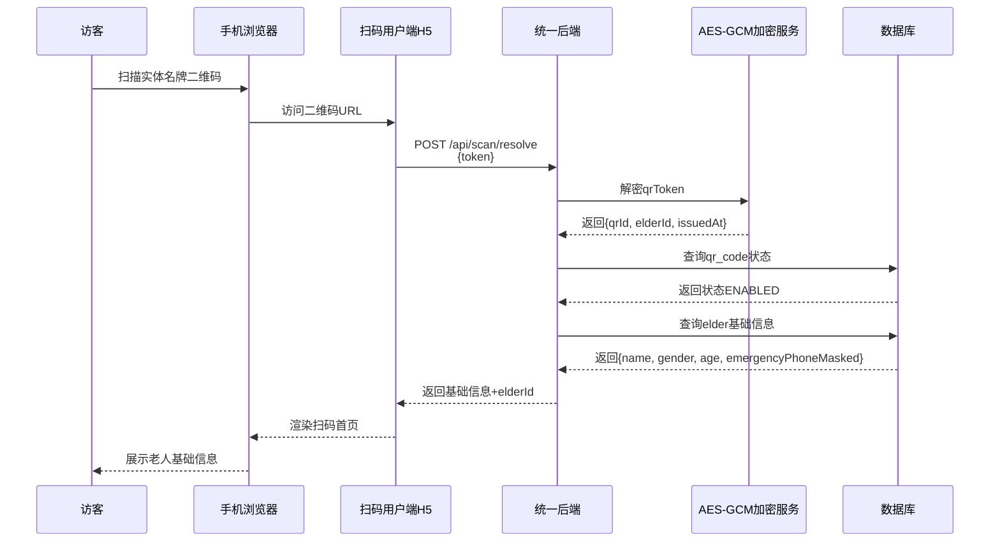
```mermaid
sequenceDiagram
    participant V as 访客
    participant M as 手机浏览器
    participant S as 扫码用户端H5
    participant API as 统一后端
    participant Crypto as AES-GCM加密服务
    participant DB as 数据库

    V->>M: 扫描实体名牌二维码
    M->>S: 访问二维码URL
    S->>API: POST /api/scan/resolve<br>{token}
    API->>Crypto: 解密qrToken
    Crypto-->>API: 返回{qrId, elderId, issuedAt}
    API->>DB: 查询qr_code状态
    DB-->>API: 返回状态ENABLED
    API->>DB: 查询elder基础信息
    DB-->>API: 返回{name, gender, age, emergencyPhoneMasked}
    API-->>S: 返回基础信息+elderId
    S-->>M: 渲染扫码首页
    M-->>V: 展示老人基础信息
```

---

### 6.2 短信验证查看敏感信息

**表 6.2 "短信验证查看敏感信息"用例规约**

| 项目 | 内容 |
|------|------|
| 用例名 | 短信验证查看敏感信息 |
| 简要描述 | 访客在扫码首页选择查看敏感信息后，通过固定号码短信回传验证或实名登记验证，获取短时访问权限 |
| 参与者 | 访客 |
| 前置条件 | 1. 访客已成功访问扫码首页<br>2. 访客点击"查看健康档案"或"查看用药记录"等敏感信息入口<br>3. 系统已配置短信中转设备且设备在线 |
| 后置条件 | 1. 验证通过后，系统创建已验证会话（Verified Session）<br>2. 访客可在授权时间窗口内（默认10分钟）查看敏感信息<br>3. 系统记录验证成功日志 |
| 基本事件流 | 1. 访客点击"查看健康档案"按钮<br>2. 系统展示验证方式选择：①短信回传验证 ②实名登记验证<br>3. 访客选择短信回传验证<br>4. 系统创建验证会话（sessionId），生成随机消息体（如"SL XXXXXXXX"）<br>5. 系统展示指引：请使用登记手机号向固定号码发送指定内容短信<br>6. 访客使用登记手机号发送短信到固定接收号码<br>7. 安卓短信中转端接收短信，解析内容，签名后回传后端<br>8. 后端验证签名、匹配消息体、标记会话为 VERIFIED<br>9. 访客页面轮询检测到验证成功，自动跳转健康档案页<br>10. 访客查看敏感信息，用例结束 |
| 备选事件流 | A-1 访客选择实名登记验证：访客填写姓名、手机号、身份证号，系统加密存储后直接标记 VERIFIED（适用于无登记手机号场景）<br>A-2 短信发送超时（5分钟）：会话状态变为 EXPIRED，访客需重新发起验证<br>A-3 消息体不匹配：系统拒绝验证，保持 PENDING 状态<br>A-4 设备离线：系统提示"验证服务暂不可用，请选择实名登记验证"<br>A-5 访客直接输入短信验证码：系统支持备用直接短信验证码验证路径 |
| 补充约束 | 1. 验证会话有效期：PENDING 状态 5 分钟，VERIFIED 后授权窗口 10 分钟<br>2. 消息体格式：`{prefix} {8位随机字母数字}`<br>3. 短信中转设备必须校验 HMAC-SHA256 签名<br>4. 访客身份信息（姓名、手机号、身份证号）必须 AES 加密存储<br>5. 同一手机号频繁验证需限流 |

**时序图：**

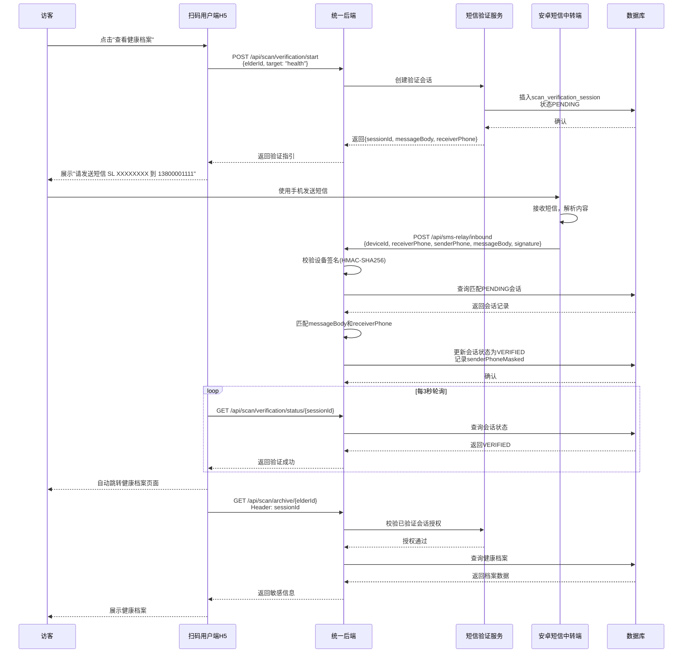
```mermaid
sequenceDiagram
    participant V as 访客
    participant S as 扫码用户端H5
    participant API as 统一后端
    participant SMS as 短信验证服务
    participant Android as 安卓短信中转端
    participant DB as 数据库

    V->>S: 点击"查看健康档案"
    S->>API: POST /api/scan/verification/start<br>{elderId, target: "health"}
    API->>SMS: 创建验证会话
    SMS->>DB: 插入scan_verification_session<br>状态PENDING
    DB-->>SMS: 确认
    SMS-->>API: 返回{sessionId, messageBody, receiverPhone}
    API-->>S: 返回验证指引
    S-->>V: 展示"请发送短信 SL XXXXXXXX 到 13800001111"

    V->>Android: 使用手机发送短信
    Android->>Android: 接收短信，解析内容
    Android->>API: POST /api/sms-relay/inbound<br>{deviceId, receiverPhone, senderPhone, messageBody, signature}
    API->>API: 校验设备签名(HMAC-SHA256)
    API->>DB: 查询匹配PENDING会话
    DB-->>API: 返回会话记录
    API->>API: 匹配messageBody和receiverPhone
    API->>DB: 更新会话状态为VERIFIED<br>记录senderPhoneMasked
    DB-->>API: 确认

    loop 每3秒轮询
        S->>API: GET /api/scan/verification/status/{sessionId}
        API->>DB: 查询会话状态
        DB-->>API: 返回VERIFIED
        API-->>S: 返回验证成功
    end

    S-->>V: 自动跳转健康档案页面
    S->>API: GET /api/scan/archive/{elderId}<br>Header: sessionId
    API->>SMS: 校验已验证会话授权
    SMS-->>API: 授权通过
    API->>DB: 查询健康档案
    DB-->>API: 返回档案数据
    API-->>S: 返回敏感信息
    S-->>V: 展示健康档案
```

---

### 6.3 志愿者登录

**表 6.3 "志愿者登录"用例规约**

| 项目 | 内容 |
|------|------|
| 用例名 | 志愿者登录 |
| 简要描述 | 志愿者通过账号密码登录统一照护工作台，获取负责老人列表的访问权限 |
| 参与者 | 志愿者 |
| 前置条件 | 1. 志愿者账号已在管理后台创建<br>2. 志愿者已分配负责老人范围（volunteer_elder_scope）<br>3. 账号状态为 ACTIVE |
| 后置条件 | 1. 系统签发 JWT Token（有效期2小时）<br>2. 前端存储 Token 并设置全局认证状态<br>3. 跳转至志愿者工作台首页（老人列表） |
| 基本事件流 | 1. 志愿者访问统一照护工作台入口<br>2. 系统展示登录页面，志愿者选择"志愿者登录"<br>3. 志愿者输入账号和密码<br>4. 前端进行基础格式验证<br>5. 前端发送登录请求到后端<br>6. 后端验证账号密码（bcrypt 比对）<br>7. 后端验证角色为 VOLUNTEER<br>8. 后端生成 JWT Token，包含账号、角色、过期时间<br>9. 后端返回 Token 和志愿者基本信息<br>10. 前端存储 Token，跳转老人列表页，用例结束 |
| 备选事件流 | A-1 账号不存在：系统返回"账号或密码错误"（不暴露账号是否存在）<br>A-2 密码错误：系统返回"账号或密码错误"<br>A-3 角色不匹配：系统返回"账号或密码错误"<br>A-4 账号被禁用：系统返回"账号已被禁用，请联系管理员" |
| 补充约束 | 1. 密码使用 bcrypt 算法哈希存储<br>2. JWT 使用 HS256 签名，过期时间 2 小时<br>3. 登录失败 5 次后锁定账号 30 分钟<br>4. 登录操作记录审计日志 |

**时序图：**

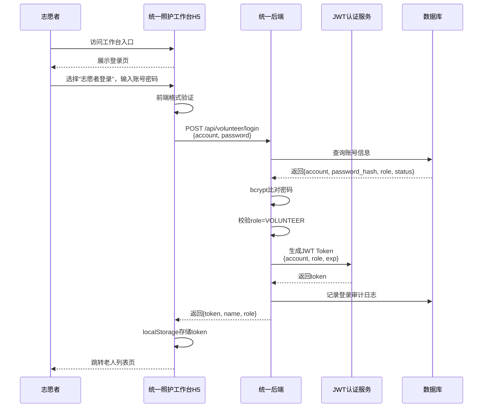
```mermaid
sequenceDiagram
    participant V as 志愿者
    participant F as 统一照护工作台H5
    participant API as 统一后端
    participant Auth as JWT认证服务
    participant DB as 数据库

    V->>F: 访问工作台入口
    F-->>V: 展示登录页
    V->>F: 选择"志愿者登录"，输入账号密码
    F->>F: 前端格式验证
    F->>API: POST /api/volunteer/login<br>{account, password}
    API->>DB: 查询账号信息
    DB-->>API: 返回{account, password_hash, role, status}
    API->>API: bcrypt比对密码
    API->>API: 校验role=VOLUNTEER
    API->>Auth: 生成JWT Token<br>{account, role, exp}
    Auth-->>API: 返回token
    API->>DB: 记录登录审计日志
    API-->>F: 返回{token, name, role}
    F->>F: localStorage存储token
    F-->>V: 跳转老人列表页
```

---

### 6.4 家属登录

**表 6.4 "家属登录"用例规约**

| 项目 | 内容 |
|------|------|
| 用例名 | 家属登录 |
| 简要描述 | 家属通过账号密码登录统一照护工作台，查看和管理绑定的老人档案 |
| 参与者 | 家属 |
| 前置条件 | 1. 家属已通过邀请码完成注册<br>2. 家属账号已与老人档案建立绑定关系（family_binding）<br>3. 账号状态为 ACTIVE |
| 后置条件 | 1. 系统签发 JWT Token<br>2. 前端存储 Token<br>3. 跳转至家属工作台首页（绑定老人列表） |
| 基本事件流 | 1. 家属访问统一照护工作台入口<br>2. 系统展示登录页面，家属选择"家属登录"<br>3. 家属输入账号和密码<br>4. 前端进行基础格式验证<br>5. 前端发送登录请求到后端<br>6. 后端验证账号密码<br>7. 后端验证角色为 FAMILY<br>8. 后端查询家属绑定的老人列表<br>9. 后端生成 JWT Token<br>10. 后端返回 Token 和绑定老人摘要<br>11. 前端存储 Token，跳转绑定老人列表页，用例结束 |
| 备选事件流 | A-1 账号不存在：返回"账号或密码错误"<br>A-2 密码错误：返回"账号或密码错误"<br>A-3 角色不匹配：返回"账号或密码错误"<br>A-4 无绑定老人：登录成功但列表为空，提示"暂无绑定老人" |
| 补充约束 | 1. 家属账号通过邀请码注册时强制短信验证<br>2. 密码使用 bcrypt 哈希<br>3. JWT 过期时间 2 小时<br>4. 家属只能访问绑定老人的数据 |

**时序图：**

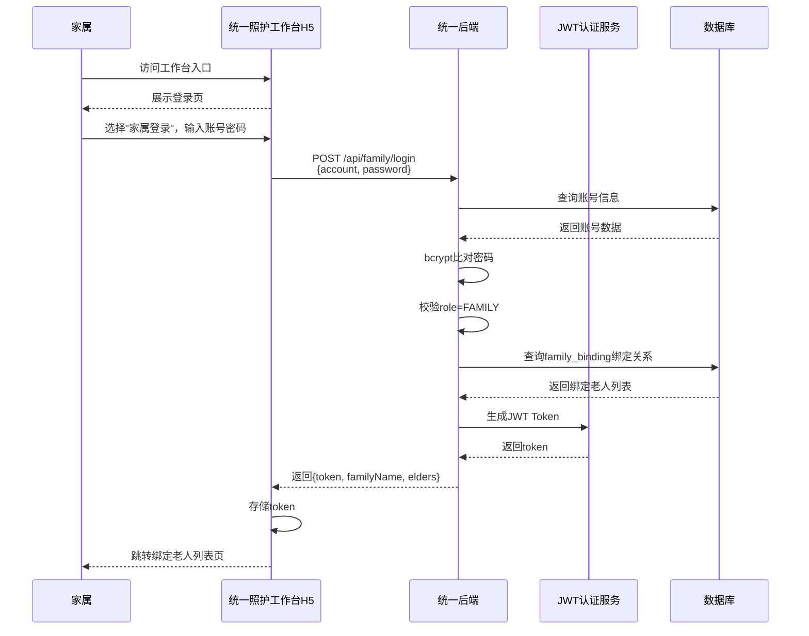
```mermaid
sequenceDiagram
    participant F as 家属
    participant FE as 统一照护工作台H5
    participant API as 统一后端
    participant Auth as JWT认证服务
    participant DB as 数据库

    F->>FE: 访问工作台入口
    FE-->>F: 展示登录页
    F->>FE: 选择"家属登录"，输入账号密码
    FE->>API: POST /api/family/login<br>{account, password}
    API->>DB: 查询账号信息
    DB-->>API: 返回账号数据
    API->>API: bcrypt比对密码
    API->>API: 校验role=FAMILY
    API->>DB: 查询family_binding绑定关系
    DB-->>API: 返回绑定老人列表
    API->>Auth: 生成JWT Token
    Auth-->>API: 返回token
    API-->>FE: 返回{token, familyName, elders}
    FE->>FE: 存储token
    FE-->>F: 跳转绑定老人列表页
```

---

### 6.5 管理后台登录

**表 6.5 "管理后台登录"用例规约**

| 项目 | 内容 |
|------|------|
| 用例名 | 管理后台登录 |
| 简要描述 | 系统管理员通过账号密码登录管理后台，获取系统管理权限 |
| 参与者 | 系统管理员 |
| 前置条件 | 1. 管理员账号已预置在系统中<br>2. 账号状态为 ACTIVE<br>3. 账号角色为 SYSTEM_ADMIN |
| 后置条件 | 1. 系统签发 JWT Token<br>2. 跳转至管理后台仪表盘<br>3. 记录登录审计日志 |
| 基本事件流 | 1. 管理员访问管理后台登录页<br>2. 输入管理员账号和密码<br>3. 前端基础验证<br>4. 发送登录请求<br>5. 后端验证账号密码<br>6. 后端验证角色为 SYSTEM_ADMIN<br>7. 生成 JWT Token<br>8. 返回 Token 和管理员信息<br>9. 前端存储 Token，跳转仪表盘，用例结束 |
| 备选事件流 | A-1 账号不存在：返回"账号或密码错误"<br>A-2 密码错误：返回"账号或密码错误"<br>A-3 非管理员角色：返回"账号或密码错误"<br>A-4 账号被禁用：返回"账号已被禁用" |
| 补充约束 | 1. 管理员密码必须定期更换（建议90天）<br>2. 登录失败 5 次锁定 30 分钟<br>3. 后台登录必须记录审计日志（IP、时间、结果）<br>4. JWT 过期时间 2 小时 |

**时序图：**

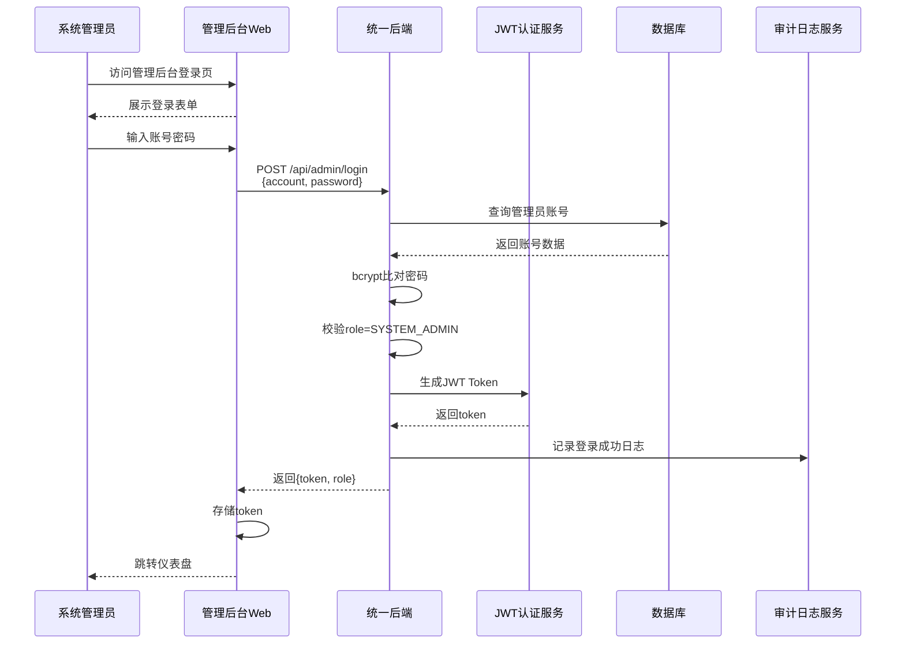
```mermaid
sequenceDiagram
    participant A as 系统管理员
    participant AD as 管理后台Web
    participant API as 统一后端
    participant Auth as JWT认证服务
    participant DB as 数据库
    participant Audit as 审计日志服务

    A->>AD: 访问管理后台登录页
    AD-->>A: 展示登录表单
    A->>AD: 输入账号密码
    AD->>API: POST /api/admin/login<br>{account, password}
    API->>DB: 查询管理员账号
    DB-->>API: 返回账号数据
    API->>API: bcrypt比对密码
    API->>API: 校验role=SYSTEM_ADMIN
    API->>Auth: 生成JWT Token
    Auth-->>API: 返回token
    API->>Audit: 记录登录成功日志
    API-->>AD: 返回{token, role}
    AD->>AD: 存储token
    AD-->>A: 跳转仪表盘
```

---

### 6.6 查看老人档案

**表 6.6 "查看老人档案"用例规约**

| 项目 | 内容 |
|------|------|
| 用例名 | 查看老人档案 |
| 简要描述 | 不同角色的用户在其权限范围内查看老人档案信息 |
| 参与者 | 访客（验证后）、志愿者、家属、系统管理员 |
| 前置条件 | 1. 老人档案已创建且状态为 ACTIVE<br>2. 用户已获取对应权限（扫码验证通过 / 登录成功 / 数据范围授权） |
| 后置条件 | 1. 系统展示老人档案信息<br>2. 记录查看审计日志（管理员/志愿者/家属查看时） |
| 基本事件流 | 1. 用户进入老人档案查看页面<br>2. 前端发送请求携带认证信息（Token 或 SessionId）<br>3. 后端校验用户身份和权限<br>4. 后端根据角色应用数据范围过滤：<br>   - 访客：仅查看验证通过的目标老人<br>   - 志愿者：仅查看本人负责老人<br>   - 家属：仅查看绑定老人<br>   - 管理员：查看所有老人<br>5. 后端查询老人基础信息、健康档案、用药记录、量表记录<br>6. 后端对敏感字段解密（AES-GCM）<br>7. 后端返回数据，前端渲染档案页面，用例结束 |
| 备选事件流 | A-1 无权限查看：返回"无权访问该档案"403错误<br>A-2 档案不存在：返回"档案不存在"404错误<br>A-3 档案已禁用：返回"该档案已停用" |
| 补充约束 | 1. 手机号、联系人姓名等敏感字段加密存储，返回时按需脱敏<br>2. 访客查看敏感信息需已验证会话且在授权窗口内<br>3. 志愿者和家属只能查看授权范围内的老人<br>4. 管理员查看时返回完整信息（含脱敏控制） |

**时序图：**

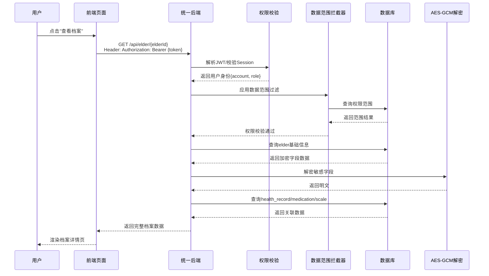
```mermaid
sequenceDiagram
    participant U as 用户
    participant F as 前端页面
    participant API as 统一后端
    participant Auth as 权限校验
    participant DS as 数据范围拦截器
    participant DB as 数据库
    participant Crypto as AES-GCM解密

    U->>F: 点击"查看档案"
    F->>API: GET /api/elder/{elderId}<br>Header: Authorization: Bearer {token}
    API->>Auth: 解析JWT/校验Session
    Auth-->>API: 返回用户身份{account, role}
    API->>DS: 应用数据范围过滤
    DS->>DB: 查询权限范围
    DB-->>DS: 返回范围结果
    DS-->>API: 权限校验通过
    API->>DB: 查询elder基础信息
    DB-->>API: 返回加密字段数据
    API->>Crypto: 解密敏感字段
    Crypto-->>API: 返回明文
    API->>DB: 查询health_record/medication/scale
    DB-->>API: 返回关联数据
    API-->>F: 返回完整档案数据
    F-->>U: 渲染档案详情页
```

---

### 6.7 填写老人基本信息

**表 6.7 "填写老人基本信息"用例规约**

| 项目 | 内容 |
|------|------|
| 用例名 | 填写老人基本信息 |
| 简要描述 | 志愿者或管理员录入或更新老人的基础档案信息 |
| 参与者 | 志愿者、系统管理员 |
| 前置条件 | 1. 用户已登录且角色为 VOLUNTEER 或 SYSTEM_ADMIN<br>2. 志愿者只能修改本人负责老人的信息<br>3. 管理员可修改所有老人信息 |
| 后置条件 | 1. 老人基础信息保存到数据库<br>2. 敏感字段自动加密存储<br>3. 记录操作审计日志 |
| 基本事件流 | 1. 用户进入老人基本信息填写页面<br>2. 系统展示表单：姓名、性别、年龄、血型、过敏史、紧急联系人姓名、紧急联系人电话、备用联系人姓名、备用联系人电话、与老人关系<br>3. 用户填写或修改信息<br>4. 前端进行字段格式验证（手机号11位、身份证号格式等）<br>5. 用户点击"保存"<br>6. 前端发送保存请求<br>7. 后端校验用户权限和数据范围<br>8. 后端对敏感字段加密（AES-GCM）<br>9. 后端保存到 elder 表<br>10. 返回保存成功，用例结束 |
| 备选事件流 | A-1 字段格式错误：前端提示"手机号格式不正确"等<br>A-2 无权限修改：返回"无权修改该档案"403<br>A-3 姓名为空：前端禁用保存并提示"姓名不能为空" |
| 补充约束 | 1. 姓名、手机号等字段必须加密存储<br>2. 紧急联系人手机号必须11位数字<br>3. 身份证号需校验 mainland 校验码<br>4. 保存操作记录审计日志（操作人、时间、修改字段摘要） |

**时序图：**

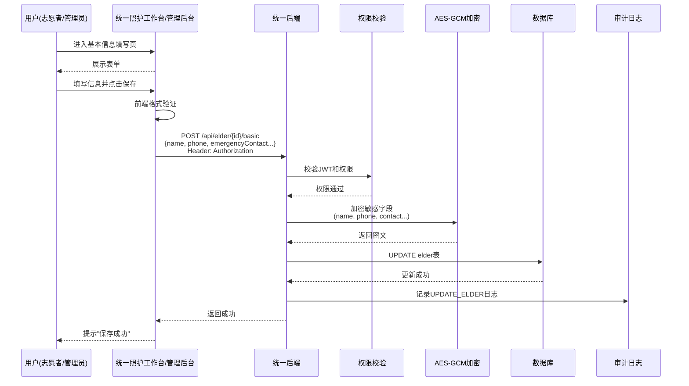
```mermaid
sequenceDiagram
    participant U as 用户(志愿者/管理员)
    participant F as 统一照护工作台/管理后台
    participant API as 统一后端
    participant Auth as 权限校验
    participant Crypto as AES-GCM加密
    participant DB as 数据库
    participant Audit as 审计日志

    U->>F: 进入基本信息填写页
    F-->>U: 展示表单
    U->>F: 填写信息并点击保存
    F->>F: 前端格式验证
    F->>API: POST /api/elder/{id}/basic<br>{name, phone, emergencyContact...}<br>Header: Authorization
    API->>Auth: 校验JWT和权限
    Auth-->>API: 权限通过
    API->>Crypto: 加密敏感字段<br>(name, phone, contact...)
    Crypto-->>API: 返回密文
    API->>DB: UPDATE elder表
    DB-->>API: 更新成功
    API->>Audit: 记录UPDATE_ELDER日志
    API-->>F: 返回成功
    F-->>U: 提示"保存成功"
```

---

### 6.8 填写用药记录

**表 6.8 "填写用药记录"用例规约**

| 项目 | 内容 |
|------|------|
| 用例名 | 填写用药记录 |
| 简要描述 | 志愿者或家属录入、修改老人的主要用药信息 |
| 参与者 | 志愿者、家属 |
| 前置条件 | 1. 用户已登录（志愿者或家属）<br>2. 志愿者只能修改负责老人的用药<br>3. 家属只能修改绑定老人的用药 |
| 后置条件 | 1. 用药记录保存到数据库<br>2. 敏感字段加密存储<br>3. 记录操作审计日志 |
| 基本事件流 | 1. 用户进入用药管理页面<br>2. 系统展示当前用药列表<br>3. 用户点击"添加用药"或"编辑"<br>4. 系统展示用药表单：药品名称、剂量、用法、服用时间<br>5. 用户填写信息<br>6. 前端验证必填字段<br>7. 用户点击保存<br>8. 后端校验权限和数据范围<br>9. 后端加密敏感字段<br>10. 保存到 medication 表<br>11. 返回成功，更新列表，用例结束 |
| 备选事件流 | A-1 药品名称为空：提示"药品名称不能为空"<br>A-2 无权限：返回403<br>A-3 删除用药：用户点击删除，确认后删除记录 |
| 补充约束 | 1. 药品名称、剂量、用法等字段加密存储<br>2. 一个老人可有多条用药记录<br>3. 用药记录支持增删改查<br>4. 志愿者和家属对同一老人的用药记录共享可见 |

**时序图：**

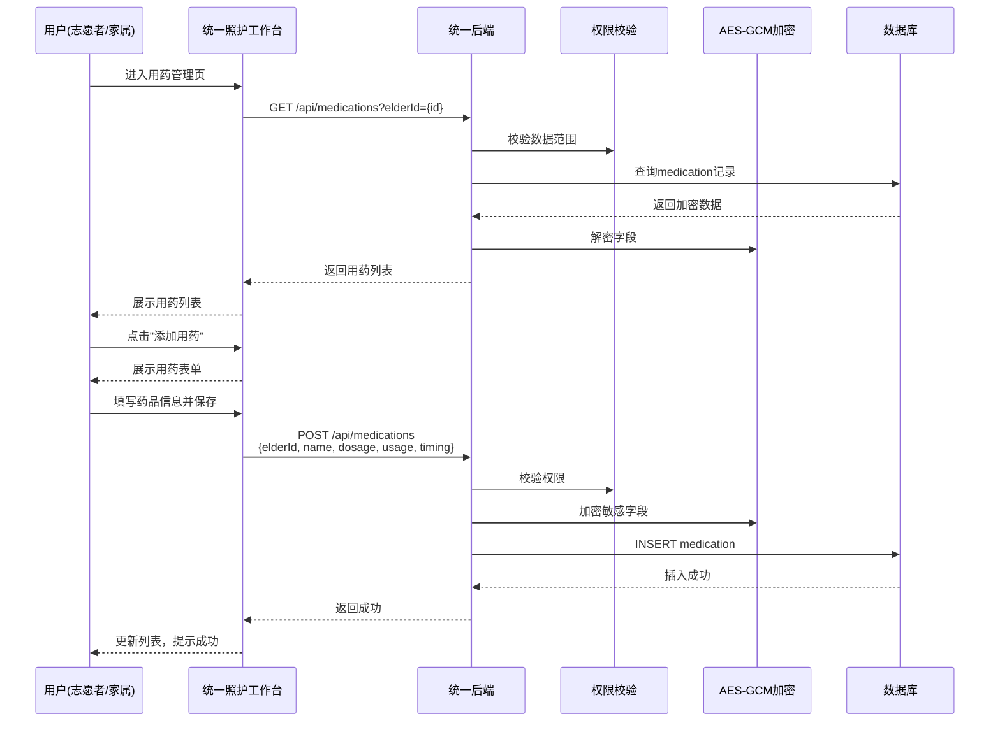
```mermaid
sequenceDiagram
    participant U as 用户(志愿者/家属)
    participant F as 统一照护工作台
    participant API as 统一后端
    participant Auth as 权限校验
    participant Crypto as AES-GCM加密
    participant DB as 数据库

    U->>F: 进入用药管理页
    F->>API: GET /api/medications?elderId={id}
    API->>Auth: 校验数据范围
    API->>DB: 查询medication记录
    DB-->>API: 返回加密数据
    API->>Crypto: 解密字段
    API-->>F: 返回用药列表
    F-->>U: 展示用药列表

    U->>F: 点击"添加用药"
    F-->>U: 展示用药表单
    U->>F: 填写药品信息并保存
    F->>API: POST /api/medications<br>{elderId, name, dosage, usage, timing}
    API->>Auth: 校验权限
    API->>Crypto: 加密敏感字段
    API->>DB: INSERT medication
    DB-->>API: 插入成功
    API-->>F: 返回成功
    F-->>U: 更新列表，提示成功
```

---

### 6.9 填写量表评估

**表 6.9 "填写量表评估"用例规约**

| 项目 | 内容 |
|------|------|
| 用例名 | 填写量表评估 |
| 简要描述 | 志愿者为老人填写心理健康量表（PHQ-9、GAD-7、UCLA 孤独量表），系统自动计算得分并保存 |
| 参与者 | 志愿者 |
| 前置条件 | 1. 志愿者已登录<br>2. 老人档案已创建<br>3. 志愿者有该老人的负责权限 |
| 后置条件 | 1. 量表记录保存到数据库<br>2. 系统计算并保存总分<br>3. 记录操作审计日志 |
| 基本事件流 | 1. 志愿者进入量表填写页面<br>2. 系统展示量表选择：PHQ-9（抑郁筛查）、GAD-7（焦虑筛查）、UCLA 孤独量表<br>3. 志愿者选择量表<br>4. 系统逐题展示量表问题<br>5. 志愿者逐题选择答案（0-3分制）<br>6. 系统实时计算当前得分<br>7. 志愿者完成所有题目<br>8. 系统展示总分和结果解读<br>9. 志愿者确认提交<br>10. 后端校验权限<br>11. 后端保存量表记录（量表名称、总分、各题答案 JSON、填写日期、填写人）<br>12. 返回成功，用例结束 |
| 备选事件流 | A-1 题目未答完：提示"还有未完成的题目"<br>A-2 无权限填写：返回403<br>A-3 查看历史量表：志愿者可查看该老人历次量表记录和得分趋势 |
| 补充约束 | 1. PHQ-9 共9题，总分0-27分；GAD-7 共7题，总分0-21分；UCLA 共20题<br>2. 量表答案以 JSON 格式加密存储（payload_enc）<br>3. 支持查看历史量表记录和得分变化趋势<br>4. 量表填写记录不可修改（保证数据完整性），可重新填写新记录 |

**时序图：**

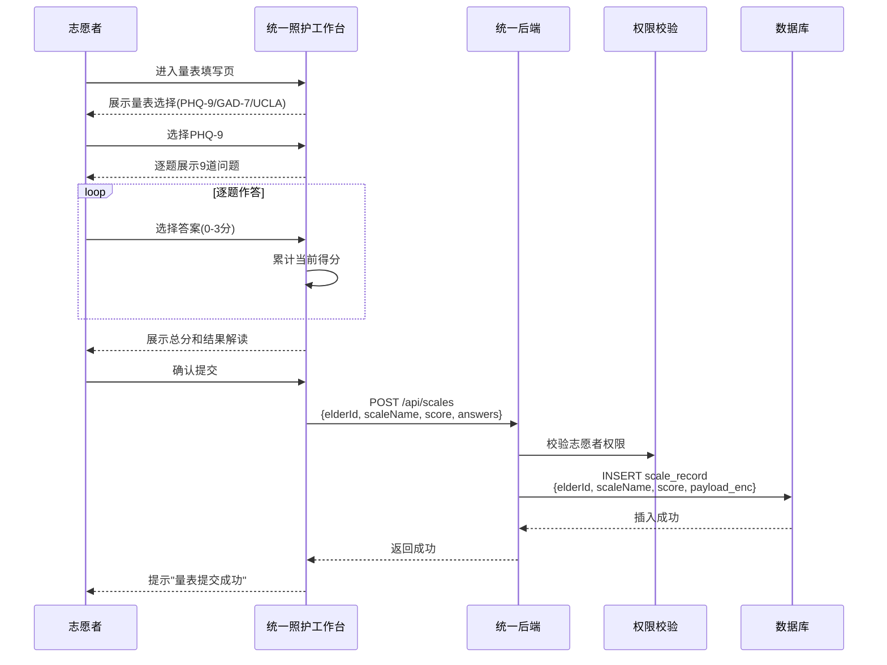
```mermaid
sequenceDiagram
    participant V as 志愿者
    participant F as 统一照护工作台
    participant API as 统一后端
    participant Auth as 权限校验
    participant DB as 数据库

    V->>F: 进入量表填写页
    F-->>V: 展示量表选择(PHQ-9/GAD-7/UCLA)
    V->>F: 选择PHQ-9
    F-->>V: 逐题展示9道问题
    loop 逐题作答
        V->>F: 选择答案(0-3分)
        F->>F: 累计当前得分
    end
    F-->>V: 展示总分和结果解读
    V->>F: 确认提交
    F->>API: POST /api/scales<br>{elderId, scaleName, score, answers}
    API->>Auth: 校验志愿者权限
    API->>DB: INSERT scale_record<br>{elderId, scaleName, score, payload_enc}
    DB-->>API: 插入成功
    API-->>F: 返回成功
    F-->>V: 提示"量表提交成功"
```

---

### 6.10 生成二维码名牌

**表 6.10 "生成二维码名牌"用例规约**

| 项目 | 内容 |
|------|------|
| 用例名 | 生成二维码名牌 |
| 简要描述 | 管理员为老人生成加密二维码，并生成实体名牌 PDF 文件 |
| 参与者 | 系统管理员 |
| 前置条件 | 1. 管理员已登录<br>2. 老人档案已创建且状态为 ACTIVE<br>3. 老人档案有档案号（archive_no） |
| 后置条件 | 1. 生成唯一二维码并绑定老人档案<br>2. 生成名牌预览和 PDF 文件<br>3. 二维码 token 哈希保存到数据库 |
| 基本事件流 | 1. 管理员进入二维码管理页面<br>2. 选择目标老人，点击"生成二维码"<br>3. 系统生成二维码 payload：{qrId, elderId, issuedAt, version}<br>4. 系统使用 AES-256-GCM 加密 payload，生成 encryptedQrToken<br>5. 系统计算 token 哈希并保存到 qr_code 表<br>6. 系统生成二维码图片（URL 格式：`/s/{encryptedQrToken}`）<br>7. 系统展示二维码预览<br>8. 管理员点击"生成名牌 PDF"<br>9. 系统组装名牌数据：正面（姓名、年龄、联系电话）、背面（二维码、档案号、扫码提示）<br>10. 系统渲染 PDF 并返回下载链接<br>11. 管理员下载 PDF 用于打印实体名牌，用例结束 |
| 备选事件流 | A-1 二维码已存在：提示"该老人已有有效二维码，是否重新生成？"<br>A-2 重新生成：停用旧二维码，生成新二维码<br>A-3 停用二维码：管理员可停用二维码，停用后扫码将拒绝访问 |
| 补充约束 | 1. 二维码使用 AES-256-GCM 加密，每次生成使用随机 IV<br>2. Token 结构：`kid.iv.ciphertext.tag`，base64url 编码<br>3. 服务端只保存 token 哈希，不保存明文 token<br>4. 名牌 PDF 不包含健康档案、用药、量表等敏感信息<br>5. 支持批量生成多个老人的名牌 PDF |

**时序图：**

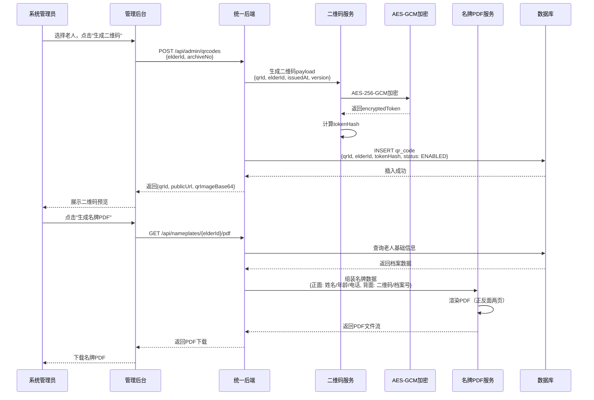
```mermaid
sequenceDiagram
    participant A as 系统管理员
    participant AD as 管理后台
    participant API as 统一后端
    participant QR as 二维码服务
    participant Crypto as AES-GCM加密
    participant NP as 名牌PDF服务
    participant DB as 数据库

    A->>AD: 选择老人，点击"生成二维码"
    AD->>API: POST /api/admin/qrcodes<br>{elderId, archiveNo}
    API->>QR: 生成二维码payload<br>{qrId, elderId, issuedAt, version}
    QR->>Crypto: AES-256-GCM加密
    Crypto-->>QR: 返回encryptedToken
    QR->>QR: 计算tokenHash
    API->>DB: INSERT qr_code<br>{qrId, elderId, tokenHash, status: ENABLED}
    DB-->>API: 插入成功
    API-->>AD: 返回{qrId, publicUrl, qrImageBase64}
    AD-->>A: 展示二维码预览

    A->>AD: 点击"生成名牌PDF"
    AD->>API: GET /api/nameplates/{elderId}/pdf
    API->>DB: 查询老人基础信息
    DB-->>API: 返回档案数据
    API->>NP: 组装名牌数据<br>{正面: 姓名/年龄/电话, 背面: 二维码/档案号}
    NP->>NP: 渲染PDF（正反面两页）
    NP-->>API: 返回PDF文件流
    API-->>AD: 返回PDF下载
    AD-->>A: 下载名牌PDF
```

---

### 6.11 管理后台查看仪表盘

**表 6.11 "管理后台查看仪表盘"用例规约**

| 项目 | 内容 |
|------|------|
| 用例名 | 管理后台查看仪表盘 |
| 简要描述 | 管理员登录后查看系统运营数据统计仪表盘 |
| 参与者 | 系统管理员 |
| 前置条件 | 1. 管理员已登录且角色为 SYSTEM_ADMIN<br>2. 系统已有运营数据 |
| 后置条件 | 1. 展示系统运营统计<br>2. 数据实时或准实时更新 |
| 基本事件流 | 1. 管理员登录后自动进入仪表盘<br>2. 系统展示统计卡片：<br>   - 老人总数（elderCount）<br>   - 志愿者数量（volunteerCount）<br>   - 今日扫码次数（todayScanCount）<br>   - 今日短信验证次数（todaySmsVerifiedCount）<br>   - 异常访问次数（abnormalAccessCount）<br>3. 系统展示趋势图表（近7日扫码/验证趋势）<br>4. 系统展示待处理事项列表<br>5. 管理员可点击统计卡片进入对应管理页面，用例结束 |
| 备选事件流 | A-1 无数据：展示空状态或0值<br>A-2 数据加载失败：展示错误提示，支持重试 |
| 补充约束 | 1. 统计数据应缓存以提高性能（如5分钟缓存）<br>2. 异常访问定义：验证失败次数过多、非授权访问尝试等<br>3. 仪表盘数据仅管理员可见 |

**时序图：**

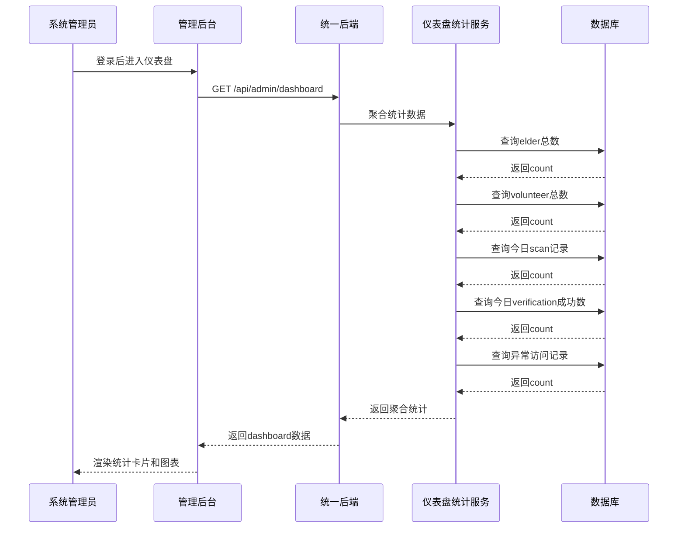
```mermaid
sequenceDiagram
    participant A as 系统管理员
    participant AD as 管理后台
    participant API as 统一后端
    participant DS as 仪表盘统计服务
    participant DB as 数据库

    A->>AD: 登录后进入仪表盘
    AD->>API: GET /api/admin/dashboard
    API->>DS: 聚合统计数据
    DS->>DB: 查询elder总数
    DB-->>DS: 返回count
    DS->>DB: 查询volunteer总数
    DB-->>DS: 返回count
    DS->>DB: 查询今日scan记录
    DB-->>DS: 返回count
    DS->>DB: 查询今日verification成功数
    DB-->>DS: 返回count
    DS->>DB: 查询异常访问记录
    DB-->>DS: 返回count
    DS-->>API: 返回聚合统计
    API-->>AD: 返回dashboard数据
    AD-->>A: 渲染统计卡片和图表
```

---

### 6.12 管理后台老人档案管理

**表 6.12 "管理后台老人档案管理"用例规约**

| 项目 | 内容 |
|------|------|
| 用例名 | 管理后台老人档案管理 |
| 简要描述 | 管理员在后台对老人档案进行增删改查、状态管理 |
| 参与者 | 系统管理员 |
| 前置条件 | 1. 管理员已登录<br>2. 管理员有 ELDER_READ/ELDER_WRITE 权限 |
| 后置条件 | 1. 档案数据变更保存到数据库<br>2. 记录操作审计日志<br>3. 创建档案时自动关联生成二维码 |
| 基本事件流 | 1. 管理员进入老人档案管理页面<br>2. 系统展示老人列表（支持分页、搜索、筛选）<br>3. 管理员可进行以下操作：<br>   a. 创建档案：填写表单，保存后自动生成二维码<br>   b. 编辑档案：修改基础信息，保存<br>   c. 查看详情：查看完整档案（含健康档案、用药、量表）<br>   d. 禁用/启用档案：修改档案状态<br>   e. 删除档案：软删除或标记禁用<br>4. 操作成功后系统提示并刷新列表，用例结束 |
| 备选事件流 | A-1 搜索无结果：展示"未找到匹配档案"<br>A-2 档案号重复：提示"档案号已存在"<br>A-3 删除档案：二次确认后执行 |
| 补充约束 | 1. 档案列表返回脱敏手机号，不展示完整手机号<br>2. 创建档案时自动生成档案号和二维码<br>3. 删除操作必须二次确认<br>4. 所有操作记录审计日志 |

**时序图：**

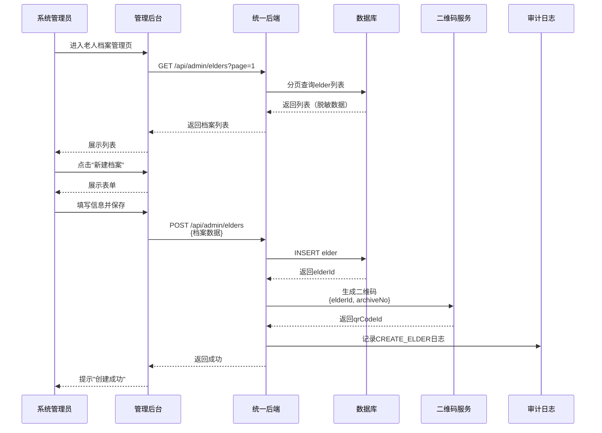
```mermaid
sequenceDiagram
    participant A as 系统管理员
    participant AD as 管理后台
    participant API as 统一后端
    participant DB as 数据库
    participant QR as 二维码服务
    participant Audit as 审计日志

    A->>AD: 进入老人档案管理页
    AD->>API: GET /api/admin/elders?page=1
    API->>DB: 分页查询elder列表
    DB-->>API: 返回列表（脱敏数据）
    API-->>AD: 返回档案列表
    AD-->>A: 展示列表

    A->>AD: 点击"新建档案"
    AD-->>A: 展示表单
    A->>AD: 填写信息并保存
    AD->>API: POST /api/admin/elders<br>{档案数据}
    API->>DB: INSERT elder
    DB-->>API: 返回elderId
    API->>QR: 生成二维码<br>{elderId, archiveNo}
    QR-->>API: 返回qrCodeId
    API->>Audit: 记录CREATE_ELDER日志
    API-->>AD: 返回成功
    AD-->>A: 提示"创建成功"
```

---

### 6.13 管理后台志愿者管理

**表 6.13 "管理后台志愿者管理"用例规约**

| 项目 | 内容 |
|------|------|
| 用例名 | 管理后台志愿者管理 |
| 简要描述 | 管理员在后台管理志愿者账号，包括创建、编辑、分配负责老人、删除 |
| 参与者 | 系统管理员 |
| 前置条件 | 1. 管理员已登录<br>2. 管理员有 VOLUNTEER_MANAGE 权限 |
| 后置条件 | 1. 志愿者账号变更保存<br>2. 负责老人范围更新<br>3. 记录审计日志 |
| 基本事件流 | 1. 管理员进入志愿者管理页面<br>2. 系统展示志愿者列表<br>3. 管理员可进行以下操作：<br>   a. 创建志愿者：填写账号、姓名、手机号、初始密码<br>   b. 编辑信息：修改姓名、手机号、状态<br>   c. 分配负责老人：选择该志愿者负责的老人档案<br>   d. 删除志愿者：移除账号<br>4. 操作成功后刷新列表，用例结束 |
| 备选事件流 | A-1 账号已存在：提示"账号已被使用"<br>A-2 分配老人时搜索：支持按姓名搜索老人<br>A-3 删除志愿者：确认后删除，关联的负责范围一并清除 |
| 补充约束 | 1. 志愿者密码默认使用 bcrypt 哈希<br>2. 一个志愿者可负责多个老人<br>3. 志愿者只能查看和修改本人负责老人的数据<br>4. 分配负责老人时展示未分配老人列表 |

**时序图：**

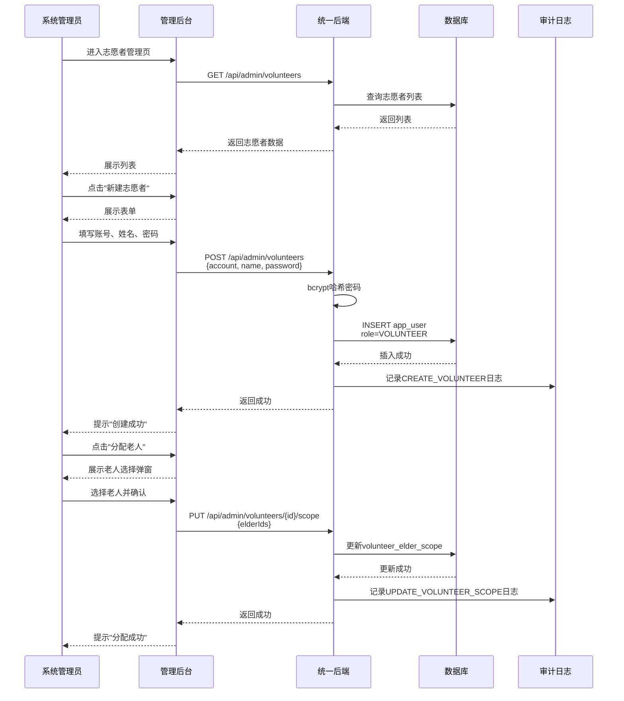
```mermaid
sequenceDiagram
    participant A as 系统管理员
    participant AD as 管理后台
    participant API as 统一后端
    participant DB as 数据库
    participant Audit as 审计日志

    A->>AD: 进入志愿者管理页
    AD->>API: GET /api/admin/volunteers
    API->>DB: 查询志愿者列表
    DB-->>API: 返回列表
    API-->>AD: 返回志愿者数据
    AD-->>A: 展示列表

    A->>AD: 点击"新建志愿者"
    AD-->>A: 展示表单
    A->>AD: 填写账号、姓名、密码
    AD->>API: POST /api/admin/volunteers<br>{account, name, password}
    API->>API: bcrypt哈希密码
    API->>DB: INSERT app_user<br>role=VOLUNTEER
    DB-->>API: 插入成功
    API->>Audit: 记录CREATE_VOLUNTEER日志
    API-->>AD: 返回成功
    AD-->>A: 提示"创建成功"

    A->>AD: 点击"分配老人"
    AD-->>A: 展示老人选择弹窗
    A->>AD: 选择老人并确认
    AD->>API: PUT /api/admin/volunteers/{id}/scope<br>{elderIds}
    API->>DB: 更新volunteer_elder_scope
    DB-->>API: 更新成功
    API->>Audit: 记录UPDATE_VOLUNTEER_SCOPE日志
    API-->>AD: 返回成功
    AD-->>A: 提示"分配成功"
```

---

### 6.14 管理后台角色权限管理

**表 6.14 "管理后台角色权限管理"用例规约**

| 项目 | 内容 |
|------|------|
| 用例名 | 管理后台角色权限管理 |
| 简要描述 | 管理员配置系统角色和权限矩阵，控制不同角色的功能访问范围 |
| 参与者 | 系统管理员 |
| 前置条件 | 1. 管理员已登录<br>2. 管理员有 SYSTEM_ADMIN 角色 |
| 后置条件 | 1. 角色权限配置更新<br>2. 用户权限实时生效 |
| 基本事件流 | 1. 管理员进入角色权限管理页面<br>2. 系统展示角色列表：志愿者、项目管理员、审计员、系统管理员<br>3. 系统展示权限矩阵（角色 × 权限菜单）<br>4. 管理员可配置：<br>   a. 角色数据范围：SELF_ELDER（仅自己负责老人）、PROJECT（项目范围）、AUDIT_ONLY（仅审计）、ALL（全部）<br>   b. 角色权限分配：ELDER_READ、ELDER_WRITE、QR_MANAGE、VOLUNTEER_MANAGE、AUDIT_LOG_READ 等<br>5. 管理员保存配置<br>6. 后端更新角色权限映射<br>7. 返回成功，用例结束 |
| 备选事件流 | A-1 系统管理员权限不可撤销：防止系统无管理员<br>A-2 角色被用户使用：提示"该角色下有关联用户，不可删除" |
| 补充约束 | 1. 预置角色不可删除：VOLUNTEER、PROJECT_ADMIN、AUDITOR、SYSTEM_ADMIN<br>2. 数据范围控制通过 DataScopeInterceptor 实现<br>3. 权限变更即时生效（基于 JWT 中的角色信息）<br>4. 权限矩阵页面支持批量勾选 |

**时序图：**

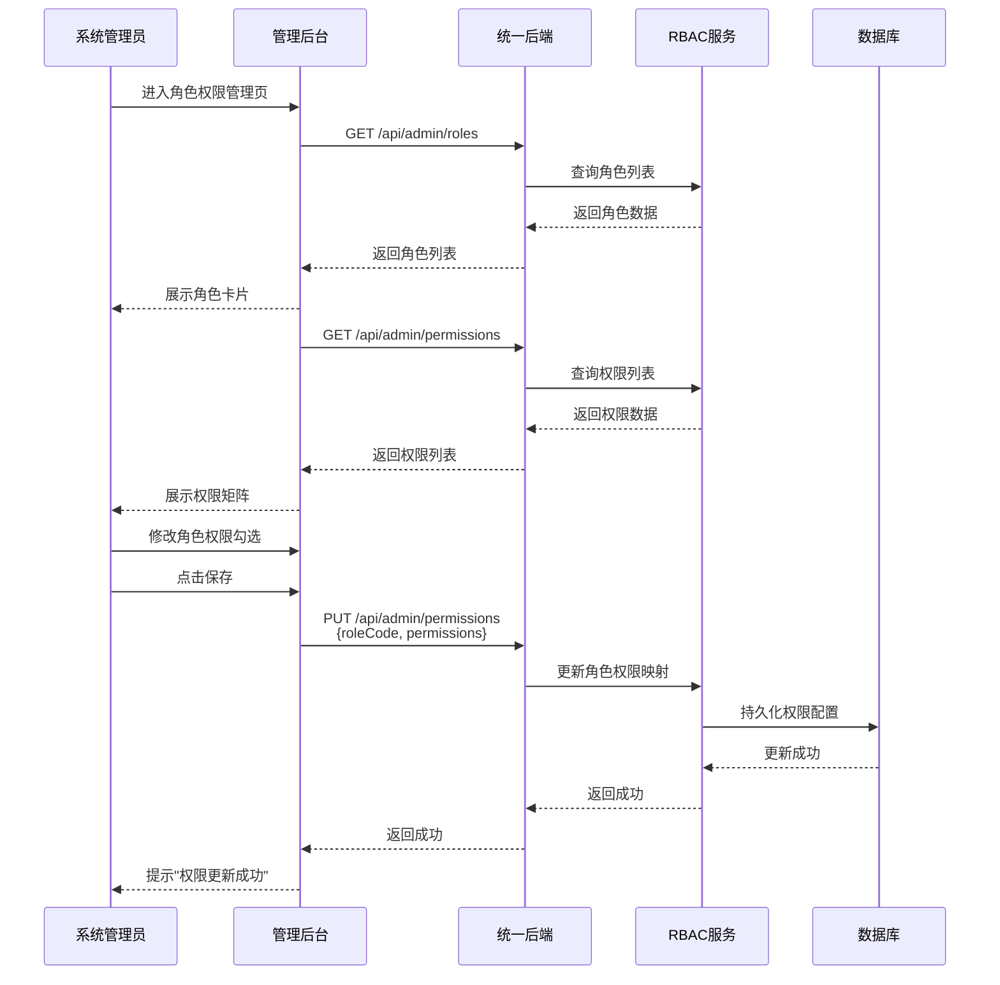
```mermaid
sequenceDiagram
    participant A as 系统管理员
    participant AD as 管理后台
    participant API as 统一后端
    participant RBAC as RBAC服务
    participant DB as 数据库

    A->>AD: 进入角色权限管理页
    AD->>API: GET /api/admin/roles
    API->>RBAC: 查询角色列表
    RBAC-->>API: 返回角色数据
    API-->>AD: 返回角色列表
    AD-->>A: 展示角色卡片

    AD->>API: GET /api/admin/permissions
    API->>RBAC: 查询权限列表
    RBAC-->>API: 返回权限数据
    API-->>AD: 返回权限列表
    AD-->>A: 展示权限矩阵

    A->>AD: 修改角色权限勾选
    A->>AD: 点击保存
    AD->>API: PUT /api/admin/permissions<br>{roleCode, permissions}
    API->>RBAC: 更新角色权限映射
    RBAC->>DB: 持久化权限配置
    DB-->>RBAC: 更新成功
    RBAC-->>API: 返回成功
    API-->>AD: 返回成功
    AD-->>A: 提示"权限更新成功"
```

---

### 6.15 管理后台操作日志审计

**表 6.15 "管理后台操作日志审计"用例规约**

| 项目 | 内容 |
|------|------|
| 用例名 | 管理后台操作日志审计 |
| 简要描述 | 管理员查看系统操作日志，支持筛选、查询和导出，用于安全审计和问题追溯 |
| 参与者 | 系统管理员、审计员 |
| 前置条件 | 1. 用户已登录<br>2. 用户有 AUDIT_LOG_READ 权限 |
| 后置条件 | 1. 展示操作日志列表<br>2. 支持导出审计报告 |
| 基本事件流 | 1. 用户进入审计日志页面<br>2. 系统展示日志列表，包含字段：时间、操作人、角色、来源IP、操作对象、操作类型、操作结果、失败原因、requestId<br>3. 用户可使用筛选条件：操作人、操作类型、操作结果、时间范围<br>4. 系统根据条件过滤展示日志<br>5. 用户点击"导出"按钮<br>6. 系统生成 CSV 格式审计报告并下载<br>7. 用户可查看单条日志详情（含访客身份信息，如有），用例结束 |
| 备选事件流 | A-1 无日志数据：展示"暂无操作记录"<br>A-2 筛选无结果：提示"未找到匹配记录"<br>A-3 导出大量数据：分页导出或异步生成 |
| 补充约束 | 1. 日志字段必须包含：操作人、角色、时间、来源IP、操作对象、操作类型、操作结果、失败原因、requestId<br>2. 访客验证日志额外包含：验证方式、访客姓名（脱敏）、访客手机号（脱敏）、访客身份证号（脱敏）<br>3. 日志不可修改、不可删除（保证审计完整性）<br>4. 日志保留期限建议不少于 180 天<br>5. 支持按时间范围导出 |

**时序图：**

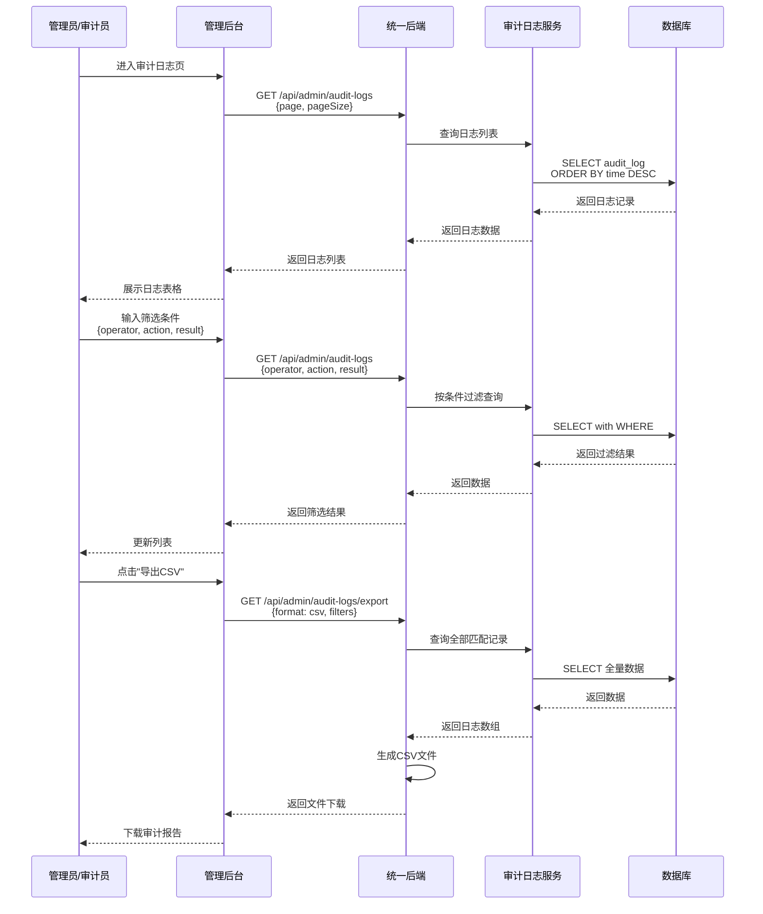
```mermaid
sequenceDiagram
    participant A as 管理员/审计员
    participant AD as 管理后台
    participant API as 统一后端
    participant Audit as 审计日志服务
    participant DB as 数据库

    A->>AD: 进入审计日志页
    AD->>API: GET /api/admin/audit-logs<br>{page, pageSize}
    API->>Audit: 查询日志列表
    Audit->>DB: SELECT audit_log<br>ORDER BY time DESC
    DB-->>Audit: 返回日志记录
    Audit-->>API: 返回日志数据
    API-->>AD: 返回日志列表
    AD-->>A: 展示日志表格

    A->>AD: 输入筛选条件<br>{operator, action, result}
    AD->>API: GET /api/admin/audit-logs<br>{operator, action, result}
    API->>Audit: 按条件过滤查询
    Audit->>DB: SELECT with WHERE
    DB-->>Audit: 返回过滤结果
    Audit-->>API: 返回数据
    API-->>AD: 返回筛选结果
    AD-->>A: 更新列表

    A->>AD: 点击"导出CSV"
    AD->>API: GET /api/admin/audit-logs/export<br>{format: csv, filters}
    API->>Audit: 查询全部匹配记录
    Audit->>DB: SELECT 全量数据
    DB-->>Audit: 返回数据
    Audit-->>API: 返回日志数组
    API->>API: 生成CSV文件
    API-->>AD: 返回文件下载
    AD-->>A: 下载审计报告
```

---

### 6.16 家属注册与绑定

**表 6.16 "家属注册与绑定"用例规约**

| 项目 | 内容 |
|------|------|
| 用例名 | 家属注册与绑定 |
| 简要描述 | 家属通过邀请码注册账号，完成短信验证后与老人档案建立绑定关系 |
| 参与者 | 家属（新用户） |
| 前置条件 | 1. 管理员已在后台生成有效邀请码<br>2. 邀请码已绑定目标老人档案<br>3. 邀请码状态为 ACTIVE 且未超过使用次数限制 |
| 后置条件 | 1. 家属账号创建成功<br>2. 家属与老人档案建立绑定关系<br>3. 邀请码使用次数 +1 |
| 基本事件流 | 1. 家属获得邀请码（由管理员提供）<br>2. 家属访问注册页面，输入邀请码<br>3. 系统验证邀请码有效，展示绑定老人摘要（姓名脱敏）<br>4. 家属输入注册信息：账号、密码、姓名、手机号<br>5. 系统发送短信验证码到家属手机号<br>6. 家属输入短信验证码<br>7. 系统验证验证码正确<br>8. 系统创建家属账号（role=FAMILY）<br>9. 系统创建 family_binding 记录<br>10. 邀请码使用次数 +1<br>11. 返回注册成功，跳转登录页，用例结束 |
| 备选事件流 | A-1 邀请码无效：提示"邀请码无效或已过期"<br>A-2 邀请码已达使用上限：提示"邀请码已达使用次数上限"<br>A-3 短信验证码错误：提示"验证码错误"<br>A-4 账号已存在：提示"账号已被注册"<br>A-5 邀请码预览：家属输入邀请码后可先查看绑定老人摘要，再决定是否注册 |
| 补充约束 | 1. 邀请码默认有效期 7 天，默认使用次数 1 次<br>2. 注册时必须短信验证手机号<br>3. 密码使用 bcrypt 哈希存储<br>4. 家属姓名、手机号加密存储<br>5. 注册成功后邀请码状态根据使用次数自动更新 |

**时序图：**

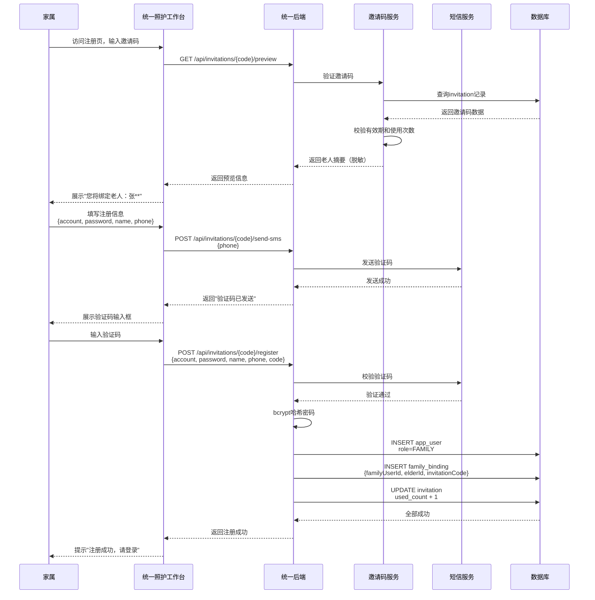
```mermaid
sequenceDiagram
    participant F as 家属
    participant FE as 统一照护工作台
    participant API as 统一后端
    participant Invite as 邀请码服务
    participant SMS as 短信服务
    participant DB as 数据库

    F->>FE: 访问注册页，输入邀请码
    FE->>API: GET /api/invitations/{code}/preview
    API->>Invite: 验证邀请码
    Invite->>DB: 查询invitation记录
    DB-->>Invite: 返回邀请码数据
    Invite->>Invite: 校验有效期和使用次数
    Invite-->>API: 返回老人摘要（脱敏）
    API-->>FE: 返回预览信息
    FE-->>F: 展示"您将绑定老人：张**"

    F->>FE: 填写注册信息<br>{account, password, name, phone}
    FE->>API: POST /api/invitations/{code}/send-sms<br>{phone}
    API->>SMS: 发送验证码
    SMS-->>API: 发送成功
    API-->>FE: 返回"验证码已发送"
    FE-->>F: 展示验证码输入框

    F->>FE: 输入验证码
    FE->>API: POST /api/invitations/{code}/register<br>{account, password, name, phone, code}
    API->>SMS: 校验验证码
    SMS-->>API: 验证通过
    API->>API: bcrypt哈希密码
    API->>DB: INSERT app_user<br>role=FAMILY
    API->>DB: INSERT family_binding<br>{familyUserId, elderId, invitationCode}
    API->>DB: UPDATE invitation<br>used_count + 1
    DB-->>API: 全部成功
    API-->>FE: 返回注册成功
    FE-->>F: 提示"注册成功，请登录"
```

---

### 6.17 邀请码管理

**表 6.17 "邀请码管理"用例规约**

| 项目 | 内容 |
|------|------|
| 用例名 | 邀请码管理 |
| 简要描述 | 管理员在后台生成、查看、作废家属邀请码 |
| 参与者 | 系统管理员 |
| 前置条件 | 1. 管理员已登录<br>2. 目标老人档案已创建 |
| 后置条件 | 1. 邀请码生成或状态变更<br>2. 记录审计日志 |
| 基本事件流 | 1. 管理员进入邀请码管理页面<br>2. 系统展示邀请码列表（含邀请码、绑定老人、有效期、使用次数、状态）<br>3. 管理员点击"生成邀请码"<br>4. 选择目标老人、设置有效期、设置最大使用次数<br>5. 系统生成唯一邀请码<br>6. 保存到 invitation 表<br>7. 系统展示邀请码，管理员可复制分发给家属<br>8. 管理员可作废邀请码（状态变为 DISABLED）<br>9. 管理员可查看邀请码使用记录，用例结束 |
| 备选事件流 | A-1 老人未选择：提示"请选择绑定老人"<br>A-2 邀请码生成失败：提示"生成失败，请重试"<br>A-3 作废已使用邀请码：允许作废，但不影响已注册家属 |
| 补充约束 | 1. 邀请码唯一，区分大小写<br>2. 默认有效期 7 天，默认最大使用次数 1 次<br>3. 邀请码展示时部分脱敏（如 INV***123）<br>4. 生成和作废操作记录审计日志 |

**时序图：**

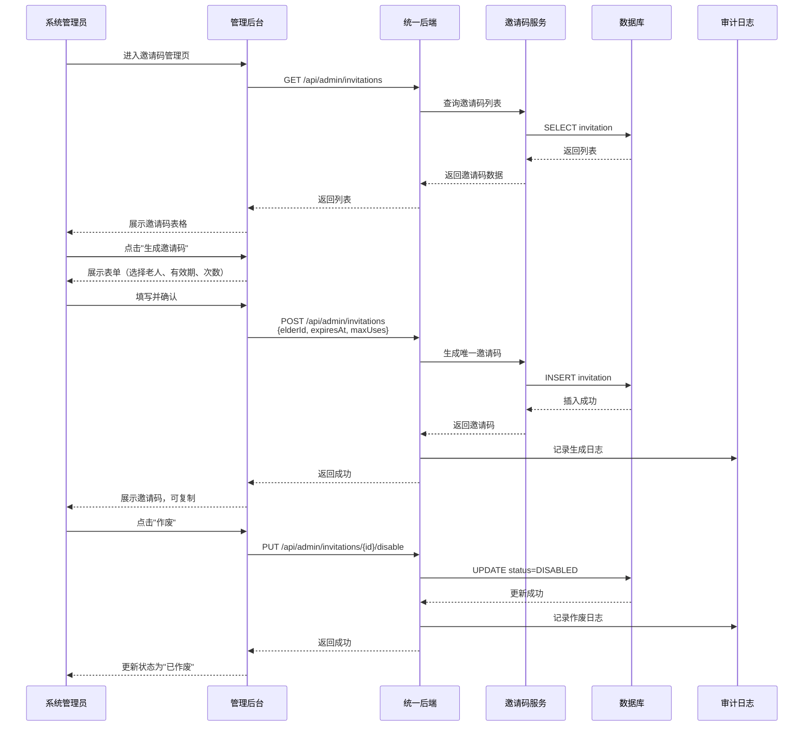
```mermaid
sequenceDiagram
    participant A as 系统管理员
    participant AD as 管理后台
    participant API as 统一后端
    participant Invite as 邀请码服务
    participant DB as 数据库
    participant Audit as 审计日志

    A->>AD: 进入邀请码管理页
    AD->>API: GET /api/admin/invitations
    API->>Invite: 查询邀请码列表
    Invite->>DB: SELECT invitation
    DB-->>Invite: 返回列表
    Invite-->>API: 返回邀请码数据
    API-->>AD: 返回列表
    AD-->>A: 展示邀请码表格

    A->>AD: 点击"生成邀请码"
    AD-->>A: 展示表单（选择老人、有效期、次数）
    A->>AD: 填写并确认
    AD->>API: POST /api/admin/invitations<br>{elderId, expiresAt, maxUses}
    API->>Invite: 生成唯一邀请码
    Invite->>DB: INSERT invitation
    DB-->>Invite: 插入成功
    Invite-->>API: 返回邀请码
    API->>Audit: 记录生成日志
    API-->>AD: 返回成功
    AD-->>A: 展示邀请码，可复制

    A->>AD: 点击"作废"
    AD->>API: PUT /api/admin/invitations/{id}/disable
    API->>DB: UPDATE status=DISABLED
    DB-->>API: 更新成功
    API->>Audit: 记录作废日志
    API-->>AD: 返回成功
    AD-->>A: 更新状态为"已作废"
```

---

### 6.18 短信中转设备管理

**表 6.18 "短信中转设备管理"用例规约**

| 项目 | 内容 |
|------|------|
| 用例名 | 短信中转设备管理 |
| 简要描述 | 管理员管理安卓短信中转设备，包括查看设备状态、配置接收号码、查看中转记录 |
| 参与者 | 系统管理员 |
| 前置条件 | 1. 管理员已登录<br>2. 安卓短信中转端已部署 |
| 后置条件 | 1. 设备配置更新<br>2. 设备状态实时监控 |
| 基本事件流 | 1. 管理员进入短信中转设备管理页面<br>2. 系统展示设备列表，包含：设备ID、接收手机号、服务器地址、消息前缀、在线状态、最后心跳时间<br>3. 管理员可编辑设备配置：接收手机号、服务器地址、消息前缀<br>4. 管理员保存配置<br>5. 后端更新 sms_relay_device 表<br>6. 系统展示短信中转记录列表：发送号码、接收号码、消息内容、接收时间、上传时间、状态<br>7. 管理员可查看设备实时状态（在线/离线），用例结束 |
| 备选事件流 | A-1 设备离线：展示"离线"状态，最后心跳时间超过阈值标红<br>A-2 配置验证失败：接收手机号格式不正确时提示错误<br>A-3 无中转记录：展示"暂无中转记录" |
| 补充约束 | 1. 设备必须校验 HMAC-SHA256 签名<br>2. 心跳间隔默认 60 秒，超过 3 分钟未心跳标记离线<br>3. 中转记录保留 30 天<br>4. 设备配置变更即时生效<br>5. 设备 secret 不可在前端展示 |

**时序图：**

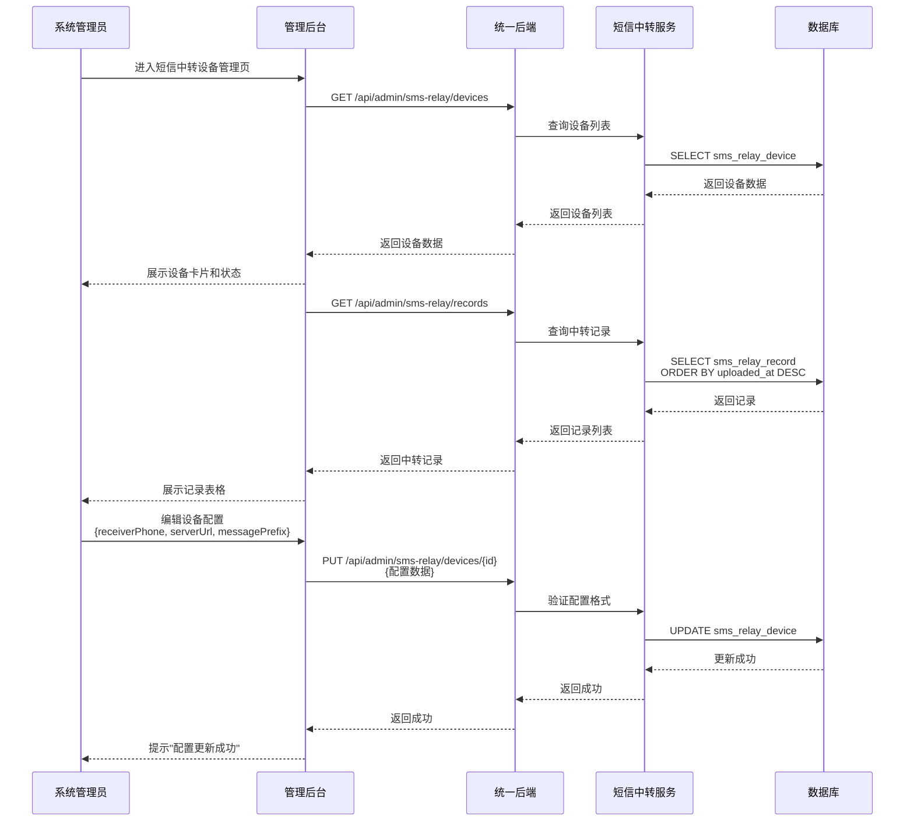
```mermaid
sequenceDiagram
    participant A as 系统管理员
    participant AD as 管理后台
    participant API as 统一后端
    participant Relay as 短信中转服务
    participant DB as 数据库

    A->>AD: 进入短信中转设备管理页
    AD->>API: GET /api/admin/sms-relay/devices
    API->>Relay: 查询设备列表
    Relay->>DB: SELECT sms_relay_device
    DB-->>Relay: 返回设备数据
    Relay-->>API: 返回设备列表
    API-->>AD: 返回设备数据
    AD-->>A: 展示设备卡片和状态

    AD->>API: GET /api/admin/sms-relay/records
    API->>Relay: 查询中转记录
    Relay->>DB: SELECT sms_relay_record<br>ORDER BY uploaded_at DESC
    DB-->>Relay: 返回记录
    Relay-->>API: 返回记录列表
    API-->>AD: 返回中转记录
    AD-->>A: 展示记录表格

    A->>AD: 编辑设备配置<br>{receiverPhone, serverUrl, messagePrefix}
    AD->>API: PUT /api/admin/sms-relay/devices/{id}<br>{配置数据}
    API->>Relay: 验证配置格式
    Relay->>DB: UPDATE sms_relay_device
    DB-->>Relay: 更新成功
    Relay-->>API: 返回成功
    API-->>AD: 返回成功
    AD-->>A: 提示"配置更新成功"
```

---

## 第七章 非功能性需求

### 7.1 性能需求

**表 7.1 性能需求规约**

| 需求编号 | 需求类别 | 需求描述 | 指标值 | 优先级 |
|---------|---------|---------|--------|--------|
| NFR-PERF-001 | 页面加载性能 | 扫码用户端 H5 页面首屏加载时间 | ≤ 3 秒 | 高 |
| NFR-PERF-002 | 页面加载性能 | 统一照护工作台页面首屏加载时间 | ≤ 3 秒 | 高 |
| NFR-PERF-003 | 页面加载性能 | 管理后台页面首屏加载时间 | ≤ 3 秒 | 高 |
| NFR-PERF-004 | API 响应性能 | 普通查询类 API 响应时间（P95） | ≤ 500 ms | 高 |
| NFR-PERF-005 | API 响应性能 | 扫码解析 API 响应时间 | ≤ 2 秒 | 高 |
| NFR-PERF-006 | API 响应性能 | 短信验证会话创建 API 响应时间 | ≤ 1 秒 | 高 |
| NFR-PERF-007 | 并发性能 | 系统支持同时在线用户数 | ≥ 500 人 | 中 |
| NFR-PERF-008 | 并发性能 | 系统支持每秒扫码请求数（QPS） | ≥ 100 | 中 |
| NFR-PERF-009 | 并发性能 | 系统支持每秒短信验证请求数 | ≥ 50 | 中 |
| NFR-PERF-010 | 扫码响应 | 二维码扫描到页面展示总耗时 | ≤ 3 秒 | 高 |
| NFR-PERF-011 | 数据库性能 | 复杂查询（含关联、分页）响应时间 | ≤ 1 秒 | 中 |
| NFR-PERF-012 | 资源占用 | 后端服务内存占用（稳定运行期） | ≤ 2 GB | 中 |
| NFR-PERF-013 | 资源占用 | 安卓短信中转端后台运行内存占用 | ≤ 150 MB | 中 |

#### 7.1.1 性能优化策略

1. **前端优化**：使用 Vite 构建工具、代码分割、懒加载、静态资源 CDN 加速
2. **后端优化**：数据库连接池、查询索引优化、常用数据缓存（Redis）
3. **数据库优化**：关键表建立索引（如 elder_id、status、created_at），分页查询限制单页最大 100 条
4. **二维码解析优化**：AES 解密使用硬件加速（如可用），token 缓存热点数据

---

### 7.2 安全需求

**表 7.2 安全需求规约**

| 需求编号 | 需求类别 | 需求描述 | 实现方式 | 优先级 |
|---------|---------|---------|---------|--------|
| NFR-SEC-001 | 数据加密 | 敏感字段（姓名、手机号、身份证号、健康档案、用药信息）加密存储 | AES-256-GCM 对称加密 | 高 |
| NFR-SEC-002 | 数据加密 | 二维码 Token 加密传输和存储 | AES-256-GCM，随机 IV | 高 |
| NFR-SEC-003 | 认证机制 | 用户登录认证 | JWT Token（HS256 签名） | 高 |
| NFR-SEC-004 | 认证机制 | Token 过期和刷新机制 | JWT 过期时间 2 小时 | 高 |
| NFR-SEC-005 | 密码安全 | 用户密码存储 | bcrypt 算法哈希（cost ≥ 10） | 高 |
| NFR-SEC-006 | 密码安全 | 管理员密码定期更换策略 | 建议 90 天强制更换 | 中 |
| NFR-SEC-007 | 数据隔离 | 志愿者数据范围隔离 | DataScopeInterceptor 拦截，仅查询负责老人 | 高 |
| NFR-SEC-008 | 数据隔离 | 家属数据范围隔离 | 仅查询绑定老人数据 | 高 |
| NFR-SEC-009 | 接口安全 | 短信中转设备请求签名验证 | HMAC-SHA256，含时间戳和随机数防重放 | 高 |
| NFR-SEC-010 | 接口安全 | 签名时间窗口 | ±5 分钟内有效 | 高 |
| NFR-SEC-011 | 接口安全 | 随机数（nonce）防重放 | 服务端存储 nonce，5 分钟内不可复用 | 高 |
| NFR-SEC-012 | 验证安全 | 短信验证会话有效期 | PENDING 状态 5 分钟，VERIFIED 后授权窗口 10 分钟 | 高 |
| NFR-SEC-013 | 验证安全 | 访客身份信息加密存储 | AES-256-GCM 加密姓名、手机号、身份证号 | 高 |
| NFR-SEC-014 | 审计安全 | 关键操作记录审计日志 | 记录操作人、角色、IP、对象、类型、结果 | 高 |
| NFR-SEC-015 | 审计安全 | 审计日志不可篡改 | 日志表禁止 UPDATE/DELETE，仅 INSERT | 高 |
| NFR-SEC-016 | 传输安全 | 生产环境全站 HTTPS | TLS 1.2+ 加密传输 | 高 |
| NFR-SEC-017 | 输入安全 | SQL 注入防护 | 使用参数化查询（JdbcTemplate/PreparedStatement） | 高 |
| NFR-SEC-018 | 输入安全 | XSS 防护 | 前端转义输出，后端校验输入 | 高 |
| NFR-SEC-019 | 访问控制 | 登录失败锁定 | 连续 5 次失败锁定 30 分钟 | 中 |
| NFR-SEC-020 | 访问控制 | 后台接口 IP 白名单（可选） | 限制管理后台访问来源 IP | 低 |

#### 7.2.1 安全架构示意

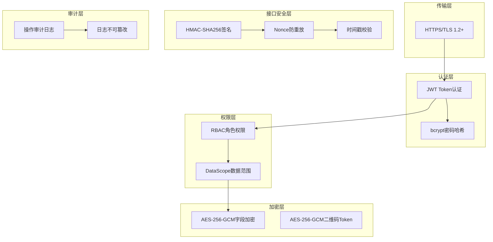
```mermaid
flowchart TB
    subgraph 传输层
        TLS[HTTPS/TLS 1.2+]
    end

    subgraph 认证层
        JWT[JWT Token认证]
        BC[bcrypt密码哈希]
    end

    subgraph 加密层
        AES[AES-256-GCM字段加密]
        QR[AES-256-GCM二维码Token]
    end

    subgraph 权限层
        RBAC[RBAC角色权限]
        DS[DataScope数据范围]
    end

    subgraph 接口安全层
        SIGN[HMAC-SHA256签名]
        NONCE[Nonce防重放]
        TS[时间戳校验]
    end

    subgraph 审计层
        AUDIT[操作审计日志]
        IMMU[日志不可篡改]
    end

    TLS --> JWT
    JWT --> BC
    JWT --> RBAC
    RBAC --> DS
    DS --> AES
    SIGN --> NONCE
    NONCE --> TS
    AUDIT --> IMMU
```

---

### 7.3 可用性需求

**表 7.3 可用性需求规约**

| 需求编号 | 需求类别 | 需求描述 | 验收标准 | 优先级 |
|---------|---------|---------|---------|--------|
| NFR-AVA-001 | 响应式布局 | 扫码用户端适配各种手机屏幕 | 支持 320px - 428px 宽度，布局不错乱 | 高 |
| NFR-AVA-002 | 响应式布局 | 统一照护工作台适配手机和平板 | 支持手机竖屏、平板横屏 | 高 |
| NFR-AVA-003 | 响应式布局 | 管理后台适配桌面端和笔记本 | 支持 1366px 及以上宽度 | 中 |
| NFR-AVA-004 | 错误提示 | 友好的错误提示信息 | 不使用技术错误码，使用用户可理解的中文提示 | 高 |
| NFR-AVA-005 | 错误提示 | 网络异常处理 | 网络断开时展示"网络异常，请检查网络后重试" | 高 |
| NFR-AVA-006 | 离线能力 | 安卓短信中转端离线缓存 | 设备无网络时缓存短信，恢复网络后批量上传 | 高 |
| NFR-AVA-007 | 离线能力 | 安卓短信中转端后台保活 | 系统杀后台后自动重启或引导用户设置白名单 | 中 |
| NFR-AVA-008 | 加载状态 | 操作加载反馈 | 按钮点击后展示加载状态，防止重复提交 | 高 |
| NFR-AVA-009 | 空状态 | 无数据页面展示 | 列表为空时展示友好空状态插图和引导文案 | 中 |
| NFR-AVA-010 | 兼容性 | 扫码端浏览器兼容 | 支持微信内置浏览器、Chrome、Safari 最新两版 | 高 |
| NFR-AVA-011 | 兼容性 | 管理后台浏览器兼容 | 支持 Chrome、Firefox、Edge 最新两版 | 中 |

---

### 7.4 可靠性需求

**表 7.4 可靠性需求规约**

| 需求编号 | 需求类别 | 需求描述 | 验收标准 | 优先级 |
|---------|---------|---------|---------|--------|
| NFR-REL-001 | 数据备份 | 数据库定期备份 | 每日自动全量备份，保留 30 天 | 高 |
| NFR-REL-002 | 数据备份 | 备份恢复演练 | 每季度执行一次备份恢复验证 | 中 |
| NFR-REL-003 | 故障容错 | 后端服务异常处理 | 全局异常处理，不暴露内部错误信息 | 高 |
| NFR-REL-004 | 故障容错 | 数据库连接故障 | 连接池自动重连，失败时返回服务不可用提示 | 高 |
| NFR-REL-005 | 心跳监控 | 短信中转设备心跳检测 | 设备每 60 秒上报心跳，服务端检测离线状态 | 高 |
| NFR-REL-006 | 心跳监控 | 设备离线告警 | 设备超过 3 分钟未心跳，标记离线并通知管理员 | 中 |
| NFR-REL-007 | 会话容错 | 验证会话过期处理 | 会话过期后自动清理，拒绝过期会话访问 | 高 |
| NFR-REL-008 | 服务可用性 | 系统整体可用性 | 年度可用性 ≥ 99.5%（排除计划维护时间） | 高 |
| NFR-REL-009 | 降级策略 | 短信中转服务不可用降级 | 设备离线时引导用户使用实名登记验证 | 高 |
| NFR-REL-010 | 降级策略 | 数据库只读降级 | 主库故障时可切换只读模式，保证查询可用 | 低 |

---

### 7.5 可维护性需求

**表 7.5 可维护性需求规约**

| 需求编号 | 需求类别 | 需求描述 | 验收标准 | 优先级 |
|---------|---------|---------|---------|--------|
| NFR-MAINT-001 | 数据库迁移 | 使用 Flyway 管理数据库版本 | 所有 schema 变更通过 Flyway migration 脚本执行 | 高 |
| NFR-MAINT-002 | 数据库迁移 | 迁移脚本命名规范 | 遵循 V{版本号}__{描述}.sql 格式 | 高 |
| NFR-MAINT-003 | 数据库迁移 | 迁移脚本幂等性 | 重复执行不报错，使用 IF NOT EXISTS / ON DUPLICATE KEY | 高 |
| NFR-MAINT-004 | 模块化架构 | 后端代码模块化组织 | 按模块划分：scan、elder、volunteer、family、qrcode、nameplate、smsrelay、invitation、rbac、audit、admin | 高 |
| NFR-MAINT-005 | 模块化架构 | 前端工程化 | 扫码端、工作台、管理后台独立工程，独立构建部署 | 高 |
| NFR-MAINT-006 | 日志规范 | 后端统一日志格式 | 使用 SLF4J + Logback，输出级别、时间、线程、类名、消息 | 高 |
| NFR-MAINT-007 | 日志规范 | 关键操作日志 | 所有写操作记录 INFO 级别日志，异常记录 ERROR 级别 | 高 |
| NFR-MAINT-008 | 日志规范 | 日志轮转 | 按天轮转，单文件不超过 100MB，保留 30 天 | 中 |
| NFR-MAINT-009 | 代码规范 | Java 代码规范 | 遵循阿里巴巴 Java 开发手册 | 中 |
| NFR-MAINT-010 | 代码规范 | TypeScript 代码规范 | 启用 ESLint + Prettier，严格类型检查 | 中 |
| NFR-MAINT-011 | 文档规范 | API 文档自动生成 | 使用 OpenAPI/Swagger 自动生成接口文档 | 中 |
| NFR-MAINT-012 | 监控告警 | 应用健康检查 | 提供 /actuator/health 端点，支持存活和就绪探针 | 中 |
| NFR-MAINT-013 | 配置管理 | 环境配置分离 | 开发、测试、生产环境配置分离，敏感配置不提交仓库 | 高 |

#### 7.5.1 Flyway 迁移脚本示例规范

```sql
-- V1__init_schema.sql
CREATE TABLE IF NOT EXISTS app_user (
  id VARCHAR(64) PRIMARY KEY,
  account VARCHAR(64) NOT NULL,
  password_hash VARCHAR(128) NOT NULL,
  role VARCHAR(32) NOT NULL,
  status VARCHAR(20) NOT NULL DEFAULT 'ACTIVE',
  created_at TIMESTAMP NOT NULL DEFAULT CURRENT_TIMESTAMP,
  updated_at TIMESTAMP NOT NULL DEFAULT CURRENT_TIMESTAMP ON UPDATE CURRENT_TIMESTAMP,
  UNIQUE KEY uk_app_user_account_role (account, role)
);

-- V2__add_new_feature.sql
ALTER TABLE elder
  ADD COLUMN IF NOT EXISTS residence VARCHAR(128) NULL AFTER relationship;
```

---

## 附录：用例与参与者关系总览


```mermaid
flowchart TB
    subgraph 参与者
        Visitor[访客]
        Volunteer[志愿者]
        Family[家属]
        Admin[系统管理员]
    end

    subgraph 扫码用户端
        UC1[UC1: 访问扫码首页]
        UC2[UC2: 短信验证查看敏感信息]
    end

    subgraph 统一照护工作台
        UC3[UC3: 志愿者登录]
        UC4[UC4: 家属登录]
        UC6[UC6: 查看老人档案]
        UC7[UC7: 填写老人基本信息]
        UC8[UC8: 填写用药记录]
        UC9[UC9: 填写量表评估]
    end

    subgraph 管理后台
        UC5[UC5: 管理后台登录]
        UC10[UC10: 生成二维码名牌]
        UC11[UC11: 查看仪表盘]
        UC12[UC12: 老人档案管理]
        UC13[UC13: 志愿者管理]
        UC14[UC14: 角色权限管理]
        UC15[UC15: 操作日志审计]
        UC17[UC17: 邀请码管理]
        UC18[UC18: 短信中转设备管理]
    end

    subgraph 注册绑定
        UC16[UC16: 家属注册与绑定]
    end

    Visitor --> UC1
    Visitor --> UC2
    Volunteer --> UC3
    Volunteer --> UC6
    Volunteer --> UC7
    Volunteer --> UC8
    Volunteer --> UC9
    Family --> UC4
    Family --> UC6
    Family --> UC8
    Family --> UC16
    Admin --> UC5
    Admin --> UC10
    Admin --> UC11
    Admin --> UC12
    Admin --> UC13
    Admin --> UC14
    Admin --> UC15
    Admin --> UC17
    Admin --> UC18
```
