# SilverLink Care（智联名牌）- 软件需求规格说明书

***

## 目录

1. [引言](#1-引言)
2. [业务需求分析](#2-业务需求分析)
3. [系统需求分析](#3-系统需求分析)
4. [系统功能示意](#4-系统功能示意)
5. [涉众分析](#5-涉众分析)
6. [用例规约](#6-用例规约)
7. [非功能性需求](#7-非功能性需求)
8. [数据库设计](#8-数据库设计)
9. [软件界面设计](#9-软件界面设计)
10. [附录](#10-附录)

***

## 1. 引言

### 1.1 编写目的

本文档详细描述了"SilverLink Care（智联名牌）"项目的软件需求规格。本文档面向项目经理、开发人员、测试人员、UI设计师以及最终用户，作为系统开发、测试和验收的依据。

### 1.2 项目背景

SilverLink Care（智联名牌）是一款面向老年人群体的智能二维码名牌系统。每位老人佩戴一枚实体名牌，名牌背面印有专属二维码。路人、医护人员或家属通过微信扫描该二维码，即可在手机上查看老人的基础救助信息（姓名、紧急联系人、血型、过敏史等）。当需要查看更敏感的健康档案、用药记录或心理量表数据时，系统通过短信验证机制完成身份核验，确保信息安全。

系统采用"志愿者-家属"协同照护模式：
- **志愿者**：通过统一照护工作台管理负责的老人，填写健康档案、维护用药信息、录入心理量表评估数据
- **家属**：通过邀请码注册家属账号，查看绑定老人的信息，维护紧急联系人，管理名牌二维码
- **管理员**：通过管理后台进行全局数据管理、账号权限分配、审计日志查看、短信中转设备管理

### 1.3 定义与缩写

| 术语/缩写 | 定义 |
| --------- | ---- |
| JWT | JSON Web Token，无状态认证令牌 |
| REST | Representational State Transfer，表述性状态转移 |
| API | Application Programming Interface，应用程序接口 |
| JPA | Java Persistence API，Java持久化API |
| AES-GCM | Advanced Encryption Standard - Galois/Counter Mode，高级加密标准认证加密模式 |
| PHQ-9 | Patient Health Questionnaire-9，患者健康问卷-9项（抑郁评估） |
| GAD-7 | Generalized Anxiety Disorder-7，广泛性焦虑障碍量表-7项 |
| UCLA | UCLA Loneliness Scale，UCLA孤独量表 |
| QR Code | Quick Response Code，快速响应矩阵码 |
| SMS Relay | Short Message Service Relay，短信中继服务 |
| RBAC | Role-Based Access Control，基于角色的访问控制 |
| H5 | HTML5 Mobile Web，基于HTML5的移动端网页应用 |
| CI/CD | Continuous Integration / Continuous Deployment，持续集成/持续部署 |

### 1.4 参考资料

1. 《中国老龄产业发展报告（2024）》，中国老龄科学研究中心
2. 《老年人跌倒干预技术指南》，国家卫生健康委员会
3. Spring Boot 3.1.5 官方文档：https://spring.io/projects/spring-boot
4. React 19 官方文档：https://react.dev/
5. JWT RFC 7519 标准：https://tools.ietf.org/html/rfc7519
6. PHQ-9 量表使用规范（Pfizer Inc.）
7. GAD-7 量表使用规范（Spitzer et al., 2006）
8. 本项目《开发规划.md》（01-扫码用户端、02-志愿者填写端、03-管理后台端）
9. 本项目《SAG_DEVELOPMENT.md》（04-统一后端）
10. OWASP Top 10 2021 安全标准

***

## 2. 业务需求分析

### 2.1 业务背景

#### 2.1.1 行业现状

**人口老龄化加速**：中国正加速步入老龄化社会。截至2025年，60岁及以上老年人口已突破3亿，占总人口比例超过20%。独居老人、空巢老人数量持续攀升，老年人在外出时突发疾病、走失、意外摔倒等安全风险日益突出。

**智慧养老兴起**：物联网、移动互联网、大数据等技术在养老领域的应用日益广泛，智能穿戴设备、远程健康监测、紧急呼叫系统等智慧养老产品层出不穷。

**数字鸿沟依然存在**：部分老年人对智能手机使用存在困难，需要一种简单、低门槛的技术方案，让老年人无需操作任何电子设备即可获得数字化安全保障。

#### 2.1.2 现有问题

| 问题类型 | 具体描述 |
| -------- | -------- |
| 信息获取延迟 | 老人外出突发状况时，路人无法快速获取其身份和紧急联系人信息 |
| 纸质卡片局限 | 传统纸质联系卡信息容量有限、易损坏、更新困难 |
| 用药安全隐患 | 急救人员不了解老人当前用药情况，可能产生药物相互作用风险 |
| 心理健康忽视 | 老年人孤独感、抑郁、焦虑等心理问题缺乏系统评估和跟踪 |
| 数据孤岛 | 志愿者、家属、医疗机构之间信息不互通 |
| 隐私保护不足 | 老人健康信息随意展示，缺乏分级授权机制 |

### 2.2 业务目标

#### 2.2.1 总体目标

构建一套以二维码智能名牌为核心的老人安全照护系统，实现"一扫即知、分级授权、协同照护、全程留痕"，让老人在外出时获得全天候的安全保障，同时保护其隐私数据。

#### 2.2.2 具体目标

| 目标编号 | 目标描述 | 衡量指标 | 目标值 |
| -------- | -------- | -------- | ------ |
| BO-001 | 缩短紧急信息获取时间 | 扫码到获取基础信息平均耗时 | ≤ 3 秒 |
| BO-002 | 保障敏感信息安全 | 敏感信息查看前验证覆盖率 | 100% |
| BO-003 | 提升志愿者工作效率 | 单名老人档案填写平均耗时 | ≤ 10 分钟 |
| BO-004 | 保障数据安全 | 敏感数据加密存储覆盖率 | 100% |
| BO-005 | 系统可用性 | 核心服务月度可用性 | ≥ 99.5% |
| BO-006 | 审计可追溯 | 关键操作日志记录覆盖率 | 100% |
| BO-007 | 多终端适配 | 支持扫码端浏览器类型 | 微信内置浏览器、Safari、Chrome |
| BO-008 | 短信验证可靠性 | 短信中转成功率 | ≥ 95% |

### 2.3 业务范围

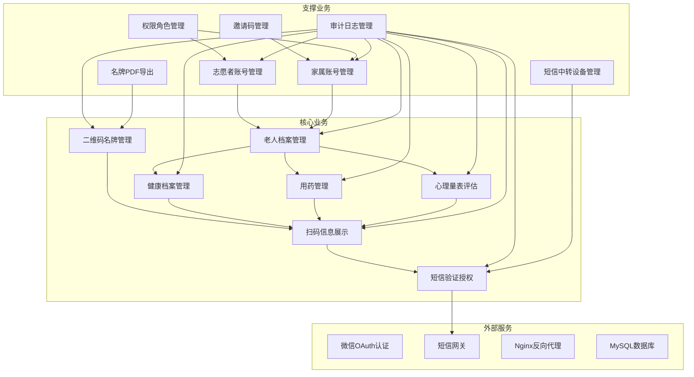

### 2.4 业务规则

#### 2.4.1 账号安全规则

| 规则编号 | 规则名称 | 规则描述 |
| -------- | -------- | -------- |
| BR-001 | 账号锁定 | 连续登录失败 5 次后，账号自动锁定 30 分钟 |
| BR-002 | 密码复杂度 | 密码长度 8-20 位，必须包含字母、数字，区分大小写 |
| BR-003 | 会话超时 | 管理员会话 2 小时无操作自动失效；志愿者/家属会话 24 小时失效 |
| BR-004 | JWT 有效期 | 扫码用户 JWT 短时 Token 有效期 2 小时；工作台用户 24 小时 |

#### 2.4.2 数据安全规则

| 规则编号 | 规则名称 | 规则描述 |
| -------- | -------- | -------- |
| BR-005 | 数据加密 | 老人姓名、手机号、身份证号等 PII 数据采用 AES-GCM 加密存储 |
| BR-006 | 传输加密 | 全站 HTTPS，TLS 1.2+ |
| BR-007 | 二维码安全 | 二维码 URL 仅包含加密 Token，不包含任何明文身份信息 |
| BR-008 | 脱敏展示 | 手机号默认展示为 138****1234 格式；身份证号展示前 3 后 4 位 |
| BR-009 | 分级授权 | 基础信息（姓名、紧急联系人）无需验证即可查看；健康档案、用药、量表需短信验证 |

#### 2.4.3 短信验证规则

| 规则编号 | 规则名称 | 规则描述 |
| -------- | -------- | -------- |
| BR-010 | 验证方式 | 用户向固定接收号码发送指定格式短信（如 `SL 483921`）完成验证 |
| BR-011 | 验证码有效期 | 单次验证会话有效期 10 分钟 |
| BR-012 | 验证次数限制 | 单会话最多允许 3 次验证尝试 |
| BR-013 | 设备签名认证 | 安卓短信中转端请求必须携带有效设备密钥和请求签名 |

#### 2.4.4 数据范围规则

| 规则编号 | 规则名称 | 规则描述 |
| -------- | -------- | -------- |
| BR-014 | 志愿者数据范围 | 志愿者只能查看和管理本人负责的老人数据 |
| BR-015 | 家属数据范围 | 家属只能查看和管理已绑定老人的数据 |
| BR-016 | 管理员数据范围 | 管理员可查看全量数据，但敏感字段仍需脱敏 |

#### 2.4.5 审计规则

| 规则编号 | 规则名称 | 规则描述 |
| -------- | -------- | -------- |
| BR-017 | 全量审计 | 所有登录、查看、修改、删除操作必须记录审计日志 |
| BR-018 | 审计字段 | 每条审计日志必须包含：操作人、角色、IP 地址、操作对象、操作类型、结果、时间戳 |
| BR-019 | 日志保留 | 审计日志保留不少于 2 年 |

***

## 3. 系统需求分析

### 3.1 系统目标

| 目标编号 | 目标描述 | 优先级 |
| -------- | -------- | ------ |
| SO-001 | 支持高并发扫码查询，QPS ≥ 1000 | 高 |
| SO-002 | 端到端数据加密，保障老人隐私安全 | 高 |
| SO-003 | 多端统一用户体验（H5、Web、Android） | 高 |
| SO-004 | 完整的 RBAC 权限管理体系 | 高 |
| SO-005 | 全链路审计日志，支持行为追溯 | 高 |
| SO-006 | 短信中转高可用，支持多设备接入 | 中 |
| SO-007 | 支持名牌批量导出 PDF | 中 |
| SO-008 | 系统水平扩展能力，支持未来业务增长 | 中 |

### 3.2 系统架构

#### 3.2.1 整体架构

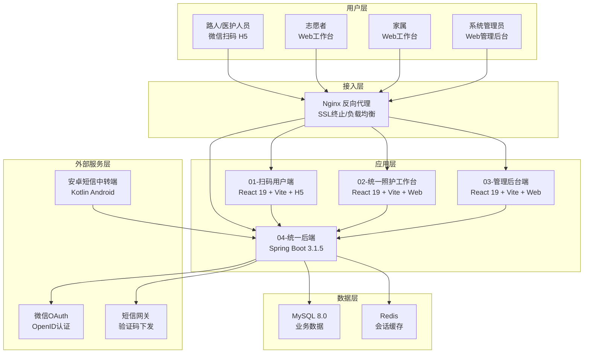

#### 3.2.2 技术栈

| 层级 | 技术 | 版本 | 说明 |
| ---- | ---- | ---- | ---- |
| 前端-扫码用户端 | React | 19.x | UI 框架 |
| | TypeScript | 5.x | 类型系统 |
| | Vite | 6.x | 构建工具 |
| | lucide-react | latest | 图标库 |
| 前端-统一照护工作台 | React | 19.x | UI 框架 |
| | TypeScript | 5.x | 类型系统 |
| | Vite | 6.x | 构建工具 |
| | HashRouter | - | 前端路由（支持志愿者/家属双模式） |
| 前端-管理后台端 | React | 19.x | UI 框架 |
| | TypeScript | 5.x | 类型系统 |
| | Vite | 6.x | 构建工具 |
| | CSS 变量 | - | 主题定制 |
| 后端 | Spring Boot | 3.1.5 | 应用框架 |
| | Java | 17 | 编程语言 |
| | Spring Security | 6.x | 安全认证 |
| | Spring Data JPA | 3.x | 数据持久化 |
| | JWT (jjwt) | 0.12.3 | Token 认证 |
| | Flyway | 10.x | 数据库迁移 |
| | MySQL Connector/J | 8.x | 数据库驱动 |
| | Apache PDFBox | 2.0.31 | PDF 生成 |
| | ZXing | 3.5.3 | 二维码生成 |
| | SpringDoc OpenAPI | 2.2.0 | API 文档 |
| 安卓端 | Kotlin | 1.9+ | 编程语言 |
| | Android SDK | API 26+ | 运行环境 |
| | WorkManager | - | 后台任务调度 |
| | Retrofit/OkHttp | - | HTTP 通信 |
| 数据库 | MySQL | 8.0+ | 关系型数据库 |
| 基础设施 | Nginx | 1.24+ | 反向代理 |
| | Ubuntu Server | 22.04 LTS | 服务器操作系统 |
| | 域名 | sxyq27.online | 公网访问 |

### 3.3 功能需求

#### 3.3.1 功能模块划分

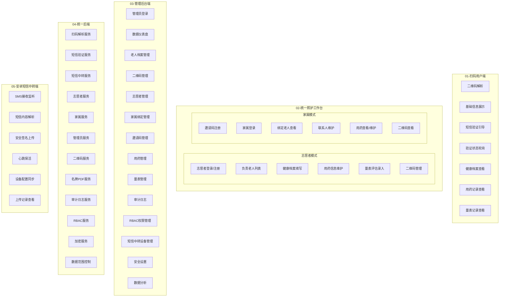

#### 3.3.2 功能需求清单

##### 01-扫码用户端功能需求

| 模块 | 功能编号 | 功能名称 | 功能描述 | 优先级 |
| ---- | -------- | -------- | -------- | ------ |
| 二维码解析 | SCAN-001 | 二维码Token解析 | 扫描名牌二维码，解析 AES-GCM 加密的 Token，获取老人基础信息 | 高 |
| 基础信息 | SCAN-002 | 基础救助信息展示 | 展示姓名（部分脱敏）、年龄、血型、过敏史、紧急联系人一键拨打 | 高 |
| 验证引导 | SCAN-003 | 短信验证会话创建 | 点击敏感信息入口后，创建验证会话，返回固定接收号码和短信内容 | 高 |
| 验证引导 | SCAN-004 | 短信内容复制 | 支持一键复制接收号码和短信内容 | 中 |
| 验证状态 | SCAN-005 | 验证状态轮询 | 定时轮询验证状态：等待中/已验证/已过期/内容不匹配 | 高 |
| 验证状态 | SCAN-006 | 访客身份登记验证 | 支持输入姓名、手机号、身份证号进行身份登记验证 | 中 |
| 健康档案 | SCAN-007 | 健康档案查看 | 验证通过后展示身高、体重、BMI、既往病史、手术史等 | 高 |
| 用药记录 | SCAN-008 | 主要用药查看 | 验证通过后展示药品名称、剂量、用法、用药时间 | 高 |
| 量表记录 | SCAN-009 | 量表摘要查看 | 验证通过后展示 PHQ-9、GAD-7、UCLA 等量表最近评估结果 | 高 |
| 量表记录 | SCAN-010 | 量表详情查看 | 查看某次量表评估的详细问题和得分 | 中 |
| 页面保护 | SCAN-011 | 内容防复制保护 | 禁止长按复制、禁止截图提示（Android） | 中 |
| 微信集成 | SCAN-012 | 微信OpenID认证 | 通过微信 OAuth 获取 OpenID，用于匿名用户标识 | 中 |

##### 02-统一照护工作台 - 志愿者模式功能需求

| 模块 | 功能编号 | 功能名称 | 功能描述 | 优先级 |
| ---- | -------- | -------- | -------- | ------ |
| 认证 | VOL-001 | 志愿者登录 | 账号密码登录，返回 JWT Token | 高 |
| 认证 | VOL-002 | 邀请码注册 | 通过有效邀请码完成志愿者注册 | 高 |
| 老人管理 | VOL-003 | 负责老人列表 | 查看本人负责的所有老人列表，支持搜索 | 高 |
| 老人管理 | VOL-004 | 老人详情查看 | 查看老人完整档案信息 | 高 |
| 老人管理 | VOL-005 | 老人档案创建 | 创建新的老人档案，填写基本信息 | 高 |
| 健康档案 | VOL-006 | 健康档案填写 | 填写/更新老人的身高、体重、血型、过敏史、既往病史等 | 高 |
| 用药管理 | VOL-007 | 用药信息维护 | 新增、编辑、删除老人的用药记录 | 高 |
| 量表评估 | VOL-008 | PHQ-9量表录入 | 录入抑郁症状评估量表 | 高 |
| 量表评估 | VOL-009 | GAD-7量表录入 | 录入焦虑症状评估量表 | 高 |
| 量表评估 | VOL-010 | UCLA量表录入 | 录入孤独感评估量表 | 高 |
| 二维码 | VOL-011 | 二维码查看 | 查看负责老人的二维码 | 中 |
| 二维码 | VOL-012 | 二维码重新生成 | 重新生成老人的二维码 | 中 |
| 二维码 | VOL-013 | 二维码禁用申请 | 申请禁用老人的二维码 | 中 |
| 个人中心 | VOL-014 | 个人资料查看 | 查看当前志愿者账号信息 | 中 |
| 个人中心 | VOL-015 | 个人资料修改 | 修改姓名、手机号等个人信息 | 中 |

##### 02-统一照护工作台 - 家属模式功能需求

| 模块 | 功能编号 | 功能名称 | 功能描述 | 优先级 |
| ---- | -------- | -------- | -------- | ------ |
| 注册登录 | FAM-001 | 邀请码落地页 | 通过邀请码链接进入注册页面，预览邀请信息 | 高 |
| 注册登录 | FAM-002 | 短信验证码发送 | 向注册手机号发送验证码短信 | 高 |
| 注册登录 | FAM-003 | 家属注册 | 使用邀请码和短信验证码完成注册 | 高 |
| 注册登录 | FAM-004 | 家属登录 | 手机号密码登录 | 高 |
| 老人查看 | FAM-005 | 绑定老人列表 | 查看已绑定的老人列表 | 高 |
| 老人查看 | FAM-006 | 老人详情查看 | 查看绑定老人的详细信息 | 高 |
| 联系人 | FAM-007 | 紧急联系人维护 | 添加、修改、删除老人的紧急联系人 | 高 |
| 用药管理 | FAM-008 | 用药查看 | 查看绑定老人的用药记录 | 高 |
| 用药管理 | FAM-009 | 用药新增 | 新增用药记录 | 高 |
| 用药管理 | FAM-010 | 用药修改 | 修改现有用药记录 | 高 |
| 用药管理 | FAM-011 | 用药删除 | 删除用药记录 | 高 |
| 二维码 | FAM-012 | 二维码查看 | 查看绑定老人的二维码图片和链接 | 中 |
| 二维码 | FAM-013 | 二维码禁用申请 | 申请禁用二维码 | 中 |

##### 03-管理后台端功能需求

| 模块 | 功能编号 | 功能名称 | 功能描述 | 优先级 |
| ---- | -------- | -------- | -------- | ------ |
| 认证 | ADM-001 | 管理员登录 | 系统管理员账号密码登录 | 高 |
| 仪表盘 | ADM-002 | 数据仪表盘 | 展示老人数量、志愿者数量、家属数量、今日扫码次数等核心指标 | 高 |
| 老人档案 | ADM-003 | 老人档案列表 | 查看全部老人档案列表，支持搜索和筛选 | 高 |
| 老人档案 | ADM-004 | 老人档案创建 | 创建新的老人档案 | 高 |
| 老人档案 | ADM-005 | 老人档案编辑 | 编辑老人档案信息 | 高 |
| 老人档案 | ADM-006 | 老人档案删除 | 删除老人档案 | 高 |
| 老人档案 | ADM-007 | 老人状态管理 | 启用/禁用老人档案 | 中 |
| 二维码 | ADM-008 | 二维码列表 | 查看所有二维码记录 | 高 |
| 二维码 | ADM-009 | 二维码生成 | 为指定老人生成二维码 | 高 |
| 二维码 | ADM-010 | 二维码重新生成 | 重新生成二维码 | 中 |
| 二维码 | ADM-011 | 二维码禁用 | 禁用指定二维码 | 中 |
| 二维码 | ADM-012 | 二维码绑定中转设备 | 将二维码与安卓短信中转设备绑定 | 中 |
| 志愿者 | ADM-013 | 志愿者列表 | 查看全部志愿者列表 | 高 |
| 志愿者 | ADM-014 | 志愿者创建 | 创建志愿者账号 | 高 |
| 志愿者 | ADM-015 | 志愿者编辑 | 编辑志愿者信息 | 高 |
| 志愿者 | ADM-016 | 志愿者删除 | 删除志愿者账号 | 高 |
| 志愿者 | ADM-017 | 志愿者数据范围设置 | 设置志愿者负责的老人范围 | 中 |
| 家属管理 | ADM-018 | 家属绑定列表 | 查看所有家属绑定关系 | 高 |
| 家属管理 | ADM-019 | 家属绑定解除 | 解除家属与老人的绑定关系 | 高 |
| 邀请码 | ADM-020 | 邀请码列表 | 查看所有邀请码 | 高 |
| 邀请码 | ADM-021 | 邀请码创建 | 创建新的邀请码 | 高 |
| 邀请码 | ADM-022 | 邀请码禁用 | 禁用邀请码 | 中 |
| 邀请码 | ADM-023 | 邀请码删除 | 删除邀请码 | 中 |
| 用药管理 | ADM-024 | 用药记录查看 | 查看指定老人或全部用药记录 | 中 |
| 量表管理 | ADM-025 | 量表记录查看 | 查看指定老人的量表评估记录 | 中 |
| 审计日志 | ADM-026 | 审计日志列表 | 查看所有审计日志，支持按操作人、操作类型、结果筛选 | 高 |
| 审计日志 | ADM-027 | 审计日志导出 | 导出审计日志为 CSV | 中 |
| 权限管理 | ADM-028 | 角色列表 | 查看系统角色（志愿者/家属/系统管理员） | 高 |
| 权限管理 | ADM-029 | 权限列表 | 查看系统权限定义 | 高 |
| 权限管理 | ADM-030 | 角色权限分配 | 为指定用户分配角色 | 高 |
| 短信中转 | ADM-031 | 中转设备列表 | 查看所有安卓短信中转设备 | 高 |
| 短信中转 | ADM-032 | 中转记录查看 | 查看短信中转历史记录 | 高 |
| 短信中转 | ADM-033 | 验证会话查看 | 查看扫码验证会话状态 | 中 |
| 短信中转 | ADM-034 | 设备配置修改 | 修改中转设备配置 | 中 |
| 安全设置 | ADM-035 | 安全策略配置 | 配置密码策略、会话超时等安全参数 | 中 |
| 数据分析 | ADM-036 | 扫码统计 | 查看扫码次数、验证成功率等统计 | 中 |
| 数据分析 | ADM-037 | 量表统计 | 查看各量表评估分布和趋势 | 低 |

##### 04-统一后端功能需求

| 模块 | 功能编号 | 功能名称 | 功能描述 | 优先级 |
| ---- | -------- | -------- | -------- | ------ |
| 扫码服务 | BE-001 | 二维码Token解析 | 解析 AES-GCM 加密的二维码 Token，返回老人基础信息 | 高 |
| 扫码服务 | BE-002 | 微信OpenID解析 | 通过微信授权码解析 OpenID | 中 |
| 扫码服务 | BE-003 | 验证会话创建 | 创建短信验证会话，生成随机验证码 | 高 |
| 扫码服务 | BE-004 | 验证状态查询 | 查询验证会话当前状态 | 高 |
| 扫码服务 | BE-005 | 身份登记验证 | 处理访客身份登记验证请求 | 中 |
| 扫码服务 | BE-006 | 会话授权校验 | 校验验证会话是否有效，授权敏感信息访问 | 高 |
| 扫码服务 | BE-007 | 健康档案查询 | 按授权查询老人健康档案 | 高 |
| 扫码服务 | BE-008 | 用药记录查询 | 按授权查询老人用药记录 | 高 |
| 扫码服务 | BE-009 | 量表记录查询 | 按授权查询老人量表记录 | 高 |
| 短信服务 | BE-010 | 验证码发送 | 向指定手机号发送验证码短信 | 中 |
| 短信服务 | BE-011 | 验证码校验 | 校验用户输入的验证码 | 中 |
| 短信中转 | BE-012 | 入站短信接收 | 接收安卓端上传的短信内容 | 高 |
| 短信中转 | BE-013 | 心跳处理 | 处理安卓端心跳，更新设备在线状态 | 高 |
| 短信中转 | BE-014 | 设备配置下发 | 向安卓端下发设备配置 | 高 |
| 短信中转 | BE-015 | 设备请求签名验证 | 验证安卓端请求的设备签名 | 高 |
| 志愿者 | BE-016 | 志愿者登录认证 | 验证志愿者账号密码，签发 JWT | 高 |
| 志愿者 | BE-017 | 志愿者注册 | 处理邀请码注册逻辑 | 高 |
| 志愿者 | BE-018 | 负责老人查询 | 查询志愿者负责的老人列表（带数据范围） | 高 |
| 志愿者 | BE-019 | 老人档案创建 | 创建老人档案并建立与志愿者的关联 | 高 |
| 志愿者 | BE-020 | 二维码管理 | 查询、重新生成、申请禁用二维码 | 中 |
| 家属 | BE-021 | 家属登录认证 | 验证家属手机号密码，签发 JWT | 高 |
| 家属 | BE-022 | 家属注册 | 处理邀请码和短信验证码注册 | 高 |
| 家属 | BE-023 | 绑定老人查询 | 查询家属绑定的老人列表 | 高 |
| 家属 | BE-024 | 联系人维护 | 更新老人紧急联系人信息 | 高 |
| 家属 | BE-025 | 用药维护 | 增删改查用药记录 | 高 |
| 家属 | BE-026 | 二维码查看 | 返回绑定老人的二维码信息 | 中 |
| 管理员 | BE-027 | 管理员登录认证 | 验证管理员账号密码，签发 JWT | 高 |
| 管理员 | BE-028 | 仪表盘统计 | 汇总核心运营指标 | 高 |
| 管理员 | BE-029 | 全量老人管理 | CRUD 老人档案 | 高 |
| 管理员 | BE-030 | 志愿者管理 | CRUD 志愿者账号 | 高 |
| 管理员 | BE-031 | 二维码管理 | 生成、禁用、重新生成、绑定设备 | 高 |
| 管理员 | BE-032 | 邀请码管理 | 创建、禁用、删除邀请码 | 高 |
| 管理员 | BE-033 | 家属绑定管理 | 查看和解除家属绑定 | 高 |
| 管理员 | BE-034 | 审计日志查询 | 查询和筛选审计日志 | 高 |
| 管理员 | BE-035 | 短信中转管理 | 查看设备、记录、会话 | 中 |
| 二维码 | BE-036 | 二维码生成 | 生成含加密 Token 的二维码 | 高 |
| 二维码 | BE-037 | 二维码URL构建 | 构建公网可访问的二维码 URL | 高 |
| 名牌 | BE-038 | 名牌预览 | 生成名牌预览数据 | 中 |
| 名牌 | BE-039 | 名牌PDF生成 | 生成可打印的名牌 PDF | 中 |
| 名牌 | BE-040 | 批量PDF生成 | 批量生成名牌 PDF | 低 |
| 审计 | BE-041 | 审计日志记录 | 记录所有关键操作 | 高 |
| 审计 | BE-042 | 审计日志查询 | 支持多条件筛选查询 | 高 |
| RBAC | BE-043 | 角色管理 | 管理系统角色 | 高 |
| RBAC | BE-044 | 权限管理 | 管理系统权限 | 高 |
| RBAC | BE-045 | 角色分配 | 为用户分配角色 | 高 |
| 加密 | BE-046 | AES-GCM加密 | 敏感数据加密存储 | 高 |
| 加密 | BE-047 | 哈希服务 | 密码哈希处理 | 高 |
| 安全 | BE-048 | JWT签发与验证 | Token 生命周期管理 | 高 |
| 安全 | BE-049 | 数据范围拦截 | 自动拦截并限制数据查询范围 | 高 |

##### 05-安卓短信中转端功能需求

| 模块 | 功能编号 | 功能名称 | 功能描述 | 优先级 |
| ---- | -------- | -------- | -------- | ------ |
| 核心服务 | AND-001 | SMS接收监听 | 通过 BroadcastReceiver 实时监听系统短信接收事件 | 高 |
| 核心服务 | AND-002 | 短信内容解析 | 解析验证短信内容，提取验证码和发送方号码 | 高 |
| 核心服务 | AND-003 | 安全签名上传 | 对上传请求进行 HMAC 签名，防止篡改 | 高 |
| 核心服务 | AND-004 | 后台服务保活 | 通过 ForegroundService 保持后台运行 | 高 |
| 设备管理 | AND-005 | 设备配置同步 | 从后端获取设备配置（接收号码、前缀规则等） | 高 |
| 设备管理 | AND-006 | 心跳上报 | 定时向后端上报设备在线状态 | 高 |
| 设备管理 | AND-007 | 开机自启 | 设备重启后自动启动短信中转服务 | 中 |
| 记录查看 | AND-008 | 上传记录列表 | 查看历史短信上传记录及状态 | 中 |
| 记录查看 | AND-009 | 设备状态概览 | 展示设备在线状态、配置信息 | 中 |
| 权限管理 | AND-010 | SMS权限申请 | 动态申请短信读取和发送权限 | 高 |
| 权限管理 | AND-011 | 电池优化豁免 | 引导用户将应用加入电池优化白名单 | 中 |
| 设置 | AND-012 | 服务端地址配置 | 配置后端服务地址 | 中 |
| 设置 | AND-013 | 设备密钥配置 | 配置设备认证密钥 | 高 |

### 3.4 接口需求

#### 3.4.1 RESTful API 汇总

| 模块 | API 数量 | 认证方式 | 主要消费者 |
| ---- | -------- | -------- | ---------- |
| 扫码用户 API | 9 | 无 / JWT 短时 Token | 01-扫码用户端 |
| 短信服务 API | 2 | 无 | 01-扫码用户端 |
| 短信中转 API | 7 | 设备密钥签名 | 05-安卓短信中转端、03-管理后台端 |
| 志愿者 API | 10 | JWT Bearer Token | 02-统一照护工作台（志愿者模式） |
| 家属 API | 11 | JWT Bearer Token | 02-统一照护工作台（家属模式） |
| 管理员 API | 18 | JWT Bearer Token | 03-管理后台端 |
| 二维码管理 API | 5 | JWT Bearer Token | 03-管理后台端 |
| 邀请码 API | 6 | 无 / JWT Bearer Token | 02-统一照护工作台、03-管理后台端 |
| 审计日志 API | 2 | JWT Bearer Token | 03-管理后台端 |
| RBAC API | 3 | JWT Bearer Token | 03-管理后台端 |
| 名牌 API | 3 | JWT Bearer Token | 03-管理后台端 |

#### 3.4.2 API 端点明细

##### 扫码用户模块（/api/scan）

| 方法 | 路径 | 描述 | 认证 |
| ---- | ---- | ---- | ---- |
| POST | /api/scan/resolve | 解析二维码 Token，返回老人基础信息 | 无 |
| POST | /api/scan/auth/wechat | 微信授权码换取 OpenID | 无 |
| POST | /api/scan/verification/start | 创建短信验证会话 | 无 |
| GET | /api/scan/verification/status | 查询验证会话状态 | 无 |
| POST | /api/scan/verification/identity | 访客身份登记验证 | 无 |
| GET | /api/scan/archive | 获取健康档案（需验证会话） | 会话ID |
| GET | /api/scan/basic-info | 获取详细基础信息（需验证会话） | 会话ID |
| GET | /api/scan/medications | 获取用药记录（需验证会话） | 会话ID |
| GET | /api/scan/scales | 获取量表记录（需验证会话） | 会话ID |

##### 短信服务模块（/api/sms）

| 方法 | 路径 | 描述 | 认证 |
| ---- | ---- | ---- | ---- |
| POST | /api/sms/send | 发送短信验证码 | 无 |
| POST | /api/sms/verify | 校验短信验证码 | 无 |

##### 短信中转模块（/api/sms-relay）

| 方法 | 路径 | 描述 | 认证 |
| ---- | ---- | ---- | ---- |
| POST | /api/sms-relay/inbound | 安卓端上传接收到的短信 | 设备密钥签名 |
| POST | /api/sms-relay/heartbeat | 安卓端心跳上报 | 设备密钥签名 |
| GET | /api/sms-relay/devices/{deviceId}/config | 获取设备配置 | 设备密钥签名 |
| GET | /api/sms-relay/admin/records | 查看中转记录（管理后台） | JWT |
| GET | /api/sms-relay/admin/devices | 查看设备列表（管理后台） | JWT |
| PUT | /api/sms-relay/admin/devices/{deviceId} | 修改设备配置（管理后台） | JWT |
| GET | /api/sms-relay/admin/sessions | 查看验证会话（管理后台） | JWT |

##### 志愿者模块（/api/volunteer）

| 方法 | 路径 | 描述 | 认证 |
| ---- | ---- | ---- | ---- |
| POST | /api/volunteer/login | 志愿者登录 | 无 |
| POST | /api/volunteer/register | 邀请码注册 | 无 |
| POST | /api/volunteer/logout | 退出登录 | JWT |
| GET | /api/volunteer/me/elders | 获取负责老人列表 | JWT |
| GET | /api/volunteer/me/profile | 获取个人资料 | JWT |
| PUT | /api/volunteer/me/profile | 更新个人资料 | JWT |
| POST | /api/volunteer/me/elders | 创建老人档案 | JWT |
| GET | /api/volunteer/me/elders/{elderId}/qr-manage | 查看老人二维码 | JWT |
| POST | /api/volunteer/me/elders/{elderId}/qr-regenerate | 重新生成二维码 | JWT |
| PUT | /api/volunteer/me/elders/{elderId}/qr-disable | 申请禁用二维码 | JWT |

##### 家属模块（/api/family）

| 方法 | 路径 | 描述 | 认证 |
| ---- | ---- | ---- | ---- |
| POST | /api/family/login | 家属登录 | 无 |
| POST | /api/family/logout | 退出登录 | JWT |
| GET | /api/family/me/elders | 获取绑定老人列表 | JWT |
| GET | /api/family/elders/{elderId} | 获取老人详情 | JWT |
| PUT | /api/family/elders/{elderId}/contacts | 更新紧急联系人 | JWT |
| GET | /api/family/elders/{elderId}/medications | 获取用药记录 | JWT |
| POST | /api/family/elders/{elderId}/medications | 新增用药记录 | JWT |
| PUT | /api/family/elders/{elderId}/medications/{medicationId} | 修改用药记录 | JWT |
| DELETE | /api/family/elders/{elderId}/medications/{medicationId} | 删除用药记录 | JWT |
| GET | /api/family/elders/{elderId}/qrcode | 查看二维码 | JWT |
| POST | /api/family/elders/{elderId}/qrcode/disable-request | 申请禁用二维码 | JWT |

##### 邀请码模块（/api/invitations）

| 方法 | 路径 | 描述 | 认证 |
| ---- | ---- | ---- | ---- |
| GET | /api/invitations/{code}/preview | 预览邀请码信息 | 无 |
| POST | /api/invitations/{code}/send-sms | 发送注册短信验证码 | 无 |
| POST | /api/invitations/{code}/register | 使用邀请码注册 | 无 |
| GET | /api/admin/invitations | 查看邀请码列表 | JWT（管理员） |
| POST | /api/admin/invitations | 创建邀请码 | JWT（管理员） |
| PUT | /api/admin/invitations/{id}/disable | 禁用邀请码 | JWT（管理员） |
| DELETE | /api/admin/invitations/{id} | 删除邀请码 | JWT（管理员） |

##### 管理员模块（/api/admin）

| 方法 | 路径 | 描述 | 认证 |
| ---- | ---- | ---- | ---- |
| POST | /api/admin/login | 管理员登录 | 无 |
| POST | /api/admin/logout | 退出登录 | JWT |
| GET | /api/admin/dashboard | 数据仪表盘 | JWT |
| GET | /api/admin/elders | 老人档案列表 | JWT |
| POST | /api/admin/elders | 创建老人档案 | JWT |
| PUT | /api/admin/elders/{id} | 更新老人档案 | JWT |
| DELETE | /api/admin/elders/{id} | 删除老人档案 | JWT |
| PUT | /api/admin/elders/{id}/status | 更新老人状态 | JWT |
| GET | /api/admin/volunteers | 志愿者列表 | JWT |
| POST | /api/admin/volunteers | 创建志愿者 | JWT |
| PUT | /api/admin/volunteers/{id} | 更新志愿者 | JWT |
| PUT | /api/admin/volunteers/{id}/scope | 设置志愿者数据范围 | JWT |
| DELETE | /api/admin/volunteers/{id} | 删除志愿者 | JWT |
| GET | /api/admin/roles | 角色列表 | JWT |
| GET | /api/admin/permissions | 权限列表 | JWT |
| PUT | /api/admin/permissions | 更新权限配置 | JWT |
| GET | /api/admin/audit-logs | 审计日志列表 | JWT |
| GET | /api/admin/medications | 用药记录查询 | JWT |
| GET | /api/admin/scales | 量表记录查询 | JWT |

##### 家属绑定管理（/api/admin/family-bindings）

| 方法 | 路径 | 描述 | 认证 |
| ---- | ---- | ---- | ---- |
| GET | /api/admin/family-bindings | 查看家属绑定列表 | JWT |
| PUT | /api/admin/family-bindings/{id}/disable | 解除家属绑定 | JWT |

##### 二维码管理（/api/admin/qrcodes）

| 方法 | 路径 | 描述 | 认证 |
| ---- | ---- | ---- | ---- |
| GET | /api/admin/qrcodes | 二维码列表 | JWT |
| POST | /api/admin/qrcodes | 生成二维码 | JWT |
| PUT | /api/admin/qrcodes/{id}/disable | 禁用二维码 | JWT |
| POST | /api/admin/qrcodes/{id}/regenerate | 重新生成二维码 | JWT |
| PUT | /api/admin/qrcodes/{id}/relay-device | 绑定短信中转设备 | JWT |

##### 审计日志（/api/audit-logs）

| 方法 | 路径 | 描述 | 认证 |
| ---- | ---- | ---- | ---- |
| GET | /api/audit-logs | 查询审计日志 | JWT |
| POST | /api/audit-logs/report | 客户端上报审计事件 | 无 |

##### RBAC（/api/rbac）

| 方法 | 路径 | 描述 | 认证 |
| ---- | ---- | ---- | ---- |
| GET | /api/rbac/roles | 角色列表 | JWT |
| GET | /api/rbac/permissions | 权限列表 | JWT |
| POST | /api/rbac/assign | 分配角色 | JWT |

##### 名牌（/api/nameplates）

| 方法 | 路径 | 描述 | 认证 |
| ---- | ---- | ---- | ---- |
| GET | /api/nameplates/{elderId}/preview | 名牌预览 | JWT |
| GET | /api/nameplates/{elderId}/pdf | 下载名牌 PDF | JWT |
| POST | /api/nameplates/batch-pdf | 批量生成 PDF | JWT |

***

## 4. 系统功能示意

### 4.1 系统功能概述

本系统采用多角色协同模式，提供从二维码名牌管理到安全分析的一体化流程。

### 4.2 功能结构图

```mermaid
graph TD
    A[智联名牌系统] --> B[01-扫码用户端]
    A --> C[02-志愿者/家属端]
    A --> D[03-管理后台端]
    A --> E[04-统一后端]
    A --> F[05-Android SMS中继]

    B --> B1[扫码解析]
    B --> B2[基础信息展示]
    B --> B3[短信验证]
    B --> B4[健康档案查看]
    B --> B5[用药记录查看]
    B --> B6[量表评估查看]
    B --> B7[名牌预览]

    C --> C1[志愿者登录]
    C --> C2[分配老人列表]
    C --> C3[基础信息填写]
    C --> C4[用药信息填写]
    C --> C5[量表评估填写]
    C --> C6[二维码管理]
    C --> C7[家属注册/登录]
    C --> C8[家属老人管理]
    C --> C9[联系人管理]
    C --> C10[家属用药管理]

    D --> D1[首页概览]
    D --> D2[老人档案管理]
    D --> D3[二维码管理]
    D --> D4[志愿者管理]
    D --> D5[邀请码管理]
    D --> D6[家属绑定管理]
    D --> D7[角色权限管理]
    D --> D8[安全策略]
    D --> D9[操作日志审计]
    D --> D10[短信中继管理]

    E --> E1[老人档案API]
    E --> E2[扫码解析API]
    E --> E3[短信验证API]
    E --> E4[志愿者管理API]
    E --> E5[家属管理API]
    E --> E6[二维码管理API]
    E --> E7[权限控制API]
    E --> E8[审计日志API]
    E --> E9[名牌导出API]
    E --> E10[SMS中继API]

    F --> F1[短信接收]
    F --> F2[签名验证]
    F --> F3[HTTP转发]
    F --> F4[心跳上报]
```

### 4.3 核心业务流程

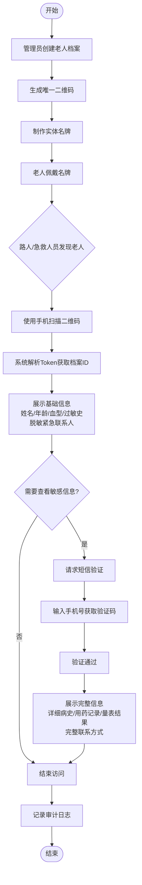

### 4.4 老人档案状态流转

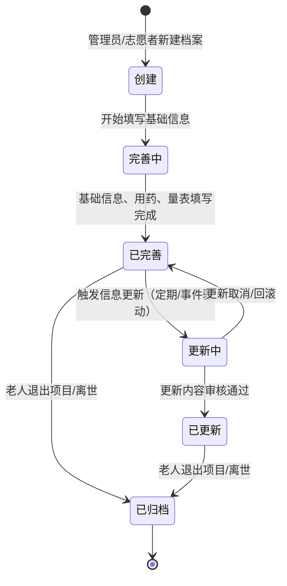

### 4.5 扫码访问流程活动图

```mermaid
flowchart TD
    Start([扫码者打开微信/浏览器]) --> A[扫描二维码]
    A --> B{解析Token成功?}
    B -->|否| C[显示错误页面<br/>二维码无效或过期]
    B -->|是| D[请求后端获取基础信息]
    D --> E[展示老人基础信息页<br/>姓名/性别/年龄/血型/过敏史]
    E --> F{用户点击"查看健康档案"?}
    F -->|否| G[停留在基础信息页]
    F -->|是| H{已短信验证?}
    H -->|是| I[直接展示健康档案]
    H -->|否| J[进入短信验证页]
    J --> K[输入手机号]
    K --> L[请求发送验证码]
    L --> M[Android短信中继转发]
    M --> N[用户输入验证码]
    N --> O{验证成功?}
    O -->|否| P[显示验证失败<br/>允许重新输入]
    P --> N
    O -->|是| Q[标记会话已验证]
    Q --> I
    I --> R[展示完整健康档案<br/>病史/用药/量表/完整联系方式]
    R --> S[记录访问审计日志]
    G --> End([结束])
    C --> End
    S --> End
```

### 4.6 志愿者填写流程活动图

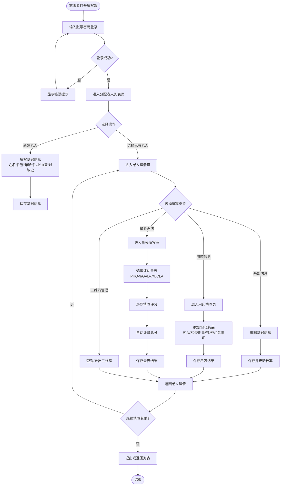

### 4.7 页面清单

#### 4.7.1 扫码用户端（01-扫码用户端）

| 页面名称 | 路由路径 | 权限 | 说明 |
| -------- | -------- | ---- | ---- |
| 基础信息页 | `/` (index) | 公开访问 | 展示老人姓名、性别、年龄、血型、过敏史等基础信息，紧急联系人脱敏显示 |
| 短信验证页 | `/verify` | 公开访问 | 输入手机号获取短信验证码，验证通过后可查看敏感信息 |
| 健康档案页 | `/health` | 需短信验证 | 展示老人完整健康档案，包括既往病史、手术史、慢病管理等 |
| 用药记录页 | `/medication` | 需短信验证 | 展示老人当前用药清单，包含药品名称、剂量、频次、注意事项 |
| 量表汇总页 | `/scale` | 需短信验证 | 展示老人各项评估量表的汇总结果和评分趋势 |
| 量表明细页 | `/scale/:scaleName` | 需短信验证 | 展示指定量表的详细题目和答题记录 |
| 名牌预览页 | `/nameplate` | 公开访问 | 预览老人名牌的展示效果 |
| 404错误页 | `/404` | 公开访问 | 二维码无效或页面不存在时的错误提示 |

#### 4.7.2 志愿者/家属端（02-志愿者填写端）

##### 志愿者模块

| 页面名称 | 路由路径 | 权限 | 说明 |
| -------- | -------- | ---- | ---- |
| 志愿者登录页 | `#/login` | 公开访问 | 志愿者账号密码登录入口 |
| 分配老人列表页 | `#/list` | 志愿者 | 展示当前志愿者负责的所有老人列表，支持搜索 |
| 老人详情页 | `#/detail` | 志愿者 | 展示指定老人的档案概览，提供快捷入口到各填写模块 |
| 基础信息填写页 | `#/basic` | 志愿者 | 填写/编辑老人的基础档案信息 |
| 用药信息填写页 | `#/medication` | 志愿者 | 添加、编辑、删除老人的用药记录 |
| 量表评估填写页 | `#/scale` | 志愿者 | 选择量表并逐题填写评分，自动计算结果 |
| 二维码管理页 | `#/qrcode` | 志愿者 | 查看、下载、重新生成老人名牌二维码 |

##### 家属模块（family-entry）

| 页面名称 | 路由路径 | 权限 | 说明 |
| -------- | -------- | ---- | ---- |
| 邀请落地页 | `/invite/:code` | 公开访问 | 通过邀请码链接进入，引导家属注册 |
| 家属注册页 | `/register` | 公开访问 | 填写手机号、密码等信息完成家属账号注册 |
| 短信验证页 | `/verify` | 公开访问 | 注册/登录时的短信验证码验证 |
| 家属登录页 | `/login` | 公开访问 | 已注册家属的登录入口 |
| 家属首页 | `/` | 家属 | 展示已绑定老人的概览卡片 |
| 老人基础管理页 | `/elders/:elderId` | 家属 | 编辑所绑定老人的基础信息 |
| 联系人管理页 | `/elders/:elderId/contacts` | 家属 | 管理老人的紧急联系人信息 |
| 用药管理页 | `/elders/:elderId/medications` | 家属 | 查看和管理老人的用药记录 |
| 二维码查看页 | `/elders/:elderId/qrcode` | 家属 | 查看老人名牌二维码 |

#### 4.7.3 管理后台端（03-管理后台端）

| 页面名称 | 路由路径 | 权限 | 说明 |
| -------- | -------- | ---- | ---- |
| 管理员登录页 | `/login` | 公开访问 | 系统管理员/项目管理员/审计员登录入口 |
| 首页概览 | `/` | 系统管理员/项目管理员 | 展示系统关键指标：老人数、志愿者数、二维码数、审计数等 |
| 老人档案页 | `/elders` | 系统管理员/项目管理员 | 查看和管理所有老人档案，支持搜索、筛选、导出 |
| 用药信息页 | `/medications` | 系统管理员/项目管理员 | 查看和管理所有老人的用药记录 |
| 量表管理页 | `/scales` | 系统管理员/项目管理员 | 查看和管理所有量表评估记录 |
| 二维码管理页 | `/qrcodes` | 系统管理员/项目管理员 | 批量生成、查看状态、作废二维码 |
| 志愿者管理页 | `/volunteers` | 系统管理员/项目管理员 | 查看志愿者列表、分配老人、管理账号 |
| 邀请管理页 | `/invitations` | 系统管理员/项目管理员 | 创建和管理家属邀请码 |
| 家属绑定页 | `/family-bindings` | 系统管理员/项目管理员 | 查看和管理家属与老人的绑定关系 |
| 短信中继页 | `/sms-relay` | 系统管理员/项目管理员 | 管理Android短信中继设备状态 |
| 角色权限页 | `/rbac` | 系统管理员 | 配置角色、分配权限、管理数据范围 |
| 安全策略页 | `/security` | 系统管理员/审计员 | 配置系统安全参数、密码策略等 |
| 操作日志页 | `/audit/admin` | 系统管理员/审计员 | 查看管理员操作日志 |
| 医疗日志页 | `/audit/medical` | 审计员 | 查看医疗相关操作日志 |
| 家属日志页 | `/audit/family` | 审计员 | 查看家属操作日志 |
| 访客日志页 | `/audit/visitor` | 审计员 | 查看扫码访客访问日志 |

***

## 5. 涉众分析

### 5.1 涉众概要

| 编号 | 涉众名称 | 涉众说明 | 期望 |
| ---- | -------- | -------- | ---- |
| SH001 | 老年人（服务对象） | 佩戴智联名牌的社区老年人，系统的核心服务对象 | 紧急情况下能快速获得救助；个人信息得到妥善保护；名牌佩戴舒适方便 |
| SH002 | 家属 | 老年人的家庭成员，通过家属端管理老人信息 | 随时了解老人健康状况；能远程更新老人信息；接收紧急通知 |
| SH003 | 志愿者 | 社区志愿者，上门为老人采集信息、维护档案 | 操作界面简单易用；能高效完成信息采集；明确自己的工作范围 |
| SH004 | 管理人员 | 项目管理员和系统管理员，负责系统运营和维护 | 全面掌握项目运行状态；灵活配置权限；数据安全可控 |
| SH005 | 扫码者（访客） | 扫描名牌的路人、急救人员、医护人员 | 快速获取关键信息；验证流程简单；信息准确可靠 |

### 5.2 涉众简档

#### 5.2.1 老年人（SH001）

| 分类 | 详情 |
| ---- | ---- |
| 涉众 | SH001 老年人 |
| 涉众代表 | 社区独居老人、高龄老人、患有慢性病的老人 |
| 特点 | 年龄通常在65岁以上；对智能设备使用能力有限；可能存在听力、视力、记忆力下降等问题；对隐私保护较为敏感 |
| 职责 | 配合志愿者完成信息采集；正确佩戴名牌；在紧急情况下向救助者出示名牌 |
| 成功标准 | 名牌佩戴率100%；紧急情况下救助者能在30秒内获取关键信息；个人信息无泄露事件 |
| 参与 | 被动参与，主要通过志愿者协助完成信息录入 |
| 可交付工作 | 个人基础信息、健康状况描述、用药习惯反馈 |

#### 5.2.2 家属（SH002）

| 分类 | 详情 |
| ---- | ---- |
| 涉众 | SH002 家属 |
| 涉众代表 | 老人的子女、配偶、近亲属 |
| 特点 | 年龄分布广（30-70岁）；具备基本智能手机操作能力；关注老人健康但可能不在身边；对信息准确性要求高 |
| 职责 | 通过邀请码注册家属账号；维护老人的联系人和用药信息；定期更新老人健康状况；紧急情况下接听救助电话 |
| 成功标准 | 家属绑定率≥90%；信息更新及时率≥95%；紧急联系接通率≥98% |
| 参与 | 主动参与，定期登录家属端维护信息 |
| 可交付工作 | 紧急联系人信息、用药记录变更、老人近况更新 |

#### 5.2.3 志愿者（SH003）

| 分类 | 详情 |
| ---- | ---- |
| 涉众 | SH003 志愿者 |
| 涉众代表 | 社区志愿者、护理学院学生、社区工作者 |
| 特点 | 年龄以青年和中年为主；具备一定的医疗护理基础知识；流动性较大；使用移动端设备工作 |
| 职责 | 登录志愿者端查看分配的老人列表；上门采集老人基础信息；填写用药记录和量表评估；协助老人正确佩戴名牌 |
| 成功标准 | 信息采集完整率≥95%；量表填写准确率≥98%；月度拜访覆盖率100% |
| 参与 | 高频主动参与，是系统的主要操作用户 |
| 可交付工作 | 老人基础档案、用药记录、量表评估结果、拜访记录 |

#### 5.2.4 管理人员（SH004）

| 分类 | 详情 |
| ---- | ---- |
| 涉众 | SH004 管理人员 |
| 涉众代表 | 项目管理员（社区/医院项目负责人）、系统管理员（IT运维）、审计员（合规审查） |
| 特点 | 项目管理员：熟悉业务流程，关注项目指标；系统管理员：技术背景，关注系统稳定性；审计员：注重合规和安全 |
| 职责 | 项目管理员：管理志愿者和老人分配，查看统计报表；系统管理员：配置角色权限，维护系统安全；审计员：审查操作日志，确保合规 |
| 成功标准 | 系统可用性≥99.5%；权限配置零失误；审计问题闭环率100% |
| 参与 | 中频参与，以管理和监控为主 |
| 可交付工作 | 项目运营报表、权限配置方案、审计报告 |

#### 5.2.5 扫码者（SH005）

| 分类 | 详情 |
| ---- | ---- |
| 涉众 | SH005 扫码者（访客） |
| 涉众代表 | 路人、急救医护人员、社区保安、快递员、邻居 |
| 特点 | 身份不固定；使用场景紧急；对系统完全不了解；使用手机扫码即可访问 |
| 职责 | 发现老人异常时扫描二维码；根据展示信息采取适当救助措施；必要时联系紧急联系人 |
| 成功标准 | 扫码响应时间≤3秒；信息展示完整清晰；短信验证成功率≥95% |
| 参与 | 极低频参与，单次使用，无需注册 |
| 可交付工作 | 救助行为记录（通过审计日志） |

### 5.3 用例图

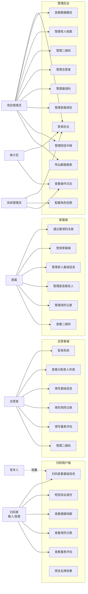

***

## 6. 用例规约

### 6.1 访问扫码首页

**表 6.1 "访问扫码首页"用例规约**

| 项目 | 内容 |
| ---- | ---- |
| 用例名 | 访问扫码首页 |
| 简要描述 | 访客通过扫描老人实体名牌上的二维码，访问扫码用户端首页，查看老人基础救助信息 |
| 参与者 | 访客（路人、急救人员、社区工作者等） |
| 前置条件 | 1. 老人已持有实体名牌且名牌上印有有效二维码<br>2. 访客使用智能手机扫描二维码<br>3. 二维码状态为 ENABLED（未停用） |
| 后置条件 | 1. 系统展示老人基础信息页面（姓名、年龄、紧急联系人等公开信息）<br>2. 系统记录一次扫码访问日志<br>3. 访客可选择查看敏感信息（需进入验证流程） |
| 基本事件流 | 1. 访客使用手机相机或微信扫描实体名牌上的二维码<br>2. 系统解析二维码中的加密 token（AES-256-GCM 解密）<br>3. 系统根据 token 中的 elderId 查询老人档案<br>4. 系统验证二维码状态为 ENABLED<br>5. 系统返回老人基础公开信息（姓名、性别、年龄、紧急联系人脱敏手机号）<br>6. 前端渲染扫码首页，展示基础信息卡片<br>7. 页面底部展示"查看健康档案"按钮（需验证），用例结束 |
| 备选事件流 | A-1 二维码已停用：系统返回"该二维码已停用"错误页面<br>A-2 二维码无效或解析失败：系统返回"二维码无效"错误页面<br>A-3 老人档案不存在：系统返回"档案不存在"错误页面<br>A-4 网络异常：前端展示网络错误提示，支持重试 |
| 补充约束 | 1. 二维码 URL 格式：`https://{domain}/s/{encryptedQrToken}`<br>2. 扫码响应时间 < 2 秒<br>3. 基础信息页面不得展示健康档案、用药记录、量表结果等敏感信息<br>4. 系统记录扫码日志：时间、IP、二维码ID、是否进入验证流程 |

**时序图：**

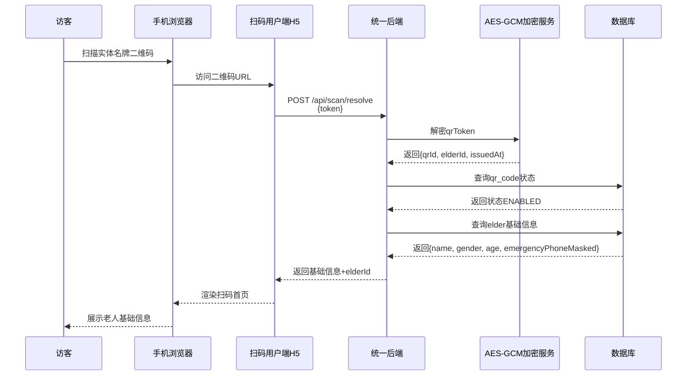

### 6.2 短信验证查看敏感信息

**表 6.2 "短信验证查看敏感信息"用例规约**

| 项目 | 内容 |
| ---- | ---- |
| 用例名 | 短信验证查看敏感信息 |
| 简要描述 | 访客通过短信验证身份后，查看老人的敏感健康信息（健康档案、用药记录、量表评估） |
| 参与者 | 访客（路人、急救人员、社区工作者等） |
| 前置条件 | 1. 访客已成功访问扫码首页<br>2. 访客点击"查看健康档案"或"查看用药记录"等敏感信息入口<br>3. 访客尚未完成短信验证 |
| 后置条件 | 1. 访客通过短信验证，获得敏感信息查看权限<br>2. 系统记录验证通过日志<br>3. 访客可在当前会话期间查看敏感信息 |
| 基本事件流 | 1. 访客点击"查看健康档案"按钮<br>2. 系统创建短信验证会话，生成随机验证码<br>3. 系统返回验证指引：接收号码、短信内容格式<br>4. 访客使用自己的手机向接收号码发送指定格式短信<br>5. 安卓短信中转端接收短信并上传到后端<br>6. 后端匹配验证会话，标记会话为已验证<br>7. 访客页面轮询检测到验证通过<br>8. 系统展示完整健康档案，用例结束 |
| 备选事件流 | A-1 验证码错误：系统提示"验证码错误，请重新发送"<br>A-2 验证超时：会话过期后需重新发起验证<br>A-3 短信发送失败：提示访客检查网络或稍后重试<br>A-4 访客选择实名登记验证：填写姓名、手机号、身份证号进行身份登记 |
| 补充约束 | 1. 验证会话有效期 10 分钟<br>2. 单会话最多 3 次验证尝试<br>3. 验证通过后 2 小时内可查看敏感信息<br>4. 所有验证行为记录审计日志 |

**时序图：**

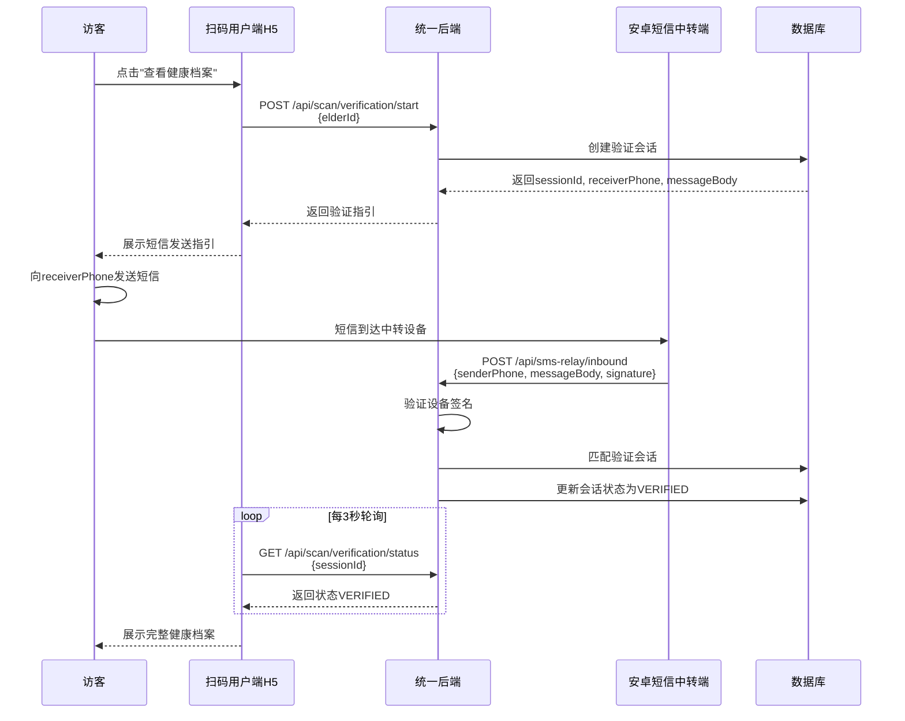

### 6.3 志愿者登录

**表 6.3 "志愿者登录"用例规约**

| 项目 | 内容 |
| ---- | ---- |
| 用例名 | 志愿者登录 |
| 简要描述 | 已注册志愿者使用账号和密码登录系统，获取 JWT Token 后进入工作台 |
| 参与者 | 志愿者 |
| 前置条件 | 1. 志愿者已注册并获得有效账号<br>2. 志愿者在登录页面输入账号和密码 |
| 后置条件 | 1. 志愿者登录成功，系统签发 JWT Token<br>2. 前端存储 Token 并设置认证状态<br>3. 跳转至分配老人列表页 |
| 基本事件流 | 1. 志愿者打开志愿者填写端，进入登录页面<br>2. 志愿者输入账号和密码<br>3. 志愿者点击"登录"按钮<br>4. 前端发送登录请求到后端<br>5. 后端验证账号密码<br>6. 后端签发 JWT Token（含用户ID、角色、过期时间）<br>7. 前端存储 Token 到 localStorage<br>8. 跳转至分配老人列表页，用例结束 |
| 备选事件流 | A-1 账号不存在：系统返回"账号或密码错误"（不暴露具体原因）<br>A-2 密码错误：系统返回"账号或密码错误"<br>A-3 账号被禁用：系统返回"账号已被禁用"<br>A-4 连续5次登录失败：账号锁定30分钟 |
| 补充约束 | 1. 密码采用 bcrypt 哈希存储<br>2. JWT Token 有效期 24 小时<br>3. 登录行为记录审计日志 |

**时序图：**

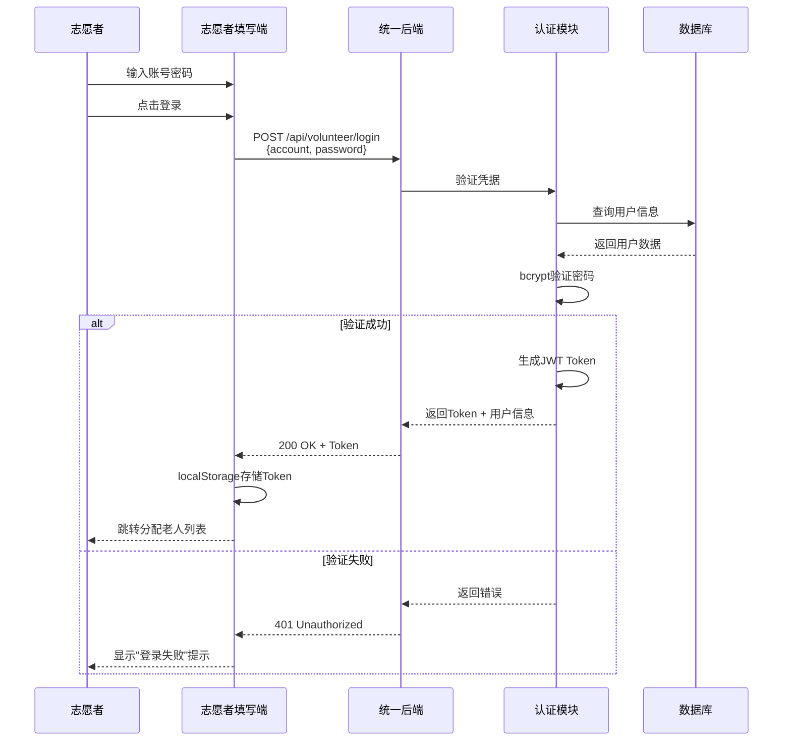

### 6.4 家属登录

**表 6.4 "家属登录"用例规约**

| 项目 | 内容 |
| ---- | ---- |
| 用例名 | 家属登录 |
| 简要描述 | 已注册家属使用手机号和密码登录系统，查看绑定老人信息 |
| 参与者 | 家属 |
| 前置条件 | 1. 家属已通过邀请码完成注册<br>2. 家属在登录页面输入手机号和密码 |
| 后置条件 | 1. 家属登录成功，系统签发 JWT Token<br>2. 前端存储 Token 并设置认证状态<br>3. 跳转至家属首页（绑定老人列表） |
| 基本事件流 | 1. 家属打开家属端，进入登录页面<br>2. 家属输入手机号和密码<br>3. 家属点击"登录"按钮<br>4. 前端发送登录请求到后端<br>5. 后端验证手机号密码<br>6. 后端签发 JWT Token<br>7. 前端存储 Token<br>8. 跳转至家属首页，用例结束 |
| 备选事件流 | A-1 手机号未注册：系统返回"手机号或密码错误"<br>A-2 密码错误：系统返回"手机号或密码错误"<br>A-3 账号被禁用：系统返回"账号已被禁用" |
| 补充约束 | 1. 手机号需通过短信验证码验证后方可注册<br>2. JWT Token 有效期 24 小时<br>3. 登录行为记录审计日志 |

### 6.5 管理后台登录

**表 6.5 "管理后台登录"用例规约**

| 项目 | 内容 |
| ---- | ---- |
| 用例名 | 管理后台登录 |
| 简要描述 | 系统管理员使用账号和密码登录管理后台，进行系统管理操作 |
| 参与者 | 系统管理员、项目管理员、审计员 |
| 前置条件 | 1. 管理员已创建有效账号<br>2. 管理员在登录页面输入账号和密码 |
| 后置条件 | 1. 管理员登录成功，系统签发 JWT Token<br>2. 前端存储 Token 并设置认证状态<br>3. 跳转至管理后台首页 |
| 基本事件流 | 1. 管理员打开管理后台，进入登录页面<br>2. 管理员输入账号和密码<br>3. 管理员点击"登录"按钮<br>4. 前端发送登录请求到后端<br>5. 后端验证账号密码<br>6. 后端签发 JWT Token<br>7. 前端存储 Token<br>8. 跳转至管理后台首页，用例结束 |
| 备选事件流 | A-1 账号不存在：系统返回"账号或密码错误"<br>A-2 密码错误：系统返回"账号或密码错误"<br>A-3 账号被禁用：系统返回"账号已被禁用"<br>A-4 连续5次登录失败：账号锁定30分钟 |
| 补充约束 | 1. 密码采用 bcrypt 哈希存储<br>2. JWT Token 有效期 2 小时<br>3. 登录行为记录审计日志<br>4. 管理后台接口需额外签名验证（X-Timestamp/X-Nonce/X-Signature） |

### 6.6 查看老人档案

**表 6.6 "查看老人档案"用例规约**

| 项目 | 内容 |
| ---- | ---- |
| 用例名 | 查看老人档案 |
| 简要描述 | 多角色用户（志愿者、家属、管理员）查看老人档案信息，系统根据角色自动过滤数据范围 |
| 参与者 | 志愿者、家属、系统管理员 |
| 前置条件 | 1. 用户已登录系统<br>2. 用户具有查看老人档案的权限<br>3. 志愿者只能查看本人负责的老人；家属只能查看已绑定的老人；管理员可查看全部 |
| 后置条件 | 1. 系统展示老人档案信息<br>2. 敏感字段根据角色和验证状态脱敏展示<br>3. 记录查看审计日志 |
| 基本事件流 | 1. 用户进入老人列表页面<br>2. 系统根据用户角色查询数据范围<br>3. 系统返回老人列表<br>4. 用户点击某个老人卡片<br>5. 系统查询老人完整档案<br>6. 系统对敏感字段进行脱敏处理<br>7. 前端展示老人档案页面，用例结束 |
| 备选事件流 | A-1 无权查看：系统返回 403 无权访问<br>A-2 老人不存在：系统返回 404 档案不存在<br>A-3 数据范围限制：志愿者看不到其他志愿者的老人 |
| 补充约束 | 1. 数据范围通过 DataScopeInterceptor 自动拦截<br>2. 敏感字段（姓名、电话、地址）采用 AES-GCM 加密存储，展示时脱敏 |

### 6.7 填写老人基本信息

**表 6.7 "填写老人基本信息"用例规约**

| 项目 | 内容 |
| ---- | ---- |
| 用例名 | 填写老人基本信息 |
| 简要描述 | 志愿者或管理员填写/编辑老人的基础档案信息，包括姓名、性别、年龄、住址、血型、过敏史等 |
| 参与者 | 志愿者、系统管理员 |
| 前置条件 | 1. 用户已登录系统<br>2. 用户具有编辑老人档案的权限<br>3. 志愿者只能编辑本人负责的老人 |
| 后置条件 | 1. 老人基础信息更新成功<br>2. 敏感字段加密存储<br>3. 记录操作审计日志 |
| 基本事件流 | 1. 用户进入老人详情页<br>2. 用户点击"编辑基础信息"<br>3. 系统展示编辑表单<br>4. 用户填写/修改信息<br>5. 用户点击"保存"<br>6. 前端发送更新请求到后端<br>7. 后端对敏感字段进行 AES-GCM 加密<br>8. 后端更新数据库<br>9. 返回成功响应，用例结束 |
| 备选事件流 | A-1 必填字段为空：前端提示"请填写必填字段"<br>A-2 数据格式错误：前端提示格式错误<br>A-3 无权编辑：系统返回 403 无权访问 |
| 补充约束 | 1. 姓名、电话、地址等敏感字段必须加密存储<br>2. 档案编号自动生成，格式为 A+年月日+序号 |

### 6.8 填写用药记录

**表 6.8 "填写用药记录"用例规约**

| 项目 | 内容 |
| ---- | ---- |
| 用例名 | 填写用药记录 |
| 简要描述 | 志愿者或家属填写/编辑老人的用药记录，包括药品名称、剂量、用法、用药时间等 |
| 参与者 | 志愿者、家属 |
| 前置条件 | 1. 用户已登录系统<br>2. 用户具有编辑用药记录的权限<br>3. 志愿者只能编辑本人负责的老人；家属只能编辑已绑定的老人 |
| 后置条件 | 1. 用药记录更新成功<br>2. 敏感字段加密存储<br>3. 记录操作审计日志 |
| 基本事件流 | 1. 用户进入老人详情页<br>2. 用户点击"用药记录"<br>3. 系统展示用药记录列表<br>4. 用户点击"添加药品"<br>5. 用户填写药品信息<br>6. 用户点击"保存"<br>7. 后端对敏感字段进行 AES-GCM 加密<br>8. 后端保存到数据库<br>9. 返回成功响应，用例结束 |
| 备选事件流 | A-1 药品名称重复：提示"该药品已存在"<br>A-2 必填字段为空：前端提示"请填写必填字段"<br>A-3 无权编辑：系统返回 403 无权访问 |
| 补充约束 | 1. 药品名称、剂量等敏感字段必须加密存储<br>2. 支持多条用药记录 |

### 6.9 填写量表评估

**表 6.9 "填写量表评估"用例规约**

| 项目 | 内容 |
| ---- | ---- |
| 用例名 | 填写量表评估 |
| 简要描述 | 志愿者对老人进行 PHQ-9、GAD-7、UCLA 等量表评估，逐题填写评分，系统自动计算总分 |
| 参与者 | 志愿者 |
| 前置条件 | 1. 志愿者已登录系统<br>2. 志愿者具有填写量表的权限<br>3. 志愿者只能为本人负责的老人填写 |
| 后置条件 | 1. 量表评估记录保存成功<br>2. 答题详情加密存储<br>3. 记录操作审计日志 |
| 基本事件流 | 1. 志愿者进入老人详情页<br>2. 志愿者点击"量表评估"<br>3. 系统展示量表选择页面<br>4. 志愿者选择量表（PHQ-9/GAD-7/UCLA）<br>5. 系统展示量表题目<br>6. 志愿者逐题选择评分<br>7. 系统自动计算总分<br>8. 志愿者点击"保存"<br>9. 后端对答题详情进行 AES-GCM 加密<br>10. 后端保存到数据库<br>11. 返回成功响应，用例结束 |
| 备选事件流 | A-1 题目未全部填写：提示"请完成所有题目"<br>A-2 评分超出范围：前端限制评分范围<br>A-3 无权填写：系统返回 403 无权访问 |
| 补充约束 | 1. PHQ-9 评分范围 0-27，GAD-7 评分范围 0-21，UCLA 评分范围 20-80<br>2. 答题详情以 JSON 格式加密存储 |

### 6.10 生成二维码名牌

**表 6.10 "生成二维码名牌"用例规约**

| 项目 | 内容 |
| ---- | ---- |
| 用例名 | 生成二维码名牌 |
| 简要描述 | 管理员为老人生成二维码名牌，二维码包含加密的 Token，扫描后可获取老人信息 |
| 参与者 | 系统管理员 |
| 前置条件 | 1. 管理员已登录系统<br>2. 老人档案已创建<br>3. 管理员具有二维码管理权限 |
| 后置条件 | 1. 二维码生成成功<br>2. 二维码 Token 加密存储<br>3. 记录操作审计日志 |
| 基本事件流 | 1. 管理员进入二维码管理页面<br>2. 管理员选择老人<br>3. 管理员点击"生成二维码"<br>4. 后端生成随机 Token<br>5. 后端使用 AES-GCM 加密 Token<br>6. 后端生成二维码图片<br>7. 后端保存二维码记录到数据库<br>8. 前端展示二维码图片和下载链接<br>9. 用例结束 |
| 备选事件流 | A-1 老人档案不存在：提示"请先创建老人档案"<br>A-2 二维码已存在：提示"该老人已有二维码，是否重新生成？" |
| 补充约束 | 1. 二维码 Token 使用 AES-256-GCM 加密，随机 IV<br>2. 二维码 URL 格式：`https://{domain}/s/{encryptedToken}`<br>3. 支持生成 PDF 格式的实体名牌 |

### 6.11 管理后台查看仪表盘

**表 6.11 "管理后台查看仪表盘"用例规约**

| 项目 | 内容 |
| ---- | ---- |
| 用例名 | 管理后台查看仪表盘 |
| 简要描述 | 管理员登录管理后台后，查看系统关键指标和运营数据 |
| 参与者 | 系统管理员、项目管理员 |
| 前置条件 | 1. 管理员已登录系统<br>2. 管理员具有查看仪表盘的权限 |
| 后置条件 | 1. 系统展示仪表盘页面<br>2. 展示关键指标：老人数、志愿者数、家属数、二维码数、今日扫码次数等 |
| 基本事件流 | 1. 管理员登录管理后台<br>2. 系统自动跳转至仪表盘页面<br>3. 系统查询各项统计数据<br>4. 前端展示数据卡片和图表<br>5. 用例结束 |
| 备选事件流 | A-1 数据加载失败：展示错误提示，支持刷新<br>A-2 无数据：展示空状态提示 |
| 补充约束 | 1. 数据实时更新<br>2. 支持按时间范围筛选 |

### 6.12 管理后台老人档案管理

**表 6.12 "管理后台老人档案管理"用例规约**

| 项目 | 内容 |
| ---- | ---- |
| 用例名 | 管理后台老人档案管理 |
| 简要描述 | 管理员在管理后台查看、创建、编辑、删除老人档案 |
| 参与者 | 系统管理员、项目管理员 |
| 前置条件 | 1. 管理员已登录系统<br>2. 管理员具有老人档案管理权限 |
| 后置条件 | 1. 老人档案操作成功<br>2. 敏感字段加密存储<br>3. 记录操作审计日志 |
| 基本事件流 | 1. 管理员进入老人档案管理页面<br>2. 系统展示老人档案列表<br>3. 管理员可进行创建、编辑、删除操作<br>4. 系统执行相应操作<br>5. 返回操作结果，用例结束 |
| 备选事件流 | A-1 创建时档案编号重复：系统自动生成新编号<br>A-2 删除时有关联数据：提示"该老人有关联数据，是否一并删除？" |
| 补充约束 | 1. 支持搜索和筛选<br>2. 支持导出为 CSV |

### 6.13 管理后台志愿者管理

**表 6.13 "管理后台志愿者管理"用例规约**

| 项目 | 内容 |
| ---- | ---- |
| 用例名 | 管理后台志愿者管理 |
| 简要描述 | 管理员在管理后台查看、创建、编辑、删除志愿者账号，分配负责老人 |
| 参与者 | 系统管理员、项目管理员 |
| 前置条件 | 1. 管理员已登录系统<br>2. 管理员具有志愿者管理权限 |
| 后置条件 | 1. 志愿者账号操作成功<br>2. 记录操作审计日志 |
| 基本事件流 | 1. 管理员进入志愿者管理页面<br>2. 系统展示志愿者列表<br>3. 管理员可进行创建、编辑、删除操作<br>4. 管理员可为志愿者分配负责老人<br>5. 系统执行相应操作<br>6. 返回操作结果，用例结束 |
| 备选事件流 | A-1 账号已存在：提示"该账号已存在"<br>A-2 删除时有负责老人：提示"请先解除该志愿者的老人分配" |
| 补充约束 | 1. 支持搜索和筛选<br>2. 支持批量分配老人 |

### 6.14 管理后台角色权限管理

**表 6.14 "管理后台角色权限管理"用例规约**

| 项目 | 内容 |
| ---- | ---- |
| 用例名 | 管理后台角色权限管理 |
| 简要描述 | 系统管理员配置系统角色、分配菜单和 API 权限、设置数据范围 |
| 参与者 | 系统管理员 |
| 前置条件 | 1. 系统管理员已登录<br>2. 系统管理员具有角色权限管理权限 |
| 后置条件 | 1. 角色权限配置更新成功<br>2. 记录操作审计日志 |
| 基本事件流 | 1. 系统管理员进入角色权限管理页面<br>2. 系统展示角色列表和权限矩阵<br>3. 系统管理员选择角色<br>4. 系统管理员勾选/取消权限<br>5. 系统管理员点击"保存"<br>6. 系统更新权限配置<br>7. 返回成功响应，用例结束 |
| 备选事件流 | A-1 角色编码重复：提示"该角色编码已存在" |
| 补充约束 | 1. 系统预定义四类角色：系统管理员、项目管理员、审计员、志愿者<br>2. 支持自定义角色 |

### 6.15 管理后台操作日志审计

**表 6.15 "管理后台操作日志审计"用例规约**

| 项目 | 内容 |
| ---- | ---- |
| 用例名 | 管理后台操作日志审计 |
| 简要描述 | 审计员或系统管理员查看系统操作日志，进行合规审查 |
| 参与者 | 审计员、系统管理员 |
| 前置条件 | 1. 用户已登录系统<br>2. 用户具有查看审计日志的权限 |
| 后置条件 | 1. 系统展示审计日志列表<br>2. 支持按条件筛选和导出 |
| 基本事件流 | 1. 用户进入审计日志页面<br>2. 系统展示审计日志列表<br>3. 用户可按操作人、操作类型、结果等条件筛选<br>4. 用户可导出日志为 CSV<br>5. 用例结束 |
| 备选事件流 | A-1 无日志数据：展示空状态提示 |
| 补充约束 | 1. 审计日志保留不少于 2 年<br>2. 日志不可篡改 |

### 6.16 家属注册与绑定

**表 6.16 "家属注册与绑定"用例规约**

| 项目 | 内容 |
| ---- | ---- |
| 用例名 | 家属注册与绑定 |
| 简要描述 | 家属通过邀请码注册账号，并与老人建立绑定关系 |
| 参与者 | 家属 |
| 前置条件 | 1. 管理员已创建邀请码并发送给家属<br>2. 家属收到邀请码链接 |
| 后置条件 | 1. 家属注册成功<br>2. 家属与老人建立绑定关系<br>3. 邀请码使用次数更新 |
| 基本事件流 | 1. 家属点击邀请码链接<br>2. 系统展示邀请信息预览<br>3. 家属填写注册信息（手机号、密码）<br>4. 家属获取短信验证码<br>5. 家属输入验证码<br>6. 系统验证邀请码和验证码<br>7. 系统创建家属账号<br>8. 系统建立家属与老人的绑定关系<br>9. 返回成功响应，用例结束 |
| 备选事件流 | A-1 邀请码无效：提示"邀请码无效或已过期"<br>A-2 邀请码已达使用上限：提示"邀请码已达使用上限"<br>A-3 手机号已注册：提示"该手机号已注册" |
| 补充约束 | 1. 邀请码有有效期和使用次数限制<br>2. 家属密码采用 bcrypt 哈希存储 |

### 6.17 邀请码管理

**表 6.17 "邀请码管理"用例规约**

| 项目 | 内容 |
| ---- | ---- |
| 用例名 | 邀请码管理 |
| 简要描述 | 管理员创建、禁用、删除家属邀请码 |
| 参与者 | 系统管理员、项目管理员 |
| 前置条件 | 1. 管理员已登录系统<br>2. 管理员具有邀请码管理权限 |
| 后置条件 | 1. 邀请码操作成功<br>2. 记录操作审计日志 |
| 基本事件流 | 1. 管理员进入邀请码管理页面<br>2. 系统展示邀请码列表<br>3. 管理员点击"创建邀请码"<br>4. 管理员选择关联老人、设置有效期和使用次数<br>5. 系统生成邀请码<br>6. 管理员可复制邀请链接发送给家属<br>7. 用例结束 |
| 备选事件流 | A-1 邀请码生成失败：提示"邀请码生成失败，请重试" |
| 补充约束 | 1. 邀请码格式：8位字母数字组合<br>2. 支持设置有效期和最大使用次数 |

### 6.18 短信中转设备管理

**表 6.18 "短信中转设备管理"用例规约**

| 项目 | 内容 |
| ---- | ---- |
| 用例名 | 短信中转设备管理 |
| 简要描述 | 管理员管理安卓短信中转设备，查看设备状态、配置和上传记录 |
| 参与者 | 系统管理员、项目管理员 |
| 前置条件 | 1. 管理员已登录系统<br>2. 管理员具有短信中转管理权限 |
| 后置条件 | 1. 设备管理操作成功<br>2. 记录操作审计日志 |
| 基本事件流 | 1. 管理员进入短信中转管理页面<br>2. 系统展示设备列表和状态<br>3. 管理员可查看设备详情、上传记录<br>4. 管理员可修改设备配置<br>5. 用例结束 |
| 备选事件流 | A-1 设备离线：展示离线状态，提示检查设备<br>A-2 设备未注册：提示"该设备未注册" |
| 补充约束 | 1. 设备请求必须携带有效签名<br>2. 心跳间隔 60 秒，3 分钟无心跳标记为离线 |

***

## 7. 非功能性需求

### 7.1 性能需求

| 需求编号 | 需求描述 | 目标值 |
| -------- | -------- | ------ |
| NFR-001 | 页面加载时间 | ≤ 3 秒 |
| NFR-002 | API 响应时间（P95） | ≤ 500ms |
| NFR-003 | 扫码解析响应时间 | ≤ 2 秒 |
| NFR-004 | 短信验证状态轮询间隔 | 3 秒 |
| NFR-005 | 并发扫码用户支持 | ≥ 1000 QPS |
| NFR-006 | 并发工作台用户支持 | ≥ 500 人 |
| NFR-007 | 数据库查询响应时间 | ≤ 200ms |
| NFR-008 | 二维码生成时间 | ≤ 1 秒 |
| NFR-009 | PDF 生成时间 | ≤ 5 秒 |
| NFR-010 | 审计日志写入延迟 | ≤ 100ms |
| NFR-011 | 安卓短信中转上传延迟 | ≤ 3 秒 |
| NFR-012 | 心跳检测间隔 | 60 秒 |
| NFR-013 | 系统月度可用性 | ≥ 99.5% |

### 7.2 安全需求

| 需求编号 | 需求描述 | 实现方式 |
| -------- | -------- | -------- |
| SEC-001 | 用户密码加密存储 | bcrypt 哈希 |
| SEC-002 | JWT Token 安全 | HS256 签名，24 小时有效期 |
| SEC-003 | 敏感数据加密存储 | AES-256-GCM |
| SEC-004 | 传输加密 | HTTPS TLS 1.2+ |
| SEC-005 | 接口签名验证 | HMAC-SHA256，防重放攻击 |
| SEC-006 | 数据范围隔离 | DataScopeInterceptor 自动拦截 |
| SEC-007 | 审计日志不可篡改 | 只写表，禁止修改和删除 |
| SEC-008 | 二维码 Token 安全 | AES-GCM 加密，随机 IV |
| SEC-009 | 短信验证防刷 | 单会话 3 次尝试限制 |
| SEC-010 | 账号防暴力破解 | 连续 5 次失败锁定 30 分钟 |
| SEC-011 | 内容防复制 | 禁止长按复制、禁止截图提示 |
| SEC-012 | 设备签名认证 | 安卓端 HMAC-SHA256 签名 |
| SEC-013 | 会话超时 | 管理员 2 小时，其他 24 小时 |
| SEC-014 | 密码复杂度 | 8-20 位，必须含字母和数字 |
| SEC-015 | 敏感字段脱敏 | 动态脱敏展示 |
| SEC-016 | 输入验证 | 前端+后端双重验证 |
| SEC-017 | SQL 注入防护 | 参数化查询 |
| SEC-018 | XSS 防护 | 输出编码 |
| SEC-019 | CSRF 防护 | JWT 无状态认证 |
| SEC-020 | 日志安全 | 审计日志保留 2 年以上 |

### 7.3 可用性需求

| 需求编号 | 需求描述 |
| -------- | -------- |
| USA-001 | 界面支持响应式布局，适配 320px 以上屏幕 |
| USA-002 | 提供友好的错误提示，避免技术术语 |
| USA-003 | 支持微信内置浏览器、Safari、Chrome |
| USA-004 | 扫码用户端无需注册即可使用 |
| USA-005 | 志愿者端支持离线草稿保存 |
| USA-006 | 管理后台支持键盘快捷键 |
| USA-007 | 提供操作确认对话框，防止误操作 |
| USA-008 | 表单输入实时验证 |
| USA-009 | 加载状态提示 |
| USA-010 | 空状态友好提示 |
| USA-011 | 安卓短信中转端支持离线缓存 |

### 7.4 可靠性需求

| 需求编号 | 需求描述 |
| -------- | -------- |
| REL-001 | 数据库每日自动备份 |
| REL-002 | 支持主从复制，故障自动切换 |
| REL-003 | 安卓短信中转端支持多设备冗余 |
| REL-004 | 心跳检测，3 分钟无心跳标记离线 |
| REL-005 | 服务故障自动重启 |
| REL-006 | 降级策略：短信服务不可用时提示人工验证 |
| REL-007 | 数据一致性校验 |
| REL-008 | 异常日志自动告警 |
| REL-009 | 支持灰度发布 |
| REL-010 | RPO ≤ 1 小时，RTO ≤ 30 分钟 |

### 7.5 可维护性需求

| 需求编号 | 需求描述 |
| -------- | -------- |
| MAINT-001 | 数据库版本管理使用 Flyway 迁移 |
| MAINT-002 | 后端采用模块化架构 |
| MAINT-003 | 前端组件化开发 |
| MAINT-004 | 统一日志规范（SLF4J） |
| MAINT-005 | 代码注释覆盖率 ≥ 30% |
| MAINT-006 | 单元测试覆盖率 ≥ 60% |
| MAINT-007 | API 文档使用 SpringDoc OpenAPI |
| MAINT-008 | 配置文件外部化 |
| MAINT-009 | 支持多环境部署（dev/test/prod） |
| MAINT-010 | 健康检查端点 |
| MAINT-011 | 性能监控指标暴露 |
| MAINT-012 | 容器化部署支持 |
| MAINT-013 | CI/CD 流水线 |

***

## 8. 数据库设计

### 8.1 概念模型

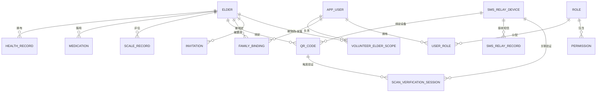

### 8.2 数据表设计

#### 8.2.1 老人信息表（elders）

| 字段名 | 类型 | 约束 | 说明 |
|--------|------|------|------|
| id | VARCHAR(64) | PRIMARY KEY | 老人唯一标识 |
| archive_no | VARCHAR(64) | NOT NULL, UNIQUE | 档案编号，如 A202604300001 |
| name_enc | TEXT | NOT NULL | AES-256-GCM 加密后的姓名 |
| gender | VARCHAR(10) | - | 性别（男/女） |
| age | INT | - | 年龄 |
| residence_enc | TEXT | - | AES 加密后的居住地址 |
| emergency_contact_name_enc | TEXT | - | AES 加密后的紧急联系人姓名 |
| emergency_phone_enc | TEXT | - | AES 加密后的紧急联系人电话 |
| backup_contact_name_enc | TEXT | - | AES 加密后的备用联系人姓名 |
| backup_phone_enc | TEXT | - | AES 加密后的备用联系人电话 |
| relationship | VARCHAR(32) | - | 与联系人关系（女儿/儿子等） |
| abo_type | VARCHAR(10) | - | ABO 血型（A/B/O/AB） |
| rh_type | VARCHAR(16) | - | RH 血型（阳性/阴性） |
| allergy_enc | TEXT | - | AES 加密后的过敏史 |
| status | VARCHAR(20) | NOT NULL DEFAULT 'ACTIVE' | 状态：ACTIVE/DISABLED |
| created_at | TIMESTAMP | NOT NULL DEFAULT CURRENT_TIMESTAMP | 创建时间 |
| updated_at | TIMESTAMP | NOT NULL DEFAULT CURRENT_TIMESTAMP ON UPDATE CURRENT_TIMESTAMP | 更新时间 |

#### 8.2.2 用户信息表（app_user）

| 字段名 | 类型 | 约束 | 说明 |
|--------|------|------|------|
| id | VARCHAR(64) | PRIMARY KEY | 用户唯一标识 |
| account | VARCHAR(64) | NOT NULL | 登录账号 |
| password_hash | VARCHAR(128) | NOT NULL | 密码哈希 |
| name_enc | TEXT | - | AES 加密后的姓名 |
| phone_enc | TEXT | - | AES 加密后的手机号 |
| role | VARCHAR(32) | NOT NULL | 角色：SYSTEM_ADMIN/VOLUNTEER/FAMILY |
| status | VARCHAR(20) | NOT NULL DEFAULT 'ACTIVE' | 状态：ACTIVE/DISABLED |
| created_at | TIMESTAMP | NOT NULL DEFAULT CURRENT_TIMESTAMP | 创建时间 |
| updated_at | TIMESTAMP | NOT NULL DEFAULT CURRENT_TIMESTAMP ON UPDATE CURRENT_TIMESTAMP | 更新时间 |

#### 8.2.3 健康记录表（health_record）

| 字段名 | 类型 | 约束 | 说明 |
|--------|------|------|------|
| id | VARCHAR(64) | PRIMARY KEY | 记录唯一标识 |
| elder_id | VARCHAR(64) | NOT NULL, FK | 关联老人 ID |
| record_date | VARCHAR(32) | - | 记录日期 |
| volunteer | VARCHAR(64) | - | 填写志愿者姓名 |
| height_cm | DECIMAL(8,2) | - | 身高（cm） |
| weight_kg | DECIMAL(8,2) | - | 体重（kg） |
| waist_cm | DECIMAL(8,2) | - | 腰围（cm） |
| bmi | DECIMAL(8,2) | - | BMI 指数 |
| health_self_assessment | TEXT | - | 健康状态自评 |
| self_care_assessment | TEXT | - | 生活自理能力评估 |
| cognitive_screening | TEXT | - | 认知功能筛查 |
| emotion_screening | TEXT | - | 情感状态筛查 |
| created_at | TIMESTAMP | NOT NULL DEFAULT CURRENT_TIMESTAMP | 创建时间 |

#### 8.2.4 用药记录表（medication）

| 字段名 | 类型 | 约束 | 说明 |
|--------|------|------|------|
| id | VARCHAR(64) | PRIMARY KEY | 记录唯一标识 |
| elder_id | VARCHAR(64) | NOT NULL, FK | 关联老人 ID |
| name_enc | TEXT | NOT NULL | AES 加密后的药品名称 |
| dosage_enc | TEXT | - | AES 加密后的剂量 |
| usage_text_enc | TEXT | - | AES 加密后的用法 |
| timing_enc | TEXT | - | AES 加密后的用药时间 |
| updated_at | TIMESTAMP | NOT NULL DEFAULT CURRENT_TIMESTAMP ON UPDATE CURRENT_TIMESTAMP | 更新时间 |

#### 8.2.5 量表评估表（scale_record）

| 字段名 | 类型 | 约束 | 说明 |
|--------|------|------|------|
| id | VARCHAR(64) | PRIMARY KEY | 记录唯一标识 |
| elder_id | VARCHAR(64) | NOT NULL, FK | 关联老人 ID |
| scale_name | VARCHAR(32) | NOT NULL | 量表名称（PHQ-9/GAD-7/UCLA） |
| score | INT | NOT NULL DEFAULT 0 | 量表得分 |
| record_date | VARCHAR(32) | - | 记录日期 |
| volunteer | VARCHAR(64) | - | 填写志愿者 |
| payload_enc | LONGTEXT | - | AES 加密后的量表答题详情 JSON |
| created_at | TIMESTAMP | NOT NULL DEFAULT CURRENT_TIMESTAMP | 创建时间 |

#### 8.2.6 二维码令牌表（qr_code）

| 字段名 | 类型 | 约束 | 说明 |
|--------|------|------|------|
| id | VARCHAR(64) | PRIMARY KEY | 记录唯一标识 |
| qr_id | VARCHAR(64) | NOT NULL, UNIQUE | 二维码业务 ID |
| elder_id | VARCHAR(64) | NOT NULL, FK | 关联老人 ID |
| archive_no | VARCHAR(64) | - | 档案编号冗余 |
| relay_device_id | VARCHAR(64) | - | 关联短信中转设备 ID |
| qr_token | LONGTEXT | - | 二维码原始 Token |
| qr_token_hash | VARCHAR(128) | NOT NULL | Token SHA-256 哈希 |
| status | VARCHAR(20) | NOT NULL DEFAULT 'ENABLED' | 状态：ENABLED/DISABLED |
| key_id | VARCHAR(64) | - | 加密密钥版本标识 |
| created_at | VARCHAR(64) | - | 创建时间 |
| disabled_at | VARCHAR(64) | - | 停用时间 |

#### 8.2.7 短信中转设备表（sms_relay_device）

| 字段名 | 类型 | 约束 | 说明 |
|--------|------|------|------|
| device_id | VARCHAR(64) | PRIMARY KEY | 设备唯一标识 |
| receiver_phone | VARCHAR(32) | NOT NULL | 接收短信的手机号 |
| server_url | VARCHAR(255) | NOT NULL | 服务器上报地址 |
| message_prefix | VARCHAR(32) | NOT NULL | 短信前缀（如 SL） |
| device_secret | VARCHAR(128) | NOT NULL | 设备签名密钥 |
| status | VARCHAR(20) | NOT NULL DEFAULT '离线' | 设备状态 |
| last_heartbeat | VARCHAR(64) | - | 最后心跳时间 |
| created_at | TIMESTAMP | NOT NULL DEFAULT CURRENT_TIMESTAMP | 创建时间 |
| updated_at | TIMESTAMP | NOT NULL DEFAULT CURRENT_TIMESTAMP ON UPDATE CURRENT_TIMESTAMP | 更新时间 |

#### 8.2.8 短信中转记录表（sms_relay_record）

| 字段名 | 类型 | 约束 | 说明 |
|--------|------|------|------|
| id | VARCHAR(64) | PRIMARY KEY | 记录唯一标识 |
| device_id | VARCHAR(64) | NOT NULL, FK | 关联设备 ID |
| receiver_phone | VARCHAR(32) | NOT NULL | 接收方手机号 |
| sender_phone | VARCHAR(32) | NOT NULL | 发送方手机号 |
| message_body | TEXT | NOT NULL | 短信内容 |
| received_at | BIGINT | NOT NULL | 接收时间戳 |
| message_prefix | VARCHAR(32) | - | 短信前缀 |
| uploaded_at | BIGINT | NOT NULL | 上报时间戳 |
| status | VARCHAR(20) | NOT NULL DEFAULT 'UPLOADED' | 状态 |

#### 8.2.9 角色表（role）

| 字段名 | 类型 | 约束 | 说明 |
|--------|------|------|------|
| id | VARCHAR(64) | PRIMARY KEY | 角色唯一标识 |
| code | VARCHAR(64) | - | 角色编码 |
| name | VARCHAR(64) | - | 角色名称 |
| data_scope | VARCHAR(64) | - | 数据范围 |

#### 8.2.10 权限表（permission）

| 字段名 | 类型 | 约束 | 说明 |
|--------|------|------|------|
| id | VARCHAR(64) | PRIMARY KEY | 权限唯一标识 |
| code | VARCHAR(64) | - | 权限编码 |
| name | VARCHAR(64) | - | 权限名称 |
| type | VARCHAR(32) | - | 权限类型（MENU/API） |

#### 8.2.11 用户角色关联表（user_role）

| 字段名 | 类型 | 约束 | 说明 |
|--------|------|------|------|
| id | VARCHAR(64) | PRIMARY KEY | 记录唯一标识 |
| user_id | VARCHAR(64) | NOT NULL, FK | 用户 ID |
| role_code | VARCHAR(64) | NOT NULL, FK | 角色编码 |

#### 8.2.12 家属绑定表（family_binding）

| 字段名 | 类型 | 约束 | 说明 |
|--------|------|------|------|
| id | VARCHAR(64) | PRIMARY KEY | 记录唯一标识 |
| family_user_id | VARCHAR(64) | NOT NULL, FK | 家属用户 ID |
| family_name_enc | TEXT | - | AES 加密后的家属姓名 |
| family_phone_enc | TEXT | - | AES 加密后的家属电话 |
| relationship | VARCHAR(32) | - | 与老人关系 |
| elder_id | VARCHAR(64) | NOT NULL, FK | 关联老人 ID |
| invitation_code | VARCHAR(32) | - | 注册使用的邀请码 |
| bound_at | VARCHAR(32) | - | 绑定时间 |
| status | VARCHAR(20) | NOT NULL DEFAULT 'ACTIVE' | 状态：ACTIVE/DISABLED |

#### 8.2.13 邀请码表（invitation）

| 字段名 | 类型 | 约束 | 说明 |
|--------|------|------|------|
| id | VARCHAR(64) | PRIMARY KEY | 记录唯一标识 |
| code | VARCHAR(32) | NOT NULL, UNIQUE | 邀请码 |
| elder_id | VARCHAR(64) | NOT NULL, FK | 关联老人 ID |
| expires_at | VARCHAR(32) | - | 过期时间 |
| max_uses | INT | NOT NULL DEFAULT 1 | 最大使用次数 |
| used_count | INT | NOT NULL DEFAULT 0 | 已使用次数 |
| status | VARCHAR(20) | NOT NULL DEFAULT 'ACTIVE' | 状态：ACTIVE/DISABLED |
| created_at | VARCHAR(32) | - | 创建时间 |

#### 8.2.14 访客验证会话表（scan_verification_session）

| 字段名 | 类型 | 约束 | 说明 |
|--------|------|------|------|
| session_id | VARCHAR(64) | PRIMARY KEY | 会话唯一标识 |
| elder_id | VARCHAR(64) | FK | 关联老人 ID |
| target | VARCHAR(64) | - | 验证目标 |
| relay_device_id | VARCHAR(64) | - | 关联设备 ID |
| verification_method | VARCHAR(32) | NOT NULL DEFAULT 'SMS_RELAY' | 验证方式：SMS_RELAY/MANUAL |
| visitor_name_enc | TEXT | - | AES 加密的访客姓名 |
| visitor_phone_enc | TEXT | - | AES 加密的访客电话 |
| visitor_id_card_enc | TEXT | - | AES 加密的访客身份证 |
| receiver_phone | VARCHAR(32) | NOT NULL | 接收短信的手机号 |
| message_body | VARCHAR(128) | NOT NULL | 短信内容 |
| message_prefix | VARCHAR(32) | NOT NULL | 短信前缀 |
| status | VARCHAR(20) | NOT NULL DEFAULT 'PENDING' | 状态：PENDING/VERIFIED/EXPIRED |
| expires_at | VARCHAR(64) | NOT NULL | 过期时间 |
| verified | TINYINT(1) | NOT NULL DEFAULT 0 | 是否已验证 |
| verified_at | VARCHAR(64) | - | 验证通过时间 |
| sender_phone_masked | VARCHAR(32) | - | 发送方手机号脱敏 |
| created_at | TIMESTAMP | NOT NULL DEFAULT CURRENT_TIMESTAMP | 创建时间 |
| updated_at | TIMESTAMP | NOT NULL DEFAULT CURRENT_TIMESTAMP ON UPDATE CURRENT_TIMESTAMP | 更新时间 |

#### 8.2.15 志愿者老人范围表（volunteer_elder_scope）

| 字段名 | 类型 | 约束 | 说明 |
|--------|------|------|------|
| id | VARCHAR(64) | PRIMARY KEY | 记录唯一标识 |
| volunteer_user_id | VARCHAR(64) | NOT NULL, FK | 志愿者用户 ID |
| elder_id | VARCHAR(64) | NOT NULL, FK | 老人 ID |
| created_at | TIMESTAMP | NOT NULL DEFAULT CURRENT_TIMESTAMP | 创建时间 |

#### 8.2.16 审计日志表（audit_log）

| 字段名 | 类型 | 约束 | 说明 |
|--------|------|------|------|
| id | VARCHAR(64) | PRIMARY KEY | 记录唯一标识 |
| time | VARCHAR(64) | NOT NULL | 操作时间（ISO-8601） |
| operator | VARCHAR(128) | - | 操作人 |
| role | VARCHAR(64) | - | 操作人角色 |
| source_ip | VARCHAR(64) | - | 来源 IP |
| target | VARCHAR(128) | - | 操作目标 |
| action | VARCHAR(64) | - | 操作类型 |
| verification_method | VARCHAR(32) | - | 验证方式 |
| visitor_name_enc | TEXT | - | AES 加密的访客姓名 |
| visitor_phone_enc | TEXT | - | AES 加密的访客电话 |
| visitor_id_card_enc | TEXT | - | AES 加密的访客身份证 |
| result | VARCHAR(32) | - | 操作结果：SUCCESS/FAIL |
| fail_reason | TEXT | - | 失败原因 |
| request_id | VARCHAR(128) | - | 请求追踪 ID |

#### 8.2.17 短信验证码表（sms_code）

| 字段名 | 类型 | 约束 | 说明 |
|--------|------|------|------|
| id | VARCHAR(64) | PRIMARY KEY | 记录唯一标识 |
| phone_hash | VARCHAR(128) | NOT NULL | 手机号 SHA-256 哈希 |
| code_hash | VARCHAR(128) | NOT NULL | 验证码 SHA-256 哈希 |
| scene | VARCHAR(32) | NOT NULL | 使用场景 |
| created_at | TIMESTAMP | NOT NULL DEFAULT CURRENT_TIMESTAMP | 创建时间 |
| expires_at | TIMESTAMP | NOT NULL | 过期时间 |
| attempts | INT | NOT NULL DEFAULT 0 | 尝试次数 |
| verified | TINYINT(1) | NOT NULL DEFAULT 0 | 是否已验证 |

### 8.3 枚举类型定义

#### 8.3.1 用户角色（User Role）

| 枚举值 | 说明 | 数据范围 |
|--------|------|----------|
| SYSTEM_ADMIN | 系统管理员 | ALL（全系统） |
| PROJECT_ADMIN | 项目管理员 | PROJECT（本项目） |
| AUDITOR | 审计员 | AUDIT_ONLY（仅审计日志） |
| VOLUNTEER | 志愿者 | SELF_ELDER（本人负责老人） |
| FAMILY | 家属 | SELF_ELDER（本人绑定老人） |

#### 8.3.2 账户/档案状态（Status）

| 枚举值 | 说明 |
|--------|------|
| ACTIVE | 正常/启用 |
| DISABLED | 停用/禁用 |

#### 8.3.3 二维码状态（QR Code Status）

| 枚举值 | 说明 |
|--------|------|
| ENABLED | 启用中 |
| DISABLED | 已停用 |

#### 8.3.4 访客验证状态（Verification Status）

| 枚举值 | 说明 |
|--------|------|
| PENDING | 等待验证 |
| VERIFIED | 已验证通过 |
| EXPIRED | 已过期 |

#### 8.3.5 量表类型（Scale Type）

| 枚举值 | 说明 | 评分范围 |
|--------|------|----------|
| PHQ-9 | 患者健康问卷-9 | 0-27 |
| GAD-7 | 广泛性焦虑量表-7 | 0-21 |
| UCLA | UCLA 孤独量表 | 20-80 |

### 8.4 系统类图

```mermaid
classDiagram
    class SilverLinkDataService {
        -JdbcTemplate jdbc
        -AesGcmCryptoService crypto
        -HashService hashService
        -ObjectMapper objectMapper
        +login(account, password, role) Optional~Map~
        +findUser(account, role) Optional~Map~
        +dashboard() Map~String, Object~
        +eldersForAdmin() List~Map~
        +elderDetail(elderId, masked) Map~String, Object~
        +createElder(body) String
        +updateElder(id, body)
        +deleteElder(id)
        +volunteers() List~Map~
        +createVolunteer(body) String
        +assignedElders(account) List~Map~
        +saveHealth(elderId, data)
        +medications(elderId) List~Map~
        +saveMedicationList(elderId, items)
        +scales(elderId) List~Map~
        +saveScales(elderId, rows)
        +recordAudit(...)
        +auditLogs(...) List~Map~
        +enc(value) String
        +dec(value) String
        +maskPhone(phone) String
        +maskName(name) String
    }
    
    class AesGcmCryptoService {
        -String ALGORITHM = "AES"
        -String TRANSFORMATION = "AES/GCM/NoPadding"
        -int IV_LENGTH = 12
        -int TAG_LENGTH = 128
        +encrypt(plaintext) String
        +decrypt(token) String
    }
    
    class HashService {
        +sha256(value) String
    }
    
    class JwtTokenProvider {
        -String jwtSecret
        +generateToken(subject, role, ttlMillis) String
        +parseToken(token) Claims
        +validateToken(token) boolean
        +getSubject(token) String
        +getRole(token) String
    }
    
    class JwtAuthenticationFilter {
        -JwtTokenProvider jwtTokenProvider
        +doFilter(request, response, chain)
    }
    
    class SignatureInterceptor {
        -long signatureWindowSeconds
        -String adminSignatureSecret
        -ConcurrentHashMap nonceStore
        +preHandle(request, response, handler) boolean
        -hmacSha256Hex(value, secret) String
        -isHighRiskPath(uri) boolean
    }
    
    class RbacService {
        -Map~String, RoleEntity~ roleStore
        -Map~String, PermissionEntity~ permissionStore
        -List~UserRoleEntity~ userRoleStore
        +listRoles() List~RoleEntity~
        +listPermissions() List~PermissionEntity~
        +assignRole(userId, roleCode)
        +getUserRoles(userId) List~String~
        +getDataScope(roleCode) String
    }
    
    class RoleEntity {
        -String id
        -String code
        -String name
        -String dataScope
    }
    
    class PermissionEntity {
        -String id
        -String code
        -String name
        -String type
    }
    
    class UserRoleEntity {
        -String id
        -String userId
        -String roleCode
    }
    
    class QrCodeEntity {
        -String id
        -String qrId
        -String elderId
        -String archiveNo
        -String relayDeviceId
        -String qrToken
        -String qrTokenHash
        -String status
        -String keyId
        -String createdAt
        -String disabledAt
    }
    
    class AuditLogEntity {
        -String id
        -String operator
        -String role
        -String time
        -String sourceIp
        -String target
        -String action
        -String verificationMethod
        -String visitorName
        -String visitorPhone
        -String visitorIdCard
        -String result
        -String failReason
        -String requestId
    }
    
    class SmsRelayService {
        -JdbcTemplate jdbc
        -SmsService smsService
        -SilverLinkDataService data
        +createSession(elderId, deviceId) ScanVerificationSessionDto
        +verifySession(sessionId, senderPhone) ScanVerificationStatusDto
        +listSessions(deviceId) List~Map~
        +cleanupExpiredSessions()
    }
    
    class AdminReviewRequestService {
        -JdbcTemplate jdbc
        -SilverLinkDataService data
        -QrCodeService qrCodeService
        +createQrDisableRequest(requesterAccount, requesterRole, elderId, qrCode) Map
        +listRequests(status) List~Map~
        +approveRequest(id, adminAccount)
        +rejectRequest(id, adminAccount, reason)
    }
    
    class SecurityConfig {
        -JwtAuthenticationFilter jwtAuthenticationFilter
        +filterChain(http) SecurityFilterChain
    }
    
    SilverLinkDataService --> AesGcmCryptoService : 依赖
    SilverLinkDataService --> HashService : 依赖
    JwtAuthenticationFilter --> JwtTokenProvider : 依赖
    SecurityConfig --> JwtAuthenticationFilter : 依赖
    RbacService --> RoleEntity : 管理
    RbacService --> PermissionEntity : 管理
    RbacService --> UserRoleEntity : 管理
    SmsRelayService --> SilverLinkDataService : 依赖
    AdminReviewRequestService --> SilverLinkDataService : 依赖
    AdminReviewRequestService --> QrCodeService : 依赖
```

### 8.5 安全架构图

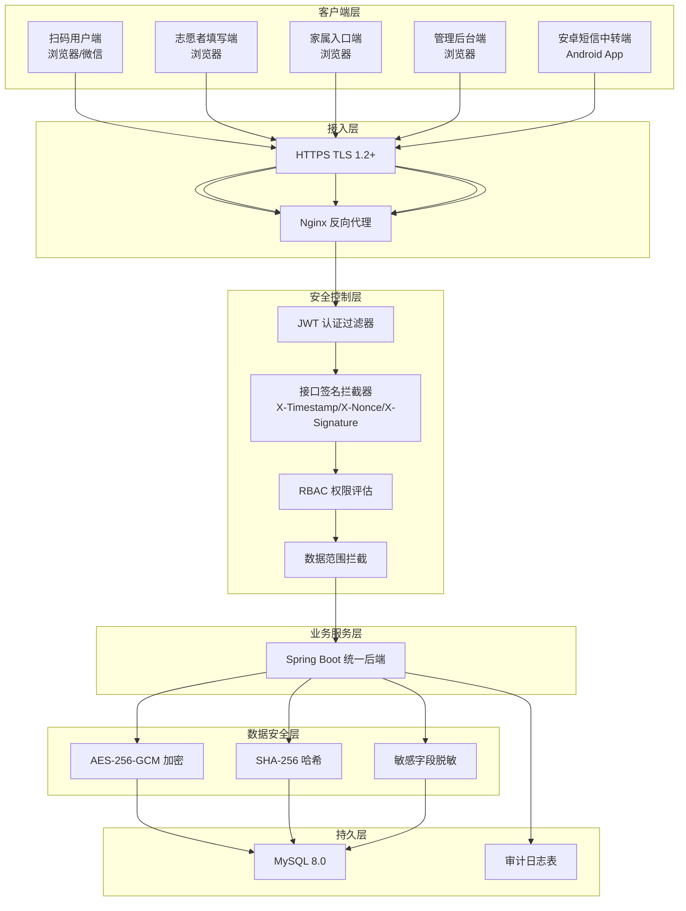

### 8.6 数据流图

#### 8.6.1 扫码查看健康档案数据流

```mermaid
flowchart LR
    A[用户扫描二维码] --> B[解析 qr_token]
    B --> C{Token 有效?}
    C -->|否| D[显示 404 错误页]
    C -->|是| E[加载老人基础信息<br/>姓名脱敏展示]
    E --> F[显示基础信息页]
    F --> G[用户点击验证]
    G --> H[创建验证会话<br/>scan_verification_session]
    H --> I[显示短信发送指引]
    I --> J[用户发送短信到中转号]
    J --> K[安卓短信中转端接收]
    K --> L[上报到 /api/sms-relay/inbound]
    L --> M[匹配验证会话]
    M --> N[更新会话状态为 VERIFIED]
    N --> O[用户刷新页面]
    O --> P[加载完整健康档案<br/>health_record + medication + scale_record]
    P --> Q[显示健康档案页<br/>ContentProtection 水印保护]
```

#### 8.6.2 志愿者填写数据流

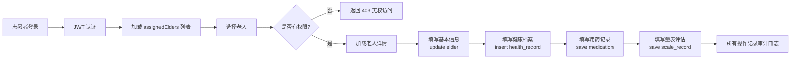

***

## 9. 软件界面设计

### 9.1 界面设计概述

SilverLink Care（智联名牌）采用 **移动优先（Mobile-First）** 的设计理念，针对三类主要用户群体（扫码访客、社区志愿者、系统管理员）分别提供适配其使用场景的界面。

### 9.1.1 设计原则

- **移动优先**：扫码用户端和志愿者填写端以移动端体验为核心，管理后台端适配桌面端
- **卡片式布局**：信息以卡片形式组织，降低认知负荷
- **主色调**：青绿色 `#0da2ad`，传递健康、信任、专业的视觉感受
- **数据脱敏**：未验证状态下所有敏感信息（姓名、电话）均脱敏展示
- **安全防护**：验证通过后的页面启用 `ContentProtection` 水印覆盖，防止截屏泄露

### 9.2 页面清单

#### 9.2.1 扫码用户端（01-扫码用户端）

| 页面路径 | 页面组件 | 权限要求 | 功能说明 |
|----------|----------|----------|----------|
| `/` | BasicInfoPage | 无需登录 | 扫码后默认页，展示老人脱敏基础信息 |
| `/verify` | SmsVerifyPage | 无需登录 | 短信验证指引页，显示待发送的短信内容和接收号码 |
| `/health` | HealthArchivePage | 需验证通过 | 完整健康档案页 |
| `/medication` | MedicationPage | 需验证通过 | 主要用药页 |
| `/scale` | ScaleSummaryPage | 需验证通过 | 量表摘要页 |
| `/scale/:scaleName` | ScaleDetailPage | 需验证通过 | 量表详情页 |
| `/nameplate` | NameplatePreviewPage | 无需验证 | 实体名牌预览页 |
| `/404` | NotFoundPage | 无需登录 | 二维码异常页 |

#### 9.2.2 志愿者填写端（02-志愿者填写端）

##### 主应用页面

| 页面路径 | 页面组件 | 权限要求 | 功能说明 |
|----------|----------|----------|----------|
| `#/` | LoginPage | 无需登录 | 志愿者登录页 |
| `#/list` | AssignedElderListPage | 需 VOLUNTEER 登录 | 本人负责老人列表 |
| `#/detail` | ElderDetailPage | 需 VOLUNTEER 登录 | 老人详情页 |
| `#/basic` | BasicInfoFormPage | 需 VOLUNTEER 登录 | 老人基本信息编辑表单 |
| `#/medication` | MedicationFormPage | 需 VOLUNTEER 登录 | 主要用药填写页 |
| `#/scale` | ScaleFormPage | 需 VOLUNTEER 登录 | 量表填写页 |
| `#/qrcode` | QrCodeManagePage | 需 VOLUNTEER 登录 | 二维码管理页 |

##### 家属入口子应用（family-entry）

| 页面路径 | 页面组件 | 权限要求 | 功能说明 |
|----------|----------|----------|----------|
| `#/family/invite/:code` | InviteLandingPage | 无需登录 | 邀请落地页 |
| `#/family/register` | FamilyRegisterPage | 需有效邀请码 | 家属注册页 |
| `#/family/verify` | SmsVerifyPage | 需注册中 | 短信验证码页 |
| `#/family/login` | FamilyLoginPage | 无需登录 | 家属登录页 |
| `#/family/` | FamilyHomePage | 需 FAMILY 登录 | 家属首页 |
| `#/family/elders/:elderId` | ElderBasicManagePage | 需绑定该老人 | 老人基本信息管理页 |
| `#/family/elders/:elderId/contacts` | ContactManagePage | 需绑定该老人 | 紧急联系人管理页 |
| `#/family/elders/:elderId/medications` | MedicationManagePage | 需绑定该老人 | 用药管理页 |
| `#/family/elders/:elderId/qrcode` | QrCodeViewPage | 需绑定该老人 | 二维码查看页 |

#### 9.2.3 管理后台端（03-管理后台端）

| 页面路径 | 页面组件 | 权限要求 | 功能说明 |
|----------|----------|----------|----------|
| `/login` | AdminLoginPage | 无需登录 | 后台登录页 |
| `/` | DashboardPage | 需登录 | 首页概览 |
| `/elders` | ElderArchivePage | 需菜单权限 | 老人档案管理页 |
| `/medications` | MedicationManagePage | 需菜单权限 | 用药信息管理页 |
| `/scales` | ScaleManagePage | 需菜单权限 | 量表管理页 |
| `/qrcodes` | QrCodeManagePage | 需菜单权限 | 二维码管理页 |
| `/volunteers` | VolunteerManagePage | 需菜单权限 | 志愿者管理页 |
| `/invitations` | InvitationManagePage | 需菜单权限 | 邀请码管理页 |
| `/family-bindings` | FamilyBindingManagePage | 需菜单权限 | 家属绑定管理页 |
| `/sms-relay` | SmsRelayManagePage | 需菜单权限 | 短信中转设备管理页 |
| `/rbac` | RbacPage | 需菜单权限 | 角色权限配置页 |
| `/audit/admin` | AuditLogPage | 需菜单权限 | 管理员操作日志 |
| `/audit/medical` | AuditLogPage | 需菜单权限 | 医护操作日志 |
| `/audit/family` | AuditLogPage | 需菜单权限 | 家属操作日志 |
| `/audit/visitor` | AuditLogPage | 需菜单权限 | 访客操作日志 |
| `/security` | SecuritySettingsPage | 需菜单权限 | 安全策略页 |
| `/analytics` | AnalyticsPage | 需菜单权限 | 统计分析页 |

### 9.3 三端界面架构图

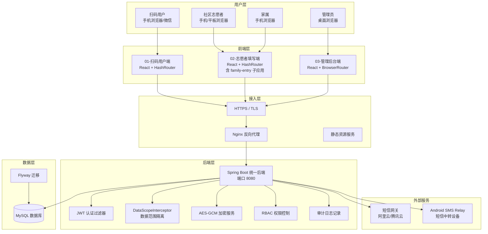

### 9.4 系统部署图

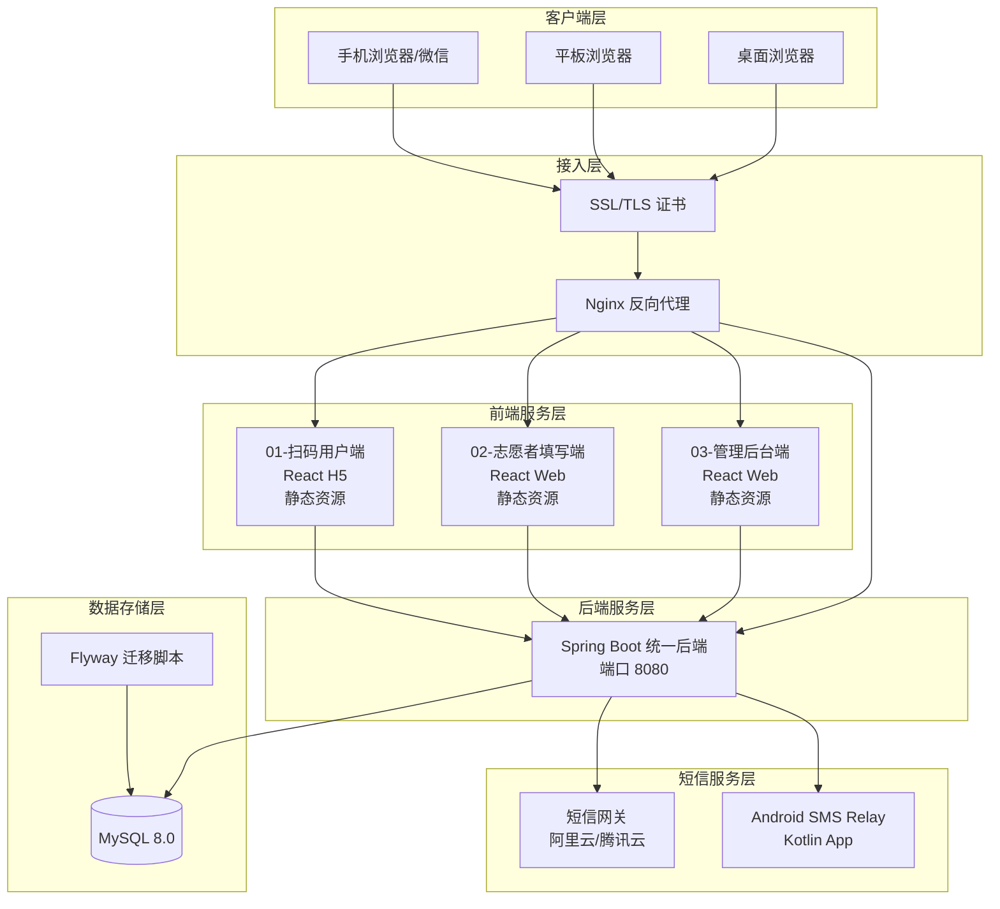

***

## 10. 附录

### 10.1 术语表

| 术语 | 英文 | 定义 |
|------|------|------|
| 智联名牌 | SilverLink Care | 面向老年人群体的智能二维码名牌系统 |
| 二维码 | QR Code | 存储加密老人身份标识的矩阵条码 |
| 短信验证 | SMS Verification | 通过发送短信验证码确认用户身份的安全机制 |
| 短信中继 | SMS Relay | 通过安卓设备中转短信验证码到后端系统的服务 |
| 心理量表 | Psychological Scale | 用于评估老人心理健康状况的标准化问卷 |
| PHQ-9 | Patient Health Questionnaire-9 | 患者健康问卷，用于抑郁症状筛查 |
| GAD-7 | Generalized Anxiety Disorder-7 | 广泛性焦虑障碍量表 |
| UCLA | UCLA Loneliness Scale | UCLA孤独量表 |
| 数据范围隔离 | Data Scope Isolation | 基于用户角色限制可访问数据范围的机制 |
| 紧急联系人 | Emergency Contact | 老人发生紧急情况时优先联系的人员 |
| 志愿者 | Volunteer | 经培训后为老人提供照护服务的社区志愿者 |
| 家属 | Family Member | 经邀请码注册并绑定老人的家属用户 |
| 系统管理员 | System Administrator | 拥有系统全部权限的管理角色 |
| 项目管理员 | Project Administrator | 负责日常数据管理的操作角色 |
| 审计员 | Auditor | 仅可查看审计日志的只读角色 |

### 10.2 参考文档

1. 《SilverLink Care 前端开发文档》- 01-扫码用户端、02-志愿者填写端、03-管理后台端
2. 《SilverLink Care 后端开发文档》- 04-统一后端
3. 《SilverLink Care 数据库设计文档》- Flyway 迁移文件 V1-V11
4. 《SilverLink Care Android SMS Relay 开发文档》- 05-Android SMS中继
5. 《Spring Boot 官方文档》- https://spring.io/projects/spring-boot
6. 《React 官方文档》- https://react.dev/
7. 《JWT 规范 RFC 7519》- https://tools.ietf.org/html/rfc7519

### 10.3 接口清单汇总

#### 10.3.1 扫码用户端接口

| 接口路径 | 方法 | 说明 |
|----------|------|------|
| /api/scan/resolve | POST | 解析二维码获取老人基础信息 |
| /api/scan/{elderId}/health | GET | 获取老人健康档案（需验证） |
| /api/scan/{elderId}/medications | GET | 获取老人用药记录（需验证） |
| /api/scan/{elderId}/scales | GET | 获取老人量表记录（需验证） |
| /api/scan/verify/send | POST | 发送短信验证码 |
| /api/scan/verify/check | POST | 校验短信验证码 |

#### 10.3.2 志愿者填写端接口

| 接口路径 | 方法 | 说明 |
|----------|------|------|
| /api/volunteer/login | POST | 志愿者登录 |
| /api/volunteer/elders | GET | 获取负责老人列表 |
| /api/volunteer/elders/{id} | GET/PUT | 获取/更新老人档案 |
| /api/volunteer/elders/{id}/health | GET/PUT | 获取/更新健康档案 |
| /api/volunteer/elders/{id}/medications | GET/POST/PUT/DELETE | 用药管理 |
| /api/volunteer/elders/{id}/scales | GET/POST | 量表记录管理 |
| /api/volunteer/qrcode/{elderId} | GET | 获取老人二维码 |

#### 10.3.3 家属入口接口

| 接口路径 | 方法 | 说明 |
|----------|------|------|
| /api/family/invite/{code} | GET | 验证邀请码 |
| /api/family/register | POST | 家属注册 |
| /api/family/login | POST | 家属登录 |
| /api/family/elders | GET | 获取绑定老人列表 |
| /api/family/elders/{id} | GET/PUT | 获取/更新老人信息 |
| /api/family/elders/{id}/contacts | GET/POST/PUT/DELETE | 紧急联系人管理 |
| /api/family/elders/{id}/medications | GET | 查看用药记录 |
| /api/family/elders/{id}/qrcode | GET | 查看二维码 |

#### 10.3.4 管理后台接口

| 接口路径 | 方法 | 说明 |
|----------|------|------|
| /api/admin/login | POST | 管理员登录 |
| /api/admin/dashboard | GET | 首页统计数据 |
| /api/admin/elders | GET/POST/PUT/DELETE | 老人档案管理 |
| /api/admin/medications | GET/POST/PUT/DELETE | 用药信息管理 |
| /api/admin/scales | GET | 量表记录管理 |
| /api/admin/qrcodes | GET/POST/PUT/DELETE | 二维码管理 |
| /api/admin/volunteers | GET/POST/PUT/DELETE | 志愿者管理 |
| /api/admin/invitations | GET/POST | 邀请码管理 |
| /api/admin/family-bindings | GET/PUT/DELETE | 家属绑定管理 |
| /api/admin/sms-relay | GET/POST/PUT/DELETE | 短信中转设备管理 |
| /api/admin/rbac/roles | GET/POST/PUT/DELETE | 角色管理 |
| /api/admin/rbac/permissions | GET | 权限列表 |
| /api/admin/audit | GET | 审计日志查询 |
| /api/admin/security | GET/PUT | 安全策略配置 |
| /api/admin/analytics | GET | 统计分析数据 |

#### 10.3.5 短信中继接口

| 接口路径 | 方法 | 说明 |
|----------|------|------|
| /api/sms-relay/devices | POST | 设备注册 |
| /api/sms-relay/devices/{id}/heartbeat | POST | 设备心跳 |
| /api/sms-relay/devices/{id}/messages | POST | 上报短信 |
| /api/sms-relay/tasks | GET | 获取待发送任务 |
| /api/sms-relay/tasks/{id}/status | PUT | 更新发送状态 |

### 10.4 角色权限矩阵

| 功能模块 | 系统管理员 | 项目管理员 | 审计员 | 志愿者 | 家属 |
|----------|:----------:|:----------:|:------:|:------:|:----:|
| 老人档案-查看全部 | ✓ | ✓ | ✗ | 仅负责 | 仅绑定 |
| 老人档案-新增/编辑/删除 | ✓ | ✓ | ✗ | ✗ | ✗ |
| 健康档案-查看 | ✓ | ✓ | ✗ | 仅负责 | 仅绑定 |
| 健康档案-编辑 | ✓ | ✓ | ✗ | 仅负责 | ✗ |
| 用药信息-查看 | ✓ | ✓ | ✗ | 仅负责 | 仅绑定 |
| 用药信息-编辑 | ✓ | ✓ | ✗ | 仅负责 | ✗ |
| 量表记录-查看 | ✓ | ✓ | ✗ | 仅负责 | 仅绑定 |
| 量表记录-录入 | ✓ | ✓ | ✗ | 仅负责 | ✗ |
| 二维码-查看 | ✓ | ✓ | ✗ | 仅负责 | 仅绑定 |
| 二维码-生成/停用 | ✓ | ✓ | ✗ | ✗ | ✗ |
| 志愿者管理 | ✓ | ✓ | ✗ | ✗ | ✗ |
| 家属绑定管理 | ✓ | ✓ | ✗ | ✗ | ✗ |
| 邀请码管理 | ✓ | ✓ | ✗ | ✗ | ✗ |
| 短信中继设备管理 | ✓ | ✗ | ✗ | ✗ | ✗ |
| RBAC配置 | ✓ | ✗ | ✗ | ✗ | ✗ |
| 审计日志查看 | ✓ | ✗ | ✓ | ✗ | ✗ |
| 安全策略配置 | ✓ | ✗ | ✗ | ✗ | ✗ |
| 统计分析 | ✓ | ✓ | ✗ | ✗ | ✗ |

### 10.5 量表评分标准

#### 10.5.1 PHQ-9 抑郁量表评分标准

| 分值范围 | 抑郁程度 | 建议措施 |
|----------|----------|----------|
| 0-4 | 无抑郁 | 无需特殊处理 |
| 5-9 | 轻度抑郁 | 建议关注，必要时咨询医生 |
| 10-14 | 中度抑郁 | 建议寻求专业帮助 |
| 15-19 | 中重度抑郁 | 建议尽快就医 |
| 20-27 | 重度抑郁 | 必须立即就医 |

#### 10.5.2 GAD-7 焦虑量表评分标准

| 分值范围 | 焦虑程度 | 建议措施 |
|----------|----------|----------|
| 0-4 | 无焦虑 | 无需特殊处理 |
| 5-9 | 轻度焦虑 | 建议关注，必要时咨询医生 |
| 10-14 | 中度焦虑 | 建议寻求专业帮助 |
| 15-21 | 重度焦虑 | 建议尽快就医 |

#### 10.5.3 UCLA 孤独量表评分标准

| 分值范围 | 孤独程度 | 建议措施 |
|----------|----------|----------|
| 20-34 | 低孤独感 | 社交状态良好 |
| 35-49 | 中等孤独感 | 建议增加社交活动 |
| 50-60 | 高孤独感 | 建议寻求专业心理支持 |

### 10.6 二维码加密说明

二维码中的 token 采用 AES-256-GCM 算法加密，包含以下字段：

```json
{
  "qrId": "二维码唯一标识",
  "elderId": "老人唯一标识",
  "issuedAt": "签发时间戳",
  "expiresAt": "过期时间戳"
}
```

加密后的 token 通过 URL 安全的 Base64 编码，嵌入二维码 URL 中：

```
https://{domain}/s/{encryptedToken}
```

### 10.7 版本历史

| 版本 | 日期 | 作者 | 修改内容 |
|------|------|------|----------|
| V1.0 | 2026-05-25 | SilverLink Care 团队 | 初始版本，涵盖五端完整功能需求 |

***

> 本文档为 SilverLink Care（智联名牌）项目的软件需求规格说明书，涵盖 01-扫码用户端、02-志愿者填写端、03-管理后台端、04-统一后端、05-Android SMS中继 全部功能模块。文档内容基于项目真实源码编写，作为系统开发、测试和验收的依据。