# VulnScan 代码安全分析平台 - 软件需求规格说明书

***

## 目录

1. [引言](#1-引言)
2. [业务需求分析](#2-业务需求分析)
3. [系统需求分析](#3-系统需求分析)
4. [系统功能示意](#4-系统功能示意)
5. [涉众分析](#5-涉众分析)
6. [用例规约](#6-用例规约)
7. [非功能性需求](#7-非功能性需求)
8. [数据库设计](#8-数据库设计)
9. [软件界面设计](#9-软件界面设计)
10. [附录](#10-附录)

***

## 1. 引言

### 1.1 编写目的

本文档详细描述了"VulnScan代码安全分析平台"的软件需求规格。本文档面向项目经理、开发人员、测试人员、UI设计师以及最终用户，作为系统开发、测试和验收的依据。

### 1.2 项目背景

VulnScan 是一个支持多批次分析的代码理解与安全分析平台，采用统一的用户角色，实现项目管理、任务管理、多智能体分析、报告查看与源码浏览的完整闭环。系统提供代码项目解析、架构分析、安全检测、智能对话等功能，帮助用户快速理解和分析代码项目结构，发现潜在的安全问题。

### 1.3 定义与缩写

| 术语/缩写             | 定义                                                  |
| ----------------- | --------------------------------------------------- |
| JWT               | JSON Web Token，无状态认证令牌                              |
| REST              | Representational State Transfer，表述性状态转移             |
| API               | Application Programming Interface，应用程序接口            |
| ORM               | Object Relational Mapping，对象关系映射                    |
| FastAPI           | 高性能Python Web框架                                     |
| SQLAlchemy        | Python ORM框架                                        |
| SQLite            | 轻量级嵌入式数据库（开发环境）                                     |
| PostgreSQL        | 开源关系型数据库（生产环境）                                      |
| Neo4j             | 图数据库，存储代码关系（仅在detailed\_intro模式使用）                  |
| LLM               | Large Language Model，大语言模型                          |
| Agent             | 智能体，自主执行任务的AI实体                                     |
| Orchestrator      | 编排器，协调多个智能体的执行                                      |
| FileAnalyzerAgent | 文件分析智能体，执行具体文件分析任务                                  |
| Checkpoint        | 检查点，用于断点续分析的状态快照                                    |
| AST               | Abstract Syntax Tree，抽象语法树                          |
| Analysis Mode     | 分析模式：simple\_intro/detailed\_intro/security\_report |
| Run Mode          | 运行模式：fresh（全新分析）/ resume（断点续分析）                     |
| Project Scope     | 运行批次标识，区分同一项目的不同分析运行                                |

### 1.4 参考资料

1. 《前端开发文档》 - FRONTEND\_DEV.md
2. 《后端开发文档》 - BACKEND\_DEV.md
3. 《数据库设计文档》 - DATABASE\_DESIGN.md

***

## 2. 业务需求分析

### 2.1 业务背景

#### 2.1.1 行业现状

随着软件开发的快速发展，代码理解与安全分析需求日益突出：

- 开源组件被广泛应用于商业软件中
- 新代码库上手成本高，需要快速理解项目结构
- 代码复杂度持续增长，人工审计难以应对大规模代码分析需求
- 安全问题发现滞后，传统静态分析工具误报率高

#### 2.1.2 现有问题

| 问题类型 | 具体描述                      |
| ---- | ------------------------- |
| 效率问题 | 人工代码阅读和审计耗时长，难以快速理解大规模代码库 |
| 遗漏问题 | 人工审计容易遗漏代码结构问题或隐蔽缺陷       |
| 误报问题 | 传统静态分析工具产生大量误报            |
| 技能门槛 | 代码分析需要专业知识，新成员上手困难        |

### 2.2 业务目标

#### 2.2.1 总体目标

构建一个**简洁、高效、易用**的代码安全分析平台，实现项目管理和安全分析的一体化流程。

#### 2.2.2 具体目标

| 目标编号   | 目标描述     | 衡量指标          |
| ------ | -------- | ------------- |
| BG-001 | 提高代码分析效率 | 相比人工阅读提升5倍以上  |
| BG-002 | 简化操作流程   | 用户30分钟内完成首次分析 |
| BG-003 | 降低使用门槛   | 普通开发者可独立使用    |

### 2.3 业务范围

#### 2.3.1 业务范围定义

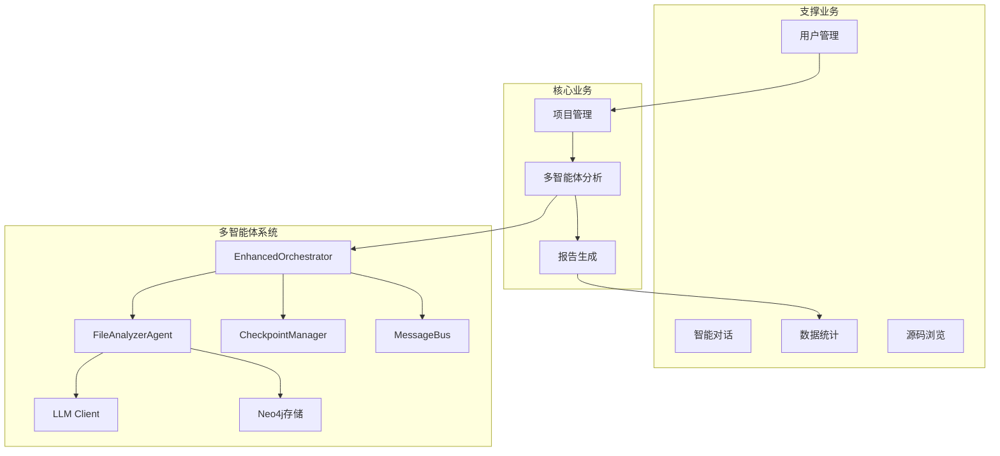
```mermaid
graph TB
    subgraph 核心业务
        A1[项目管理]
        A2[多智能体分析]
        A3[报告生成]
    end

    subgraph 支撑业务
        B1[用户管理]
        B2[智能对话]
        B3[数据统计]
        B4[源码浏览]
    end

    subgraph 多智能体系统
        C1[EnhancedOrchestrator]
        C2[FileAnalyzerAgent]
        C3[CheckpointManager]
        C4[MessageBus]
        C5[LLM Client]
        C6[Neo4j存储]
    end

    A1 --> A2 --> A3
    B1 --> A1
    A3 --> B3
    A2 --> C1
    C1 --> C2
    C2 --> C5
    C1 --> C3
    C1 --> C4
    C2 --> C6
```

### 2.4 业务规则

#### 2.4.1 用户管理规则

| 规则编号   | 规则名称 | 规则描述                |
| ------ | ---- | ------------------- |
| BR-001 | 账户锁定 | 连续5次登录失败，账户锁定30分钟   |
| BR-002 | 密码强度 | 密码长度6-20位，必须包含字母和数字 |
| BR-003 | 会话超时 | 用户无操作30分钟后自动登出      |

#### 2.4.2 项目管理规则

| 规则编号   | 规则名称  | 规则描述                  |
| ------ | ----- | --------------------- |
| BR-004 | 项目限制  | 每个用户最多创建50个项目         |
| BR-005 | 文件大小  | 单次上传 ZIP 文件最大 1GB     |
| BR-006 | 项目-任务 | 每个项目可创建多个分析任务，并保留历史批次 |

***

## 3. 系统需求分析

### 3.1 系统目标

构建一个简洁的代码安全分析平台，实现以下目标：

| 目标      | 描述                   |
| ------- | -------------------- |
| **简洁化** | 统一用户角色，简化权限管理        |
| **一体化** | 项目、任务、运行批次全链路关联，流程清晰 |
| **可视化** | 提供直观的任务监控和结果展示       |

### 3.2 系统架构

#### 3.2.1 整体架构

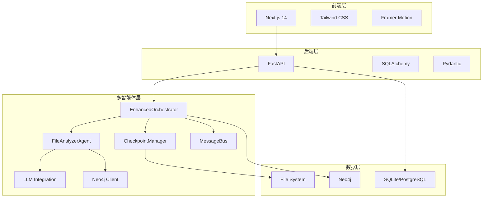
```mermaid
graph TB
    subgraph 前端层
        A1[Next.js 14]
        A2[Tailwind CSS]
        A3[Framer Motion]
    end

    subgraph 后端层
        B1[FastAPI]
        B2[SQLAlchemy]
        B3[Pydantic]
    end

    subgraph 多智能体层
        C1[EnhancedOrchestrator]
        C2[FileAnalyzerAgent]
        C3[LLM Integration]
        C4[CheckpointManager]
        C5[MessageBus]
        C6[Neo4j Client]
    end

    subgraph 数据层
        D1[SQLite/PostgreSQL]
        D2[Neo4j]
        D3[File System]
    end

    A1 --> B1
    B1 --> C1
    C1 --> C2
    C2 --> C3
    C1 --> C4
    C1 --> C5
    C2 --> C6
    B1 --> D1
    C1 --> D2
    C4 --> D3
```

#### 3.2.2 技术栈

| 层级      | 技术            | 版本     | 说明                 |
| ------- | ------------- | ------ | ------------------ |
| 前端框架    | Next.js       | 14.2+  | React框架，支持SSR/SSG  |
| 前端语言    | TypeScript    | 5.0+   | 类型安全的JavaScript    |
| UI库     | React         | 18.0+  | UI组件库              |
| 样式      | Tailwind CSS  | 3.4.0  | 原子化CSS框架           |
| 动画      | Framer Motion | 12.0+  | React动画库           |
| 后端框架    | FastAPI       | 0.109+ | 高性能Python Web框架    |
| ORM     | SQLAlchemy    | 2.0+   | Python ORM框架       |
| 数据库(开发) | SQLite        | 3.0+   | 嵌入式关系型数据库          |
| 数据库(生产) | PostgreSQL    | 15+    | 开源关系型数据库           |
| 图数据库    | Neo4j         | 5.0+   | 图数据库，存储代码关系        |
| LLM     | OpenAI API    | -      | GPT-4/GPT-3.5大语言模型 |
| 多智能体    | MultiAgent    | -      | 自研多智能体分析系统         |
| 检查点     | JSON文件        | -      | 断点续分析状态存储          |
| 消息总线    | asyncio.Queue | -      | 异步消息通信机制           |

### 3.3 功能需求

#### 3.3.1 功能模块划分

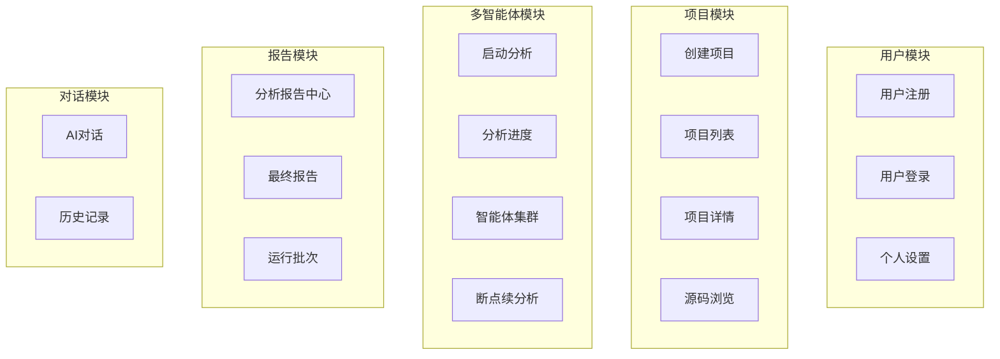
```mermaid
graph TB
    subgraph 用户模块
        A1[用户注册]
        A2[用户登录]
        A3[个人设置]
    end
    
    subgraph 项目模块
        B1[创建项目]
        B2[项目列表]
        B3[项目详情]
        B4[源码浏览]
    end
    
    subgraph 多智能体模块
        C1[启动分析]
        C2[分析进度]
        C3[智能体集群]
        C4[断点续分析]
    end
    
    subgraph 报告模块
        D1[分析报告中心]
        D2[最终报告]
        D3[运行批次]
    end
    
    subgraph 对话模块
        E1[AI对话]
        E2[历史记录]
    end
```

#### 3.3.2 功能需求清单

| 模块   | 功能编号  | 功能名称   | 功能描述                                               | 优先级 |
| ---- | ----- | ------ | -------------------------------------------------- | --- |
| 用户管理 | F-001 | 用户注册   | 用户填写信息注册账户，需邀请码验证                                  | 高   |
| 用户管理 | F-002 | 用户登录   | JWT认证登录，支持用户名或邮箱                                   | 高   |
| 项目管理 | F-003 | 创建项目   | 创建分析项目，支持Git仓库和ZIP上传                               | 高   |
| 项目管理 | F-004 | 项目列表   | 查看和管理项目列表，支持搜索和筛选                                  | 高   |
| 项目管理 | F-005 | 项目详情   | 查看项目详细信息和分析控制                                      | 高   |
| 项目管理 | F-006 | 源码浏览   | 浏览项目源码目录树和文件内容                                     | 中   |
| 项目管理 | F-007 | 项目删除   | 删除项目及相关数据                                          | 中   |
| 任务管理 | F-008 | 创建任务   | 创建分析任务，支持多种分析类型                                    | 高   |
| 任务管理 | F-009 | 任务列表   | 查看任务列表和状态                                          | 高   |
| 任务管理 | F-010 | 任务详情   | 查看任务详细信息和日志                                        | 中   |
| 多智能体 | F-011 | 启动分析   | 启动多智能体分析任务，支持三种分析模式                                | 高   |
| 多智能体 | F-012 | 分析进度   | 实时监控分析执行进度和智能体状态                                   | 高   |
| 多智能体 | F-013 | 智能体集群  | 查看所有运行中的智能体状态和统计                                   | 高   |
| 多智能体 | F-014 | 断点续分析  | 从检查点恢复分析任务                                         | 中   |
| 多智能体 | F-015 | 暂停分析   | 暂停正在运行的多智能体分析                                      | 中   |
| 多智能体 | F-016 | 分析模式选择 | 选择simple\_intro/detailed\_intro/security\_report模式 | 高   |
| 分析结果 | F-017 | 分析发现   | 查看代码分析发现的问题列表（含安全漏洞）                               | 高   |
| 分析结果 | F-018 | 发现详情   | 查看分析发现的详细信息和修复建议                                   | 中   |
| 分析报告 | F-019 | 报告摘要   | 查看分析统计和高风险文件                                       | 高   |
| 分析报告 | F-020 | 最终报告   | 查看多智能体分析生成的Markdown报告                              | 高   |
| 分析报告 | F-021 | 报告导出   | 导出报告为文本格式                                          | 低   |
| 对话管理 | F-022 | AI对话   | 与AI助手交互获取分析建议                                      | 中   |
| 对话管理 | F-023 | 对话历史   | 查看历史对话消息                                           | 低   |

### 3.4 接口需求

#### 3.4.1 RESTful API

| 接口分类   | 接口数量 | 说明                          |
| ------ | ---- | --------------------------- |
| 认证接口   | 2    | 登录、注册（需邀请码）                 |
| 项目接口   | 6    | 项目CRUD、列表查询、源码浏览、ZIP上传      |
| 任务接口   | 5    | 任务CRUD、日志查询、分析发现列表          |
| 多智能体接口 | 11   | 启动分析、暂停任务、进度查询、智能体详情、检查点管理等 |
| 源码接口   | 2    | 源码树、文件内容                    |
| 分析结果接口 | 2    | 分析发现列表、发现详情                 |
| 报告接口   | 2    | 报告摘要、报告导出                   |
| 对话接口   | 2    | 对话消息、历史记录                   |

#### 3.4.2 多智能体接口详情

| 路径                                                | 方法   | 功能描述        |
| ------------------------------------------------- | ---- | ----------- |
| `/api/v1/multiagent/analyze/{project_id}`         | POST | 启动多智能体分析    |
| `/api/v1/multiagent/pause/{task_id}`              | POST | 暂停多智能体任务    |
| `/api/v1/multiagent/progress/{task_id}`           | GET  | 获取分析进度      |
| `/api/v1/multiagent/agents/stats`                 | GET  | 获取智能体统计信息   |
| `/api/v1/multiagent/agents/{agent_id}`            | GET  | 获取智能体详情     |
| `/api/v1/multiagent/agents/{agent_id}/activities` | GET  | 获取智能体活动记录   |
| `/api/v1/multiagent/checkpoints`                  | GET  | 列出检查点       |
| `/api/v1/multiagent/dashboard`                    | GET  | 获取智能体仪表盘数据  |
| `/api/v1/multiagent/runs/{project_id}/report`     | GET  | 获取运行批次最终报告  |
| `/api/v1/multiagent/runs/{project_id}/neo4j`      | GET  | 获取Neo4j图谱快照 |
| `/api/v1/multiagent/runs/{project_id}/logs`       | GET  | 获取运行批次日志    |

#### 3.4.3 分析模式参数

**analysis\_mode**: 分析模式，可选值：

- `simple_intro`: 简单介绍模式，快速生成项目概述
- `detailed_intro`: 详细介绍模式，包含架构分析和Neo4j图谱
- `security_report`: 安全报告模式（默认），聚焦代码安全分析和潜在漏洞检测

**run\_mode**: 运行模式，可选值：

- `fresh`: 全新分析（默认）
- `resume`: 从检查点恢复分析

***

## 4. 系统功能示意

### 4.1 系统功能概述

本系统采用单一用户角色，提供从项目管理到安全分析的一体化流程。

### 4.2 功能结构图

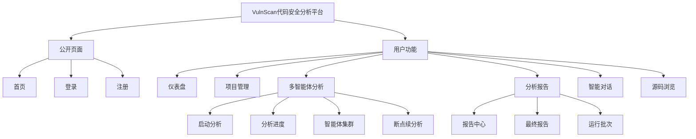
```mermaid
graph TD
    A[VulnScan代码安全分析平台] --> B[公开页面]
    A --> C[用户功能]
    
    B --> B1[首页]
    B --> B2[登录]
    B --> B3[注册]
    
    C --> C1[仪表盘]
    C --> C2[项目管理]
    C --> C3[多智能体分析]
    C --> C4[分析报告]
    C --> C5[智能对话]
    C --> C6[源码浏览]
    
    C3 --> C3a[启动分析]
    C3 --> C3b[分析进度]
    C3 --> C3c[智能体集群]
    C3 --> C3d[断点续分析]
    
    C4 --> C4a[报告中心]
    C4 --> C4b[最终报告]
    C4 --> C4c[运行批次]
```

### 4.3 核心业务流程

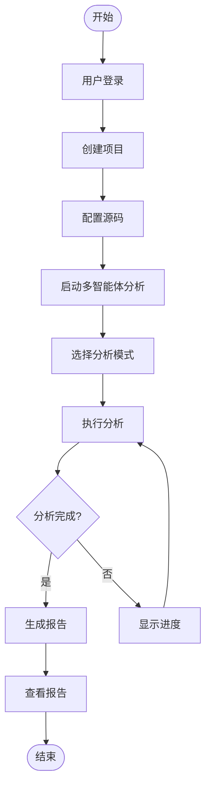
```mermaid
flowchart TD
    Start([开始]) --> A[用户登录]
    A --> B[创建项目]
    B --> C[配置源码]
    C --> D[启动多智能体分析]
    D --> E[选择分析模式]
    E --> F[执行分析]
    F --> G{分析完成?}
    G -->|是| H[生成报告]
    G -->|否| I[显示进度]
    I --> F
    H --> J[查看报告]
    J --> End([结束])
```

### 4.4 任务状态流转

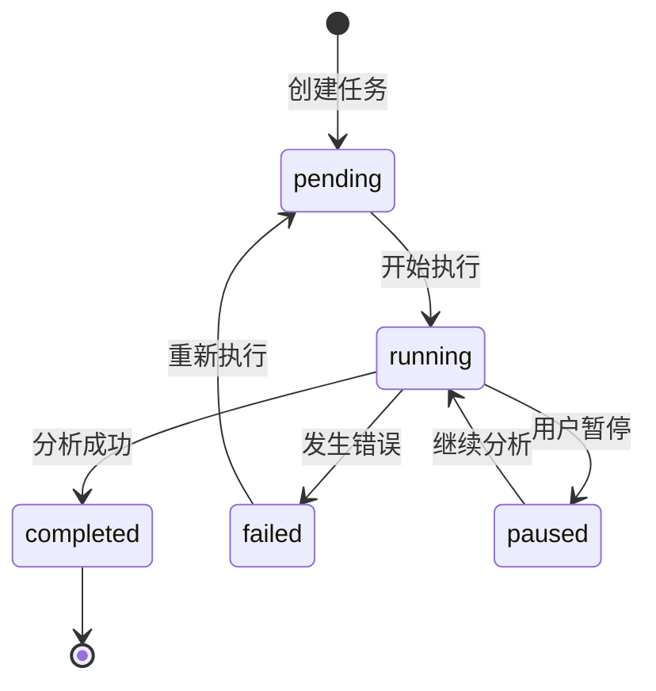
```mermaid
stateDiagram-v2
    [*] --> pending: 创建任务
    pending --> running: 开始执行
    running --> completed: 分析成功
    running --> failed: 发生错误
    running --> paused: 用户暂停
    paused --> running: 继续分析
    failed --> pending: 重新执行
    completed --> [*]
```

### 4.5 多智能体分析活动图

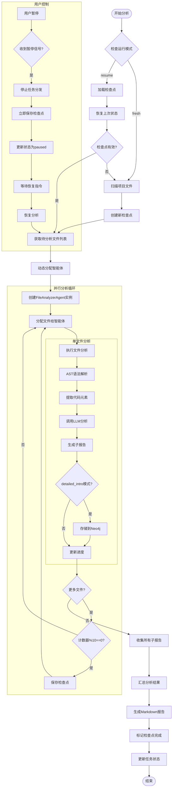
```mermaid
flowchart TD
    Start([开始分析]) --> A{检查运行模式}
    
    A -->|fresh| B[扫描项目文件]
    A -->|resume| C[加载检查点]
    
    B --> D[创建新检查点]
    C --> E[恢复上次状态]
    E --> F{检查点有效?}
    F -->|否| B
    F -->|是| G[获取待分析文件列表]
    D --> G
    
    G --> H[动态分配智能体]
    H --> I[创建FileAnalyzerAgent实例]
    
    subgraph 并行分析循环
        I --> J[分配文件给智能体]
        J --> K[执行文件分析]
        
        subgraph 单文件分析
            K --> K1[AST语法解析]
            K1 --> K2[提取代码元素]
            K2 --> K3[调用LLM分析]
            K3 --> K4[生成子报告]
            K4 --> K5{detailed_intro模式?}
            K5 -->|是| K6[存储到Neo4j]
            K5 -->|否| K7[更新进度]
            K6 --> K7
        end
        
        K7 --> L{更多文件?}
        L -->|是| M{计数器%10==0?}
        M -->|是| N[保存检查点]
        M -->|否| J
        N --> J
    end
    
    L -->|否| O[收集所有子报告]
    O --> P[汇总分析结果]
    P --> Q[生成Markdown报告]
    Q --> R[标记检查点完成]
    R --> S[更新任务状态]
    S --> End([结束])
    
    subgraph 用户控制
        T[用户暂停] --> U{收到暂停信号?}
        U -->|是| V[停止任务分发]
        V --> W[立即保存检查点]
        W --> X[更新状态为paused]
        X --> Y[等待恢复指令]
        Y --> Z[恢复分析]
        Z --> G
    end
```

### 4.6 项目创建活动图

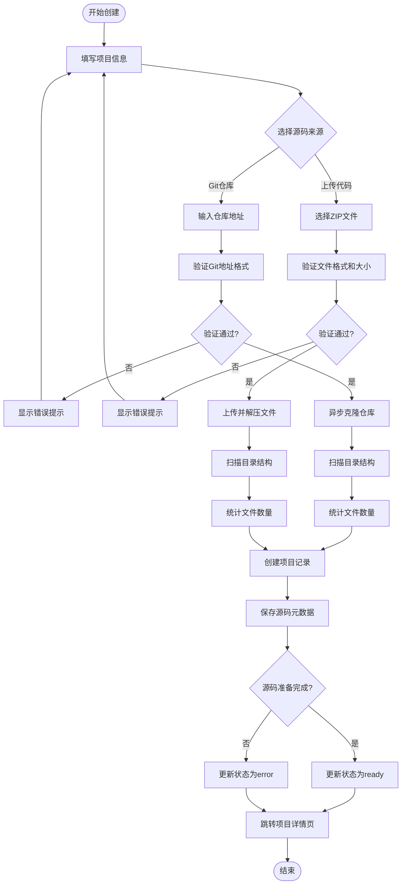
```mermaid
flowchart TD
    Start([开始创建]) --> A[填写项目信息]
    A --> B{选择源码来源}
    
    B -->|Git仓库| C[输入仓库地址]
    B -->|上传代码| D[选择ZIP文件]
    
    C --> E[验证Git地址格式]
    D --> F[验证文件格式和大小]
    
    E --> G{验证通过?}
    F --> H{验证通过?}
    
    G -->|否| I[显示错误提示] --> A
    H -->|否| J[显示错误提示] --> A
    
    G -->|是| K[异步克隆仓库]
    H -->|是| L[上传并解压文件]
    
    K --> M[扫描目录结构]
    L --> N[扫描目录结构]
    
    M --> O[统计文件数量]
    N --> P[统计文件数量]
    
    O --> Q[创建项目记录]
    P --> Q
    
    Q --> R[保存源码元数据]
    R --> S{源码准备完成?}
    
    S -->|是| T[更新状态为ready]
    S -->|否| U[更新状态为error]
    
    T --> V[跳转项目详情页]
    U --> V
    V --> End([结束])
```

### 4.7 页面清单

| 页面     | 路径                | 权限   | 说明              |
| ------ | ----------------- | ---- | --------------- |
| 首页     | /                 | 公开   | 平台介绍和导航入口       |
| 登录     | /login            | 公开   | 用户登录页面          |
| 注册     | /register         | 公开   | 用户注册页面          |
| 仪表盘    | /dashboard        | 登录用户 | 数据统计和快捷入口       |
| 项目列表   | /projects         | 登录用户 | 项目列表和管理         |
| 新建项目   | /projects/new     | 登录用户 | 创建新项目           |
| 项目详情   | /projects/:id     | 登录用户 | 项目详情、分析控制、源码浏览  |
| 分析报告中心 | /reports          | 登录用户 | 运行批次列表、分析统计     |
| 最终报告   | /reports/final    | 登录用户 | 多智能体分析生成的最终报告   |
| 智能体集群  | /dashboard/agents | 登录用户 | 智能体状态、运行批次、统计摘要 |
| 智能对话   | /chat             | 登录用户 | AI助手对话          |

***

## 5. 涉众分析

### 5.1 涉众概要

**表 5.1 涉众概要表**

| 编号    | 涉众名称 | 涉众说明            | 期望             |
| ----- | ---- | --------------- | -------------- |
| SH001 | 访客用户 | 无需登录即可访问公开页面的用户 | 了解平台功能、注册账户    |
| SH002 | 注册用户 | 已注册并登录的用户       | 管理项目、执行分析、查看报告 |

### 5.2 涉众简档

#### 5.2.1 访客用户涉众简档

**表 5.2 访客用户涉众简档表**

| 分类    | 详情               |
| ----- | ---------------- |
| 涉众    | SH001 访客用户       |
| 涉众代表  | 所有访问平台公开页面的未登录用户 |
| 特点    | 操作频率低，关注平台能力展示   |
| 职责    | 浏览公开内容、注册账户      |
| 成功标准  | 能独立完成注册流程        |
| 参与    | 不参与系统建设          |
| 可交付工作 | 无                |

#### 5.2.2 注册用户涉众简档

**表 5.3 注册用户涉众简档表**

| 分类    | 详情                  |
| ----- | ------------------- |
| 涉众    | SH002 注册用户          |
| 涉众代表  | 安全研究人员、开发人员         |
| 特点    | 操作频率高，关注分析效率、结果准确性  |
| 职责    | 创建项目、监控执行、查看结果      |
| 成功标准  | 能独立完成项目创建到报告查看的完整流程 |
| 参与    | 参与需求确认和用户验收测试       |
| 可交付工作 | 用户反馈、测试报告           |

### 5.3 用例图

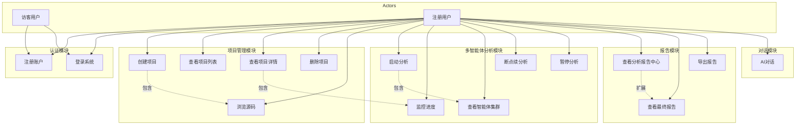
```mermaid
flowchart TB
    subgraph Actors
        G[访客用户]
        U[注册用户]
    end
    
    subgraph 认证模块
        UC1[注册账户]
        UC2[登录系统]
    end
    
    subgraph 项目管理模块
        UC3[创建项目]
        UC4[查看项目列表]
        UC5[查看项目详情]
        UC6[删除项目]
        UC7[浏览源码]
    end
    
    subgraph 多智能体分析模块
        UC8[启动分析]
        UC9[监控进度]
        UC10[查看智能体集群]
        UC11[断点续分析]
        UC12[暂停分析]
    end
    
    subgraph 报告模块
        UC13[查看分析报告中心]
        UC14[查看最终报告]
        UC15[导出报告]
    end
    
    subgraph 对话模块
        UC16[AI对话]
    end
    
    G --> UC1
    G --> UC2
    
    U --> UC1
    U --> UC2
    U --> UC3
    U --> UC4
    U --> UC5
    U --> UC6
    U --> UC7
    U --> UC8
    U --> UC9
    U --> UC10
    U --> UC11
    U --> UC12
    U --> UC13
    U --> UC14
    U --> UC15
    U --> UC16
    
    UC3 -.->|包含| UC7
    UC5 -.->|包含| UC9
    UC8 -.->|包含| UC10
    UC13 -.->|扩展| UC14
```

***

## 6. 用例规约

### 6.1 访问首页用例

**表 6.1 "访问首页"用例规约**

| 项目    | 内容                                                                                                                                 |
| ----- | ---------------------------------------------------------------------------------------------------------------------------------- |
| 用例名   | 访问首页                                                                                                                               |
| 简要描述  | 访客用户访问平台首页，了解平台功能和特性                                                                                                               |
| 参与者   | 访客用户                                                                                                                               |
| 前置条件  | 用户打开浏览器，输入平台网址                                                                                                                     |
| 后置条件  | 系统展示首页内容，用户可进行后续操作                                                                                                                 |
| 基本事件流 | (1) 用户输入平台网址(2) 系统加载首页背景动画(3) 系统展示导航栏(4) 系统展示英雄区域（平台介绍）(5) 系统展示功能特性区域(6) 系统展示代码分析类型区域(7) 系统展示工作流程区域(8) 系统展示行动号召区域(9) 系统展示页脚区域，用例结束 |
| 备选事件流 | 无                                                                                                                                  |
| 补充约束  | 首页加载时间不超过3秒，动画流畅不卡顿                                                                                                                |

### 6.2 用户注册用例

**表 6.2 "用户注册"用例规约**

| 项目    | 内容                                                                                                                                                                              |
| ----- | ------------------------------------------------------------------------------------------------------------------------------------------------------------------------------- |
| 用例名   | 用户注册                                                                                                                                                                            |
| 简要描述  | 新用户填写注册信息创建账户，需邀请码验证                                                                                                                                                            |
| 参与者   | 访客用户                                                                                                                                                                            |
| 前置条件  | 用户未登录，在登录页点击"注册"链接或直接访问注册页面                                                                                                                                                     |
| 后置条件  | 注册成功，用户可使用账户登录                                                                                                                                                                  |
| 基本事件流 | (1) 用户点击"注册"进入注册页面(2) 系统展示注册表单（用户名、邮箱、密码、确认密码、邀请码）(3) 用户填写注册信息(4) 用户输入邀请码(5) 用户点击"注册"按钮(6) 系统验证输入格式(7) 系统验证两次密码一致(8) 系统验证邀请码正确(9) 系统创建用户账户(10) 系统显示"注册成功"页面(11) 用户点击"立即登录"，用例结束 |
| 备选事件流 | A-1 用户名已存在：系统显示"用户名已被使用"错误提示A-2 邮箱已注册：系统显示"邮箱已被注册"错误提示A-3 两次密码不一致：系统显示"两次输入的密码不一致"错误提示A-4 密码长度不足：系统显示"密码长度至少为6位"错误提示A-5 邀请码错误：系统显示"邀请码无效"提示                                     |
| 补充约束  | 用户名必填，密码6位以上含字母数字，邮箱格式正确，邀请码必填                                                                                                                                                  |

**时序图：**

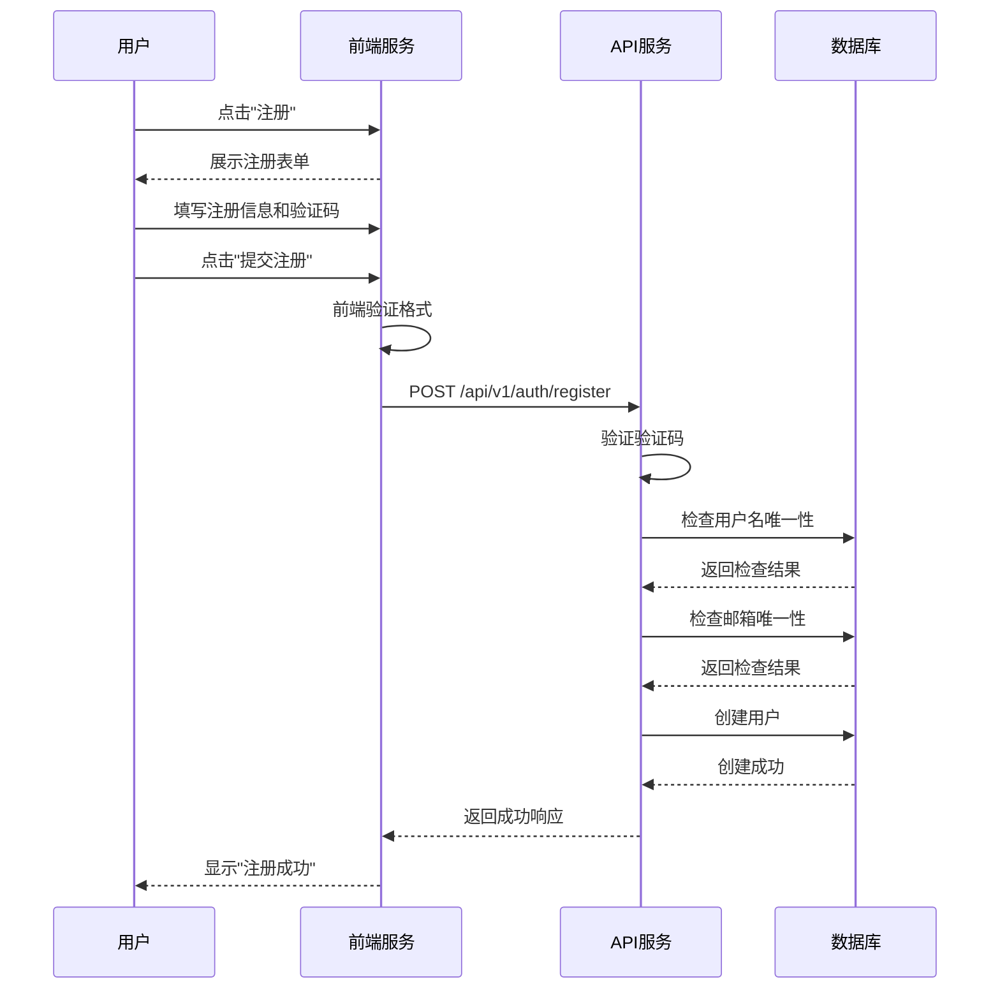
```mermaid
sequenceDiagram
    participant U as 用户
    participant F as 前端服务
    participant A as API服务
    participant D as 数据库

    U->>F: 点击"注册"
    F-->>U: 展示注册表单
    U->>F: 填写注册信息和验证码
    U->>F: 点击"提交注册"
    F->>F: 前端验证格式
    F->>A: POST /api/v1/auth/register
    A->>A: 验证验证码
    A->>D: 检查用户名唯一性
    D-->>A: 返回检查结果
    A->>D: 检查邮箱唯一性
    D-->>A: 返回检查结果
    A->>D: 创建用户
    D-->>A: 创建成功
    A-->>F: 返回成功响应
    F-->>U: 显示"注册成功"
```

### 6.3 用户登录用例

**表 6.3 "用户登录"用例规约**

| 项目    | 内容                                                                                                                               |
| ----- | -------------------------------------------------------------------------------------------------------------------------------- |
| 用例名   | 用户登录                                                                                                                             |
| 简要描述  | 已注册用户使用邮箱和密码登录系统                                                                                                                 |
| 参与者   | 注册用户                                                                                                                             |
| 前置条件  | 用户已完成注册，在首页点击"登录"或直接访问登录页面                                                                                                       |
| 后置条件  | 用户登录成功，跳转至仪表盘                                                                                                                    |
| 基本事件流 | (1) 用户在首页点击"登录"(2) 系统展示登录表单（邮箱、密码）(3) 用户输入邮箱地址(4) 用户输入密码(5) 用户点击"登录"按钮(6) 系统验证用户身份(7) 系统生成JWT Token(8) 系统存储认证状态(9) 系统跳转至仪表盘，用例结束 |
| 备选事件流 | A-1 账户不存在：系统显示"账户不存在"错误提示A-2 密码错误：系统显示"密码错误"错误提示A-3 账户已禁用：系统显示"账户已被禁用"提示                                                         |
| 补充约束  | 登录失败时显示通用错误提示，不暴露具体原因（安全考虑）                                                                                                      |

**认证时序图：**

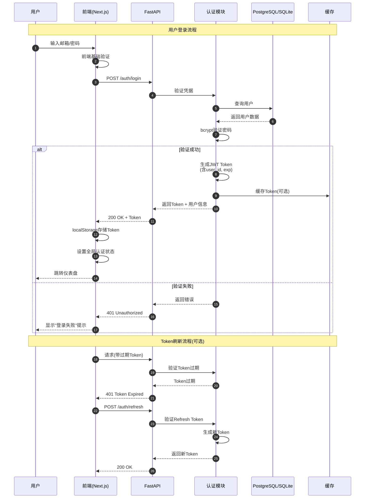
```mermaid
sequenceDiagram
    autonumber
    participant U as 用户
    participant F as 前端(Next.js)
    participant API as FastAPI
    participant Auth as 认证模块
    participant DB as PostgreSQL/SQLite
    participant Redis as 缓存

    Note over U,Redis: 用户登录流程
    U->>F: 输入邮箱/密码
    F->>F: 前端基础验证
    F->>API: POST /auth/login
    
    API->>Auth: 验证凭据
    Auth->>DB: 查询用户
    DB-->>Auth: 返回用户数据
    
    Auth->>Auth: bcrypt验证密码
    
    alt 验证成功
        Auth->>Auth: 生成JWT Token<br/>(含user_id, exp)
        Auth->>Redis: 缓存Token(可选)
        Auth-->>API: 返回Token + 用户信息
        API-->>F: 200 OK + Token
        F->>F: localStorage存储Token
        F->>F: 设置全局认证状态
        F-->>U: 跳转仪表盘
    else 验证失败
        Auth-->>API: 返回错误
        API-->>F: 401 Unauthorized
        F-->>U: 显示"登录失败"提示
    end

    Note over U,Redis: Token刷新流程(可选)
    F->>API: 请求(带过期Token)
    API->>Auth: 验证Token过期
    Auth-->>API: Token过期
    API-->>F: 401 Token Expired
    F->>API: POST /auth/refresh
    API->>Auth: 验证Refresh Token
    Auth->>Auth: 生成新Token
    Auth-->>API: 返回新Token
    API-->>F: 200 OK
```

**时序图：**

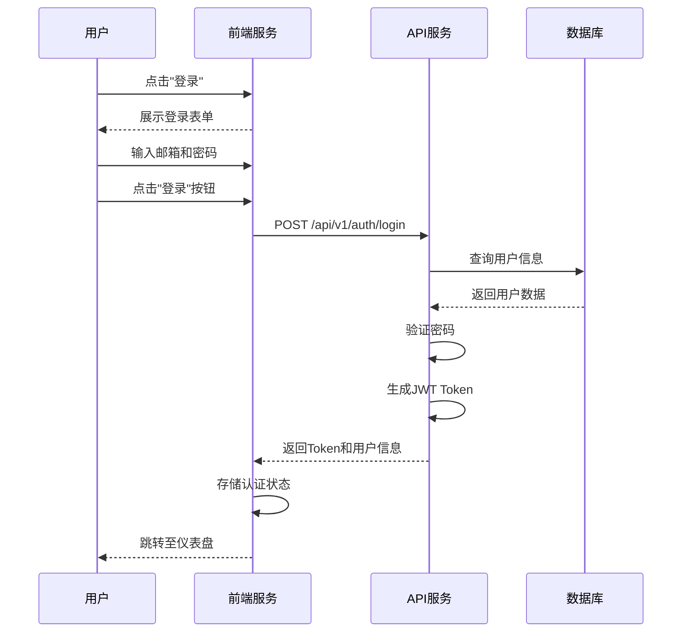
```mermaid
sequenceDiagram
    participant U as 用户
    participant F as 前端服务
    participant A as API服务
    participant D as 数据库

    U->>F: 点击"登录"
    F-->>U: 展示登录表单
    U->>F: 输入邮箱和密码
    U->>F: 点击"登录"按钮
    F->>A: POST /api/v1/auth/login
    A->>D: 查询用户信息
    D-->>A: 返回用户数据
    A->>A: 验证密码
    A->>A: 生成JWT Token
    A-->>F: 返回Token和用户信息
    F->>F: 存储认证状态
    F-->>U: 跳转至仪表盘
```

### 6.4 查看仪表盘用例

**表 6.4 "查看仪表盘"用例规约**

| 项目    | 内容                                                                                                                                          |
| ----- | ------------------------------------------------------------------------------------------------------------------------------------------- |
| 用例名   | 查看仪表盘                                                                                                                                       |
| 简要描述  | 登录用户查看个人数据统计和快捷入口                                                                                                                           |
| 参与者   | 注册用户                                                                                                                                        |
| 前置条件  | 用户已登录系统                                                                                                                                     |
| 后置条件  | 系统展示仪表盘页面内容                                                                                                                                 |
| 基本事件流 | (1) 用户登录成功后自动进入仪表盘(2) 系统展示欢迎信息和用户名(3) 系统展示快捷操作卡片（新建项目、新建任务、智能体集群、分析报告）(4) 系统展示数据统计（我的项目、进行中任务、已完成任务、代码元素）(5) 系统展示最近项目列表(6) 系统展示进行中任务列表，用例结束 |
| 备选事件流 | A-1 无项目数据：系统显示"暂无项目，创建第一个项目"提示A-2 无进行中任务：系统显示"暂无进行中任务"提示                                                                                    |
| 补充约束  | 数据统计实时更新，项目列表按更新时间倒序排列                                                                                                                      |

### 6.5 查看项目列表用例

**表 6.5 "查看项目列表"用例规约**

| 项目    | 内容                                                                                                                        |
| ----- | ------------------------------------------------------------------------------------------------------------------------- |
| 用例名   | 查看项目列表                                                                                                                    |
| 简要描述  | 登录用户查看和管理自己的项目列表                                                                                                          |
| 参与者   | 注册用户                                                                                                                      |
| 前置条件  | 用户已登录系统                                                                                                                   |
| 后置条件  | 系统展示项目列表页面内容                                                                                                              |
| 基本事件流 | (1) 用户点击"项目管理"或访问/projects(2) 系统展示项目列表页面(3) 系统展示搜索框和筛选条件(4) 系统展示项目卡片列表(5) 每个项目卡片显示：名称、描述、语言、状态、更新时间(6) 用户可点击项目卡片进入详情，用例结束 |
| 备选事件流 | A-1 无项目数据：系统显示"暂无项目"提示和"创建第一个项目"按钮A-2 搜索无结果：系统显示"未找到匹配项目"提示                                                               |
| 补充约束  | 支持按项目名称和描述搜索，支持按状态和编程语言筛选                                                                                                 |

### 6.6 创建项目用例

**表 6.6 "创建项目"用例规约**

| 项目    | 内容                                                                                                                                                                                                            |
| ----- | ------------------------------------------------------------------------------------------------------------------------------------------------------------------------------------------------------------- |
| 用例名   | 创建项目                                                                                                                                                                                                          |
| 简要描述  | 用户创建新的分析项目，支持Git仓库和上传代码两种方式                                                                                                                                                                                   |
| 参与者   | 注册用户                                                                                                                                                                                                          |
| 前置条件  | 用户已登录系统，在项目列表页点击"新建项目"                                                                                                                                                                                        |
| 后置条件  | 项目创建成功，跳转至项目详情页面                                                                                                                                                                                              |
| 基本事件流 | (1) 用户点击"新建项目"按钮(2) 系统展示项目创建表单(3) 用户输入项目名称(4) 用户输入项目描述（可选）(5) 用户选择源码来源（Git仓库/上传代码）(6) 若选择Git仓库：用户输入仓库地址(7) 若选择上传代码：用户上传代码压缩包(.zip)，最大1GB(8) 用户选择编程语言(9) 用户点击"创建项目"按钮(10) 系统创建项目记录并异步处理源码(11) 系统跳转至项目详情页面，用例结束 |
| 备选事件流 | A-1 项目名称为空：系统禁用提交按钮A-2 未选择编程语言：系统禁用提交按钮A-3 Git地址为空：系统禁用提交按钮A-4 文件上传失败：系统显示"文件上传失败"提示A-5 文件格式错误：系统显示"仅支持.zip文件"提示A-6 文件超过1GB：系统显示"文件大小超过限制"提示                                                                  |
| 补充约束  | 项目名称必填，编程语言必选，Git地址格式正确，上传文件仅支持.zip格式且最大1GB                                                                                                                                                                   |

**时序图：**

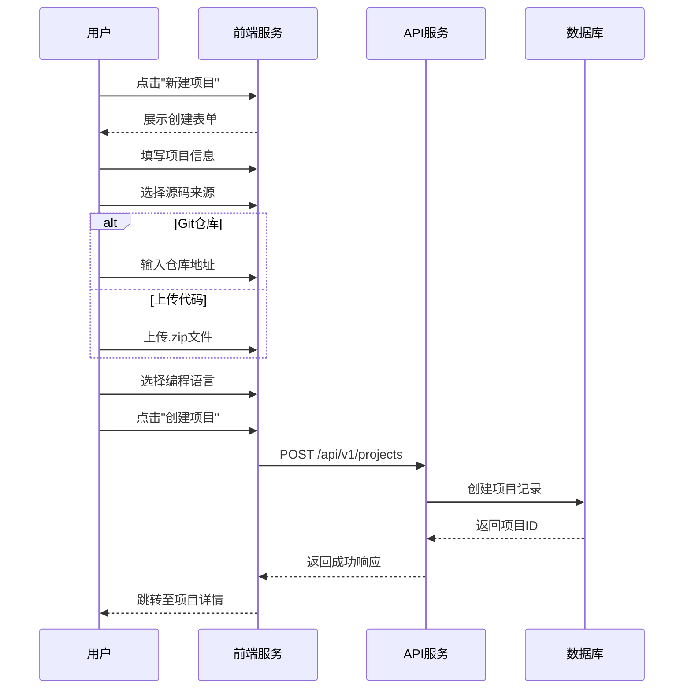
```mermaid
sequenceDiagram
    participant U as 用户
    participant F as 前端服务
    participant A as API服务
    participant D as 数据库

    U->>F: 点击"新建项目"
    F-->>U: 展示创建表单
    U->>F: 填写项目信息
    U->>F: 选择源码来源
    alt Git仓库
        U->>F: 输入仓库地址
    else 上传代码
        U->>F: 上传.zip文件
    end
    U->>F: 选择编程语言
    U->>F: 点击"创建项目"
    F->>A: POST /api/v1/projects
    A->>D: 创建项目记录
    D-->>A: 返回项目ID
    A-->>F: 返回成功响应
    F-->>U: 跳转至项目详情
```

### 6.7 查看项目详情用例

**表 6.7 "查看项目详情"用例规约**

| 项目    | 内容                                                                                                                                                 |
| ----- | -------------------------------------------------------------------------------------------------------------------------------------------------- |
| 用例名   | 查看项目详情                                                                                                                                             |
| 简要描述  | 用户查看项目详细信息、启动分析、查看进度和浏览源码                                                                                                                          |
| 参与者   | 注册用户                                                                                                                                               |
| 前置条件  | 用户已登录系统，存在已创建的项目                                                                                                                                   |
| 后置条件  | 系统展示项目详情页面内容                                                                                                                                       |
| 基本事件流 | (1) 用户在项目列表点击项目卡片(2) 系统展示项目详情页面(3) 系统展示项目基本信息（名称、描述、语言、来源）(4) 系统展示Tab导航（概览、分析、源码、报告）(5) 用户可切换Tab查看不同内容(6) 在分析Tab可启动多智能体分析(7) 在源码Tab可浏览项目源码(8) 用例结束 |
| 备选事件流 | A-1 项目不存在：系统显示"项目不存在"提示并返回列表A-2 源码不可用：系统显示"源码不可用"提示                                                                                                |
| 补充约束  | 支持启动分析、查看进度、浏览源码等功能                                                                                                                                |

### 6.8 启动多智能体分析用例

**表 6.8 "启动多智能体分析"用例规约**

| 项目    | 内容                                                                                                                                                                                                                                      |
| ----- | --------------------------------------------------------------------------------------------------------------------------------------------------------------------------------------------------------------------------------------- |
| 用例名   | 启动多智能体分析                                                                                                                                                                                                                                |
| 简要描述  | 用户启动多智能体协同分析项目代码，支持三种分析模式和断点续分析                                                                                                                                                                                                         |
| 参与者   | 注册用户                                                                                                                                                                                                                                    |
| 前置条件  | 用户在项目详情页面且项目源码可用                                                                                                                                                                                                                        |
| 后置条件  | 系统启动多智能体分析任务，创建或加载检查点                                                                                                                                                                                                                   |
| 基本事件流 | (1) 用户在项目详情页点击"分析"标签页(2) 系统显示分析启动器组件(3) 用户选择分析模式（simple\_intro/detailed\_intro/security\_report）(4) 用户选择运行模式（fresh/resume）(5) 系统检查是否存在可恢复的检查点（仅resume模式）(6) 用户点击"开始分析"按钮(7) 系统发送分析请求到后端(8) 系统创建任务记录并启动多智能体分析(9) 系统跳转到智能体集群页面显示分析进度，用例结束 |
| 备选事件流 | A-1 分析任务已存在：系统提示"已有分析任务正在进行"A-2 源码未准备完成：系统提示"项目源码尚未准备完成"A-3 无可恢复检查点：系统提示"无可恢复的分析任务"并切换到全新分析模式A-4 检查点加载失败：系统提示"检查点加载失败"并切换到fresh模式                                                                                                       |
| 补充约束  | 默认分析模式为security\_report，默认运行模式为fresh；检查点保存在checkpoints/目录下                                                                                                                                                                              |

**多智能体分析详细时序图：**

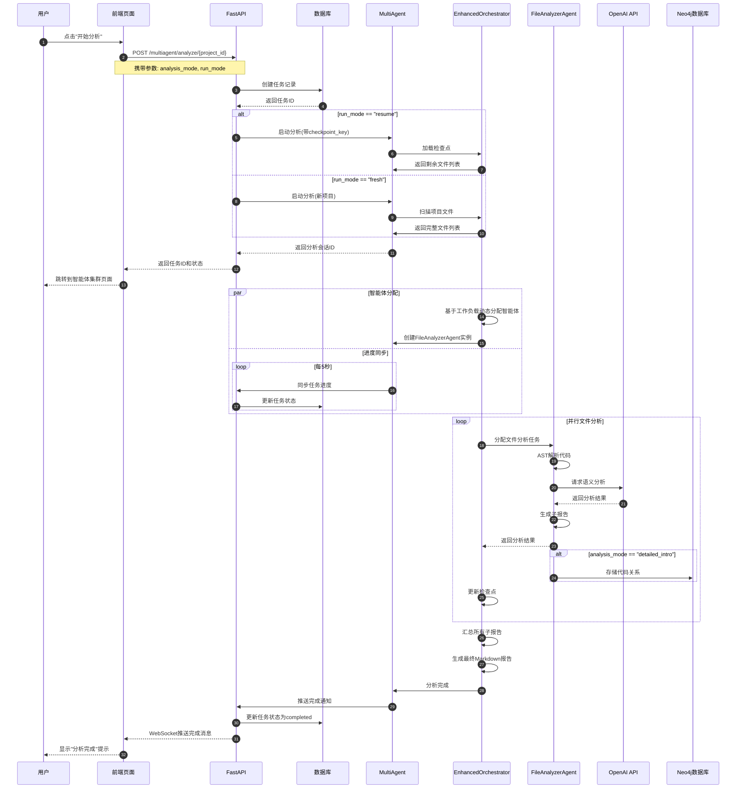
```mermaid
sequenceDiagram
    autonumber
    participant U as 用户
    participant F as 前端页面
    participant API as FastAPI
    participant DB as 数据库
    participant MA as MultiAgent
    participant EO as EnhancedOrchestrator
    participant FA as FileAnalyzerAgent
    participant LLM as OpenAI API
    participant Neo4j as Neo4j数据库

    U->>F: 点击"开始分析"
    F->>API: POST /multiagent/analyze/{project_id}
    Note over F,API: 携带参数: analysis_mode, run_mode
    
    API->>DB: 创建任务记录
    DB-->>API: 返回任务ID
    
    alt run_mode == "resume"
        API->>MA: 启动分析(带checkpoint_key)
        MA->>EO: 加载检查点
        EO->>MA: 返回剩余文件列表
    else run_mode == "fresh"
        API->>MA: 启动分析(新项目)
        MA->>EO: 扫描项目文件
        EO->>MA: 返回完整文件列表
    end
    
    MA-->>API: 返回分析会话ID
    API-->>F: 返回任务ID和状态
    F-->>U: 跳转到智能体集群页面
    
    par 智能体分配
        EO->>EO: 基于工作负载动态分配智能体
        EO->>MA: 创建FileAnalyzerAgent实例
    and 进度同步
        loop 每5秒
            MA->>API: 同步任务进度
            API->>DB: 更新任务状态
        end
    end
    
    loop 并行文件分析
        EO->>FA: 分配文件分析任务
        FA->>FA: AST解析代码
        FA->>LLM: 请求语义分析
        LLM-->>FA: 返回分析结果
        FA->>FA: 生成子报告
        FA-->>EO: 返回分析结果
        
        alt analysis_mode == "detailed_intro"
            FA->>Neo4j: 存储代码关系
        end
        
        EO->>EO: 更新检查点
    end
    
    EO->>EO: 汇总所有子报告
    EO->>EO: 生成最终Markdown报告
    EO->>MA: 分析完成
    
    MA->>API: 推送完成通知
    API->>DB: 更新任务状态为completed
    API-->>F: WebSocket推送完成消息
    F-->>U: 显示"分析完成"提示
```

**检查点机制时序图：**

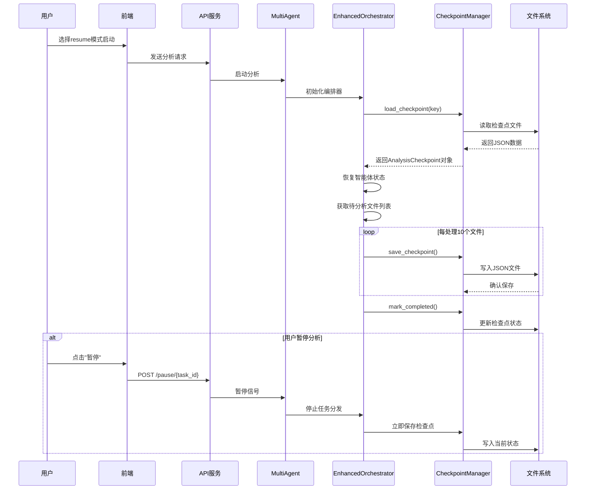
```mermaid
sequenceDiagram
    participant U as 用户
    participant F as 前端
    participant API as API服务
    participant MA as MultiAgent
    participant EO as EnhancedOrchestrator
    participant CM as CheckpointManager
    participant FS as 文件系统

    U->>F: 选择resume模式启动
    F->>API: 发送分析请求
    API->>MA: 启动分析
    MA->>EO: 初始化编排器
    EO->>CM: load_checkpoint(key)
    CM->>FS: 读取检查点文件
    FS-->>CM: 返回JSON数据
    CM-->>EO: 返回AnalysisCheckpoint对象
    
    EO->>EO: 恢复智能体状态
    EO->>EO: 获取待分析文件列表
    
    loop 每处理10个文件
        EO->>CM: save_checkpoint()
        CM->>FS: 写入JSON文件
        FS-->>CM: 确认保存
    end
    
    EO->>CM: mark_completed()
    CM->>FS: 更新检查点状态
    
    alt 用户暂停分析
        U->>F: 点击"暂停"
        F->>API: POST /pause/{task_id}
        API->>MA: 暂停信号
        MA->>EO: 停止任务分发
        EO->>CM: 立即保存检查点
        CM->>FS: 写入当前状态
    end
```

### 6.9 查看分析报告中心用例

**表 6.9 "查看分析报告中心"用例规约**

| 项目    | 内容                                                                                                                                                                                                             |
| ----- | -------------------------------------------------------------------------------------------------------------------------------------------------------------------------------------------------------------- |
| 用例名   | 查看分析报告中心                                                                                                                                                                                                       |
| 简要描述  | 用户查看多智能体分析的运行批次和分析统计信息                                                                                                                                                                                         |
| 参与者   | 注册用户                                                                                                                                                                                                           |
| 前置条件  | 用户已登录系统                                                                                                                                                                                                        |
| 后置条件  | 系统展示分析统计数据和运行批次列表                                                                                                                                                                                              |
| 基本事件流 | (1) 用户点击"分析报告"或访问/reports(2) 系统展示分析报告中心页面(3) 系统展示严重程度统计卡片（仅在security\_report模式下显示：严重、高危、中危、低危）(4) 系统展示搜索框和刷新按钮(5) 系统展示运行批次列表(6) 每个运行批次显示：项目名称、分析模式、运行阶段、进度、智能体数、Token使用量、更新时间(7) 用户可点击运行批次查看详情或跳转到智能体集群页面，用例结束 |
| 备选事件流 | A-1 无运行批次：系统显示"暂无可展示运行批次"提示A-2 搜索无结果：系统显示无匹配的运行批次                                                                                                                                                              |
| 补充约束  | 支持按项目名称、运行阶段、分析模式搜索，支持刷新数据，运行批次数据实时更新                                                                                                                                                                          |

### 6.10 查看最终报告用例

**表 6.10 "查看最终报告"用例规约**

| 项目    | 内容                                                                                                                              |
| ----- | ------------------------------------------------------------------------------------------------------------------------------- |
| 用例名   | 查看最终报告                                                                                                                          |
| 简要描述  | 用户查看多智能体分析生成的最终报告                                                                                                               |
| 参与者   | 注册用户                                                                                                                            |
| 前置条件  | 分析任务已完成                                                                                                                         |
| 后置条件  | 用户查看最终报告内容                                                                                                                      |
| 基本事件流 | (1) 用户点击运行批次卡片中的"查看报告"按钮(2) 系统导航到最终报告页面(3) 系统请求最终报告数据(4) 系统展示报告内容：标题、分析模式、Markdown渲染内容、阅读进度条(5) 用户浏览报告内容(6) 用户可切换不同运行批次的报告，用例结束 |
| 备选事件流 | A-1 报告生成中：系统显示"报告生成中..."提示                                                                                                      |
| 补充约束  | 报告支持Markdown渲染，支持阅读进度显示                                                                                                         |

### 6.11 查看智能体集群用例

**表 6.11 "查看智能体集群"用例规约**

| 项目    | 内容                                                                                                                                                                                           |
| ----- | -------------------------------------------------------------------------------------------------------------------------------------------------------------------------------------------- |
| 用例名   | 查看智能体集群                                                                                                                                                                                      |
| 简要描述  | 用户查看所有运行中的智能体状态、统计信息和运行批次                                                                                                                                                                    |
| 参与者   | 注册用户                                                                                                                                                                                         |
| 前置条件  | 用户已登录系统                                                                                                                                                                                      |
| 后置条件  | 用户了解智能体集群的整体状态和详细统计                                                                                                                                                                          |
| 基本事件流 | (1) 用户访问/dashboard/agents或点击仪表盘快捷操作(2) 系统加载智能体集群页面(3) 系统展示统计摘要：总项目数、总运行数、总智能体数、总Token数(4) 系统展示运行批次列表，包含：项目名称、分析模式、运行阶段、进度百分比(5) 系统展示智能体列表，包含：智能体ID、类型、状态、当前任务、Token使用量(6) 用户点击某个智能体查看详情，用例结束 |
| 备选事件流 | A-1 暂无运行中的智能体：系统显示"暂无运行中的智能体"提示A-2 无运行批次：系统显示空状态提示                                                                                                                                           |
| 补充约束  | 智能体状态和进度实时更新，支持按项目筛选运行批次，支持查看智能体活动历史                                                                                                                                                         |

**智能体通信协作时序图：**

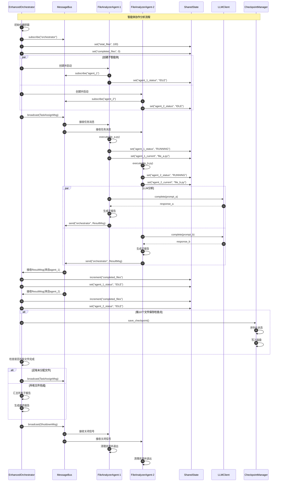
```mermaid
sequenceDiagram
    autonumber
    participant EO as EnhancedOrchestrator
    participant MB as MessageBus
    participant FA1 as FileAnalyzerAgent-1
    participant FA2 as FileAnalyzerAgent-2
    participant SS as SharedState
    participant LLM as LLMClient
    participant CM as CheckpointManager

    Note over EO,CM: 智能体协作分析流程
    
    EO->>EO: 初始化编排器
    EO->>MB: subscribe("orchestrator")
    EO->>SS: set("total_files", 100)
    EO->>SS: set("completed_files", 0)
    
    par 创建子智能体
        EO->>FA1: 创建并启动
        FA1->>MB: subscribe("agent_1")
        FA1->>SS: set("agent_1_status", "IDLE")
    and
        EO->>FA2: 创建并启动
        FA2->>MB: subscribe("agent_2")
        FA2->>SS: set("agent_2_status", "IDLE")
    end
    
    EO->>MB: broadcast(TaskAssignMsg)
    MB->>FA1: 接收任务消息
    MB->>FA2: 接收任务消息
    
    FA1->>FA1: execute(file_a.py)
    FA1->>SS: set("agent_1_status", "RUNNING")
    FA1->>SS: set("agent_1_current", "file_a.py")
    
    FA2->>FA2: execute(file_b.py)
    FA2->>SS: set("agent_2_status", "RUNNING")
    FA2->>SS: set("agent_2_current", "file_b.py")
    
    par LLM分析
        FA1->>LLM: complete(prompt_a)
        LLM-->>FA1: response_a
        FA1->>FA1: 生成子报告
        FA1->>MB: send("orchestrator", ResultMsg)
    and
        FA2->>LLM: complete(prompt_b)
        LLM-->>FA2: response_b
        FA2->>FA2: 生成子报告
        FA2->>MB: send("orchestrator", ResultMsg)
    end
    
    MB->>EO: 接收ResultMsg(来自agent_1)
    EO->>SS: increment("completed_files")
    EO->>SS: set("agent_1_status", "IDLE")
    
    MB->>EO: 接收ResultMsg(来自agent_2)
    EO->>SS: increment("completed_files")
    EO->>SS: set("agent_2_status", "IDLE")
    
    alt 每10个文件保存检查点
        EO->>CM: save_checkpoint()
        CM->>CM: 序列化状态
        CM->>CM: 写入磁盘
    end
    
    EO->>EO: 检查是否所有文件完成
    
    alt 还有未分配文件
        EO->>MB: broadcast(TaskAssignMsg)
    else 所有文件完成
        EO->>EO: 汇总所有子报告
        EO->>EO: 生成最终报告
    end
    
    EO->>MB: broadcast(ShutdownMsg)
    MB->>FA1: 接收关闭信号
    MB->>FA2: 接收关闭信号
    FA1->>FA1: 清理资源并退出
    FA2->>FA2: 清理资源并退出
```

### 6.12 智能对话用例

**表 6.12 "智能对话"用例规约**

| 项目    | 内容                                                                                                                                          |
| ----- | ------------------------------------------------------------------------------------------------------------------------------------------- |
| 用例名   | 智能对话                                                                                                                                        |
| 简要描述  | 用户与AI助手对话，获取代码分析建议                                                                                                                          |
| 参与者   | 注册用户                                                                                                                                        |
| 前置条件  | 用户已登录系统                                                                                                                                     |
| 后置条件  | 系统展示对话界面和AI回复                                                                                                                               |
| 基本事件流 | (1) 用户点击"智能助手"或访问/chat(2) 系统展示智能对话页面(3) 系统展示欢迎信息和快捷问题(4) 用户点击快捷问题或输入自定义问题(5) 用户点击发送按钮(6) 系统显示用户消息(7) 系统显示加载状态(8) 系统显示AI回复消息(9) 用户可继续提问，用例结束 |
| 备选事件流 | A-1 输入为空：系统禁用发送按钮A-2 AI服务异常：系统显示"服务暂时不可用"提示                                                                                                 |
| 补充约束  | 支持Markdown格式回复，支持代码高亮显示                                                                                                                     |

### 6.13 搜索项目用例

**表 6.13 "搜索项目"用例规约**

| 项目    | 内容                                                                 |
| ----- | ------------------------------------------------------------------ |
| 用例名   | 搜索项目                                                               |
| 简要描述  | 用户通过关键词搜索项目                                                        |
| 参与者   | 注册用户                                                               |
| 前置条件  | 用户已登录系统，在项目列表页面                                                    |
| 后置条件  | 系统展示匹配的项目列表                                                        |
| 基本事件流 | (1) 用户在搜索框输入关键词(2) 系统实时过滤项目列表(3) 系统展示匹配的项目卡片(4) 用户可点击项目卡片进入详情，用例结束 |
| 备选事件流 | A-1 无匹配结果：系统显示"未找到匹配项目"提示                                          |
| 补充约束  | 支持按项目名称和描述进行模糊搜索                                                   |

### 6.14 筛选项目用例

**表 6.14 "筛选项目"用例规约**

| 项目    | 内容                                                           |
| ----- | ------------------------------------------------------------ |
| 用例名   | 筛选项目                                                         |
| 简要描述  | 用户通过状态筛选项目                                                   |
| 参与者   | 注册用户                                                         |
| 前置条件  | 用户已登录系统，在项目列表页面                                              |
| 后置条件  | 系统展示符合筛选条件的项目列表                                              |
| 基本事件流 | (1) 用户点击状态筛选按钮（全部/进行中/已归档）(2) 系统更新项目列表(3) 系统展示符合筛选条件的项目，用例结束 |
| 备选事件流 | A-1 无符合条件项目：系统显示"暂无符合条件的项目"提示                                |
| 补充约束  | 筛选条件可组合使用，支持重置筛选                                             |

### 6.15 删除项目用例

**表 6.15 "删除项目"用例规约**

| 项目    | 内容                                                                                                     |
| ----- | ------------------------------------------------------------------------------------------------------ |
| 用例名   | 删除项目                                                                                                   |
| 简要描述  | 用户删除不需要的项目及相关数据                                                                                        |
| 参与者   | 注册用户                                                                                                   |
| 前置条件  | 用户已登录系统，在项目列表页面                                                                                        |
| 后置条件  | 项目及相关数据被删除                                                                                             |
| 基本事件流 | (1) 用户点击项目卡片右上角菜单按钮(2) 系统展示操作菜单(3) 用户点击"删除项目"选项(4) 系统弹出确认对话框(5) 用户确认删除(6) 系统删除项目及相关数据(7) 系统更新项目列表，用例结束 |
| 备选事件流 | A-1 用户取消删除：系统关闭确认对话框，不执行删除                                                                             |
| 补充约束  | 删除操作需二次确认，删除后数据不可恢复                                                                                    |

***

## 7. 非功能性需求

### 7.1 性能需求

| 需求编号    | 需求描述            |
| ------- | --------------- |
| NFR-001 | 页面加载时间不超过3秒     |
| NFR-002 | API响应时间不超过500ms |
| NFR-003 | 支持同时100个用户在线    |

### 7.2 安全需求

| 需求编号    | 需求描述               |
| ------- | ------------------ |
| SEC-001 | 用户密码使用bcrypt加密存储   |
| SEC-002 | JWT Token使用HS256签名 |
| SEC-003 | 数据库连接使用SSL加密       |
| SEC-004 | 敏感操作记录操作日志         |

### 7.3 可用性需求

| 需求编号    | 需求描述      |
| ------- | --------- |
| USA-001 | 界面支持响应式布局 |
| USA-002 | 提供友好的错误提示 |
| USA-003 | 支持深色主题    |

***

## 8. 数据库设计

### 8.1 概念模型

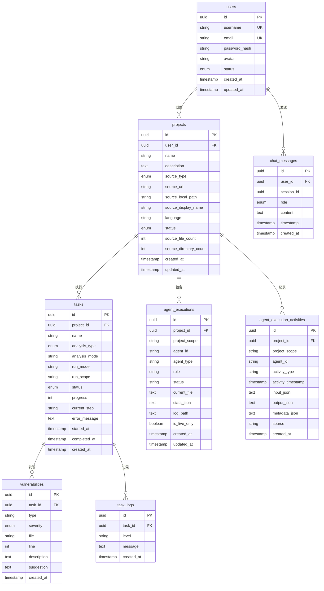
```mermaid
erDiagram
    users ||--o{ projects : "创建"
    projects ||--o{ tasks : "执行"
    projects ||--o{ agent_executions : "包含"
    projects ||--o{ agent_execution_activities : "记录"
    tasks ||--o{ vulnerabilities : "发现"
    tasks ||--o{ task_logs : "记录"
    users ||--o{ chat_messages : "发送"

    users {
        uuid id PK
        string username UK
        string email UK
        string password_hash
        string avatar
        enum status
        timestamp created_at
        timestamp updated_at
    }

    projects {
        uuid id PK
        uuid user_id FK
        string name
        text description
        enum source_type
        string source_url
        string source_local_path
        string source_display_name
        string language
        enum status
        int source_file_count
        int source_directory_count
        timestamp created_at
        timestamp updated_at
    }

    tasks {
        uuid id PK
        uuid project_id FK
        string name
        enum analysis_type
        string analysis_mode
        string run_mode
        string run_scope
        enum status
        int progress
        string current_step
        text error_message
        timestamp started_at
        timestamp completed_at
        timestamp created_at
    }

    vulnerabilities {
        uuid id PK
        uuid task_id FK
        string type
        enum severity
        string file
        int line
        text description
        text suggestion
        timestamp created_at
    }

    task_logs {
        uuid id PK
        uuid task_id FK
        string level
        text message
        timestamp created_at
    }

    agent_executions {
        uuid id PK
        uuid project_id FK
        string project_scope
        string agent_id
        string agent_type
        string role
        string status
        text current_file
        text stats_json
        text log_path
        boolean is_live_only
        timestamp created_at
        timestamp updated_at
    }

    agent_execution_activities {
        uuid id PK
        uuid project_id FK
        string project_scope
        string agent_id
        string activity_type
        timestamp activity_timestamp
        text input_json
        text output_json
        text metadata_json
        string source
        timestamp created_at
    }

    chat_messages {
        uuid id PK
        uuid user_id FK
        uuid session_id
        enum role
        text content
        timestamp timestamp
        timestamp created_at
    }
```

### 8.2 数据表设计

#### 8.2.1 用户表 (users)

| 字段             | 类型          | 约束               | 说明                   |
| -------------- | ----------- | ---------------- | -------------------- |
| id             | UUID        | PK               | 用户唯一标识               |
| username       | String(50)  | UNIQUE, NOT NULL | 用户名                  |
| email          | String(100) | UNIQUE, NOT NULL | 邮箱地址                 |
| password\_hash | String(255) | NOT NULL         | 密码哈希（bcrypt）         |
| avatar         | String(500) | NULLABLE         | 头像URL                |
| status         | Enum        | DEFAULT 'active' | 用户状态：active/inactive |
| created\_at    | DateTime    | NOT NULL         | 创建时间                 |
| updated\_at    | DateTime    | NULLABLE         | 更新时间                 |

#### 8.2.2 项目主表 (projects)

| 字段          | 类型          | 约束               | 说明                   |
| ----------- | ----------- | ---------------- | -------------------- |
| id          | UUID        | PK               | 项目唯一标识               |
| user\_id    | UUID        | FK(users.id)     | 所属用户                 |
| name        | String(200) | NOT NULL         | 项目名称                 |
| description | Text        | NULLABLE         | 项目描述                 |
| language    | String(50)  | NULLABLE         | 编程语言                 |
| status      | Enum        | DEFAULT 'active' | 项目状态：active/archived |
| created\_at | DateTime    | NOT NULL         | 创建时间                 |
| updated\_at | DateTime    | NULLABLE         | 更新时间                 |

#### 8.2.3 项目来源表 (project\_sources)

| 字段                  | 类型           | 约束                  | 说明                 |
| ------------------- | ------------ | ------------------- | ------------------ |
| project\_id         | UUID         | PK, FK(projects.id) | 对应项目               |
| source\_type        | Enum         | DEFAULT 'github'    | 源码类型：github/upload |
| source\_url         | String(1000) | NULLABLE            | Git 仓库地址           |
| source\_local\_path | String(1500) | NULLABLE            | 本地源码路径             |
| source\_available   | Boolean      | DEFAULT False       | 源码是否可用             |
| created\_at         | DateTime     | NOT NULL            | 创建时间               |
| updated\_at         | DateTime     | NULLABLE            | 更新时间               |

#### 8.2.4 项目来源元数据表 (project\_source\_metadata)

| 字段                          | 类型          | 约束                  | 说明              |
| --------------------------- | ----------- | ------------------- | --------------- |
| project\_id                 | UUID        | PK, FK(projects.id) | 对应项目            |
| source\_display\_name       | String(255) | NULLABLE            | 源码显示名称          |
| source\_archive\_name       | String(255) | NULLABLE            | 上传压缩包名称         |
| source\_root\_name          | String(255) | NULLABLE            | 解压根目录名称         |
| source\_top\_level\_entries | Text        | NULLABLE            | 顶层目录/文件列表（JSON） |
| source\_file\_count         | Integer     | NULLABLE            | 文件数量            |
| source\_directory\_count    | Integer     | NULLABLE            | 目录数量            |
| created\_at                 | DateTime    | NOT NULL            | 创建时间            |
| updated\_at                 | DateTime    | NULLABLE            | 更新时间            |

#### 8.2.5 任务主表 (tasks)

| 字段             | 类型          | 约束              | 说明                                |
| -------------- | ----------- | --------------- | --------------------------------- |
| id             | UUID        | PK              | 任务唯一标识                            |
| project\_id    | UUID        | FK(projects.id) | 所属项目                              |
| name           | String(200) | NOT NULL        | 任务名称                              |
| analysis\_type | Enum        | DEFAULT 'full'  | 分析类型：full/quick/custom/multiagent |
| created\_at    | DateTime    | NOT NULL        | 创建时间                              |

#### 8.2.6 任务运行表 (task\_runtime)

| 字段             | 类型          | 约束                         | 说明                                           |
| -------------- | ----------- | -------------------------- | -------------------------------------------- |
| task\_id       | UUID        | PK, FK(tasks.id)           | 对应任务                                         |
| analysis\_mode | String(32)  | DEFAULT 'security\_report' | 分析模式                                         |
| run\_mode      | String(20)  | DEFAULT 'fresh'            | 运行模式：fresh/resume                            |
| run\_scope     | String(255) | NULLABLE                   | 运行批次标识                                       |
| status         | Enum        | DEFAULT 'pending'          | 任务状态：pending/running/paused/completed/failed |
| progress       | Integer     | DEFAULT 0                  | 进度百分比                                        |
| current\_step  | String(100) | NULLABLE                   | 当前步骤                                         |
| error\_message | Text        | NULLABLE                   | 错误信息                                         |
| started\_at    | DateTime    | NULLABLE                   | 开始时间                                         |
| completed\_at  | DateTime    | NULLABLE                   | 完成时间                                         |
| updated\_at    | DateTime    | NULLABLE                   | 更新时间                                         |

#### 8.2.7 分析发现表 (vulnerabilities)

| 字段          | 类型          | 约束           | 说明                            |
| ----------- | ----------- | ------------ | ----------------------------- |
| id          | UUID        | PK           | 分析发现唯一标识                      |
| task\_id    | UUID        | FK(tasks.id) | 所属任务                          |
| type        | String(100) | NOT NULL     | 发现类型（如安全问题、架构问题等）             |
| severity    | Enum        | NOT NULL     | 严重程度：critical/high/medium/low |
| file        | String(500) | NOT NULL     | 文件路径                          |
| line        | Integer     | NOT NULL     | 行号                            |
| description | Text        | NULLABLE     | 问题描述                          |
| suggestion  | Text        | NULLABLE     | 修复建议                          |
| created\_at | DateTime    | NOT NULL     | 创建时间                          |

**说明**: 该表存储代码分析过程中的各类发现，包括但不限于安全漏洞、架构问题、代码质量问题等。在 `security_report` 模式下重点关注安全相关发现。

#### 8.2.8 任务日志表 (task\_logs)

| 字段          | 类型         | 约束           | 说明                      |
| ----------- | ---------- | ------------ | ----------------------- |
| id          | UUID       | PK           | 日志唯一标识                  |
| task\_id    | UUID       | FK(tasks.id) | 所属任务                    |
| level       | String(20) | NOT NULL     | 日志级别：info/warning/error |
| message     | Text       | NOT NULL     | 日志内容                    |
| created\_at | DateTime   | NOT NULL     | 创建时间                    |

#### 8.2.9 智能体执行主表 (agent\_executions)

| 字段             | 类型          | 约束              | 说明       |
| -------------- | ----------- | --------------- | -------- |
| id             | UUID        | PK              | 执行记录唯一标识 |
| project\_id    | UUID        | FK(projects.id) | 所属项目     |
| project\_scope | String(255) | NOT NULL        | 运行批次标识   |
| agent\_id      | String(128) | NOT NULL        | 智能体唯一标识  |
| agent\_type    | String(64)  | NULLABLE        | 智能体类型    |
| created\_at    | DateTime    | NOT NULL        | 创建时间     |
| updated\_at    | DateTime    | NOT NULL        | 更新时间     |

**唯一约束**: `(project_id, project_scope, agent_id)`

#### 8.2.10 智能体状态表 (agent\_execution\_state)

| 字段             | 类型         | 约束                           | 说明        |
| -------------- | ---------- | ---------------------------- | --------- |
| execution\_id  | UUID       | PK, FK(agent\_executions.id) | 对应执行记录    |
| role           | String(64) | NULLABLE                     | 智能体角色     |
| status         | String(64) | NULLABLE                     | 执行状态      |
| current\_file  | Text       | NULLABLE                     | 当前正在分析的文件 |
| is\_live\_only | Boolean    | DEFAULT False                | 是否仅在线数据   |
| updated\_at    | DateTime   | NULLABLE                     | 更新时间      |

#### 8.2.11 智能体产物表 (agent\_execution\_artifacts)

| 字段            | 类型       | 约束                           | 说明               |
| ------------- | -------- | ---------------------------- | ---------------- |
| execution\_id | UUID     | PK, FK(agent\_executions.id) | 对应执行记录           |
| log\_path     | Text     | NULLABLE                     | 单智能体 JSON 日志文件路径 |
| updated\_at   | DateTime | NULLABLE                     | 更新时间             |

#### 8.2.12 智能体统计表 (agent\_execution\_stats)

| 字段            | 类型       | 约束                           | 说明            |
| ------------- | -------- | ---------------------------- | ------------- |
| execution\_id | UUID     | PK, FK(agent\_executions.id) | 对应执行记录        |
| stats\_json   | Text     | NULLABLE                     | 统计信息（JSON 格式） |
| updated\_at   | DateTime | NULLABLE                     | 更新时间          |

#### 8.2.13 智能体活动主表 (agent\_execution\_activities)

| 字段                  | 类型         | 约束                       | 说明     |
| ------------------- | ---------- | ------------------------ | ------ |
| id                  | UUID       | PK                       | 活动唯一标识 |
| execution\_id       | UUID       | FK(agent\_executions.id) | 所属执行记录 |
| activity\_type      | String(64) | NOT NULL                 | 活动类型   |
| activity\_timestamp | DateTime   | NOT NULL                 | 活动时间戳  |
| source              | String(32) | NULLABLE                 | 数据来源   |
| created\_at         | DateTime   | NOT NULL                 | 创建时间   |

#### 8.2.14 智能体活动负载表 (agent\_activity\_payloads)

| 字段             | 类型   | 约束                                      | 说明            |
| -------------- | ---- | --------------------------------------- | ------------- |
| activity\_id   | UUID | PK, FK(agent\_execution\_activities.id) | 对应活动记录        |
| input\_json    | Text | NULLABLE                                | 输入数据（JSON 格式） |
| output\_json   | Text | NULLABLE                                | 输出数据（JSON 格式） |
| metadata\_json | Text | NULLABLE                                | 元数据（JSON 格式）  |

#### 8.2.15 对话消息表 (chat\_messages)

| 字段          | 类型       | 约束           | 说明                |
| ----------- | -------- | ------------ | ----------------- |
| id          | UUID     | PK           | 消息唯一标识            |
| user\_id    | UUID     | FK(users.id) | 所属用户              |
| session\_id | UUID     | NULLABLE     | 会话标识              |
| role        | Enum     | NOT NULL     | 角色：user/assistant |
| content     | Text     | NOT NULL     | 消息内容              |
| timestamp   | DateTime | NOT NULL     | 时间戳               |
| created\_at | DateTime | NOT NULL     | 创建时间              |

#### 8.2.16 结构版本表 (schema\_migrations)

| 字段          | 类型         | 约束       | 说明     |
| ----------- | ---------- | -------- | ------ |
| version     | String(64) | PK       | 结构版本号  |
| applied\_at | DateTime   | NOT NULL | 迁移完成时间 |
| notes       | Text       | NULLABLE | 迁移摘要   |

### 8.2.17 数据迁移与接口兼容要求

1. 项目来源信息从项目主表中拆出后，接口仍需继续返回 `source_type/source_url/source_local_path/source_display_name/source_archive_name/source_root_name/source_top_level_entries/source_file_count/source_directory_count/source_available`。
2. 任务运行信息独立存放在 `task_runtime` 后，接口仍需继续返回 `analysis_mode/run_mode/run_scope/status/progress/current_step/error_message/started_at/completed_at`。
3. 智能体执行、状态、日志、统计与活动负载拆分后，前端仍通过聚合结果读取 `role/status/current_file/log_path/stats/input/output/metadata`。
4. 服务启动时必须自动检查结构版本、补齐缺失表并回填历史数据。
5. SQLite 与 PostgreSQL 均必须支持相同的聚合读取和迁移逻辑。

### 8.3 枚举类型定义

| 枚举名称          | 枚举值                                              |
| ------------- | ------------------------------------------------ |
| UserStatus    | active, inactive                                 |
| SourceType    | github, upload                                   |
| ProjectStatus | active, archived                                 |
| TaskStatus    | pending, running, completed, failed              |
| Severity      | critical, high, medium, low                      |
| MessageRole   | user, assistant                                  |
| AnalysisType  | full, quick, custom, multiagent                  |
| AnalysisMode  | simple\_intro, detailed\_intro, security\_report |

### 8.4 检查点存储

检查点数据以文件形式存储在 `checkpoints/` 目录下，采用 JSON 格式保存分析状态：

```json
{
  "project_id": "uuid",
  "checkpoint_key": "scope_key",
  "project_path": "/path/to/project",
  "output_dir": "/path/to/output",
  "total_files": 100,
  "completed_files": 50,
  "failed_files": 0,
  "current_stage": "analyzing",
  "pending_files": ["file1.py", "file2.py"],
  "completed_file_paths": ["file3.py"],
  "failed_file_paths": [],
  "agent_count": 4,
  "agent_status": {...},
  "agent_allocation": {...},
  "analysis_mode": "security_report",
  "run_mode": "fresh"
}
```

**说明**: 检查点机制支持断点续分析功能，当运行模式为 `resume` 时，系统会从检查点恢复分析状态，仅处理未完成和失败的文件。

### 8.3 系统类图

#### 8.3.1 后端核心类图

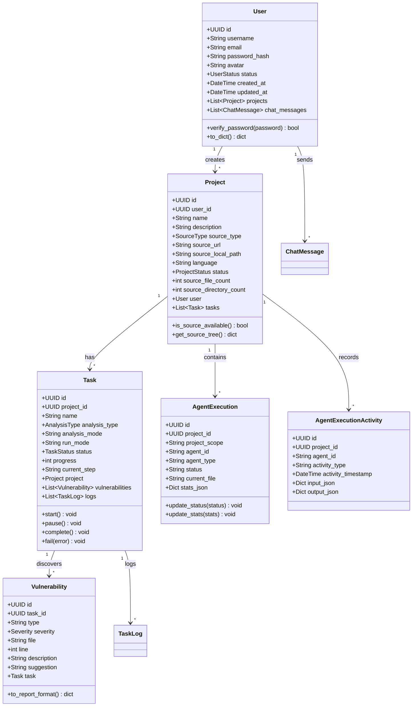
```mermaid
classDiagram
    class User {
        +UUID id
        +String username
        +String email
        +String password_hash
        +String avatar
        +UserStatus status
        +DateTime created_at
        +DateTime updated_at
        +List~Project~ projects
        +List~ChatMessage~ chat_messages
        +verify_password(password) bool
        +to_dict() dict
    }

    class Project {
        +UUID id
        +UUID user_id
        +String name
        +String description
        +SourceType source_type
        +String source_url
        +String source_local_path
        +String language
        +ProjectStatus status
        +int source_file_count
        +int source_directory_count
        +User user
        +List~Task~ tasks
        +is_source_available() bool
        +get_source_tree() dict
    }

    class Task {
        +UUID id
        +UUID project_id
        +String name
        +AnalysisType analysis_type
        +String analysis_mode
        +String run_mode
        +TaskStatus status
        +int progress
        +String current_step
        +Project project
        +List~Vulnerability~ vulnerabilities
        +List~TaskLog~ logs
        +start() void
        +pause() void
        +complete() void
        +fail(error) void
    }

    class Vulnerability {
        +UUID id
        +UUID task_id
        +String type
        +Severity severity
        +String file
        +int line
        +String description
        +String suggestion
        +Task task
        +to_report_format() dict
    }

    class AgentExecution {
        +UUID id
        +UUID project_id
        +String project_scope
        +String agent_id
        +String agent_type
        +String status
        +String current_file
        +Dict stats_json
        +update_status(status) void
        +update_stats(stats) void
    }

    class AgentExecutionActivity {
        +UUID id
        +UUID project_id
        +String agent_id
        +String activity_type
        +DateTime activity_timestamp
        +Dict input_json
        +Dict output_json
    }

    User "1" --> "*" Project : creates
    User "1" --> "*" ChatMessage : sends
    Project "1" --> "*" Task : has
    Project "1" --> "*" AgentExecution : contains
    Project "1" --> "*" AgentExecutionActivity : records
    Task "1" --> "*" Vulnerability : discovers
    Task "1" --> "*" TaskLog : logs
```

#### 8.3.2 多智能体系统类图

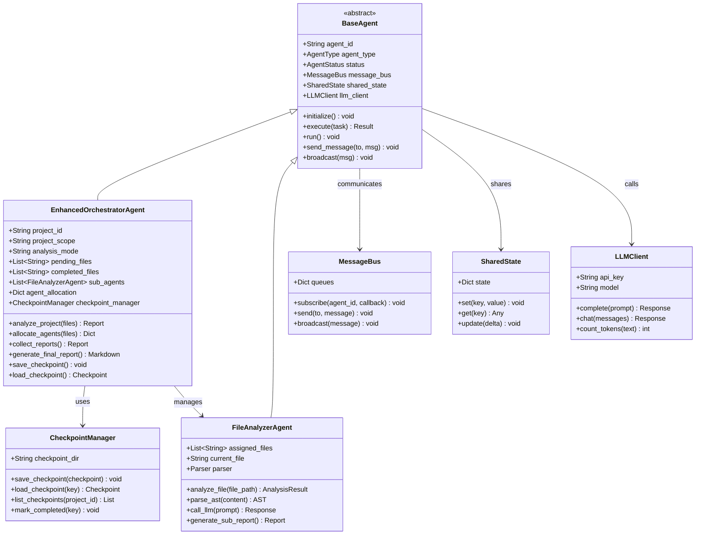
```mermaid
classDiagram
    class BaseAgent {
        <<abstract>>
        +String agent_id
        +AgentType agent_type
        +AgentStatus status
        +MessageBus message_bus
        +SharedState shared_state
        +LLMClient llm_client
        +initialize() void
        +execute(task) Result
        +run() void
        +send_message(to, msg) void
        +broadcast(msg) void
    }

    class EnhancedOrchestratorAgent {
        +String project_id
        +String project_scope
        +String analysis_mode
        +List~String~ pending_files
        +List~String~ completed_files
        +List~FileAnalyzerAgent~ sub_agents
        +Dict agent_allocation
        +CheckpointManager checkpoint_manager
        +analyze_project(files) Report
        +allocate_agents(files) Dict
        +collect_reports() Report
        +generate_final_report() Markdown
        +save_checkpoint() void
        +load_checkpoint() Checkpoint
    }

    class FileAnalyzerAgent {
        +List~String~ assigned_files
        +String current_file
        +Parser parser
        +analyze_file(file_path) AnalysisResult
        +parse_ast(content) AST
        +call_llm(prompt) Response
        +generate_sub_report() Report
    }

    class CheckpointManager {
        +String checkpoint_dir
        +save_checkpoint(checkpoint) void
        +load_checkpoint(key) Checkpoint
        +list_checkpoints(project_id) List
        +mark_completed(key) void
    }

    class MessageBus {
        +Dict queues
        +subscribe(agent_id, callback) void
        +send(to, message) void
        +broadcast(message) void
    }

    class SharedState {
        +Dict state
        +set(key, value) void
        +get(key) Any
        +update(delta) void
    }

    class LLMClient {
        +String api_key
        +String model
        +complete(prompt) Response
        +chat(messages) Response
        +count_tokens(text) int
    }

    BaseAgent <|-- EnhancedOrchestratorAgent
    BaseAgent <|-- FileAnalyzerAgent
    EnhancedOrchestratorAgent --> CheckpointManager : uses
    EnhancedOrchestratorAgent --> FileAnalyzerAgent : manages
    BaseAgent --> MessageBus : communicates
    BaseAgent --> SharedState : shares
    BaseAgent --> LLMClient : calls
```

### 8.4 安全架构图

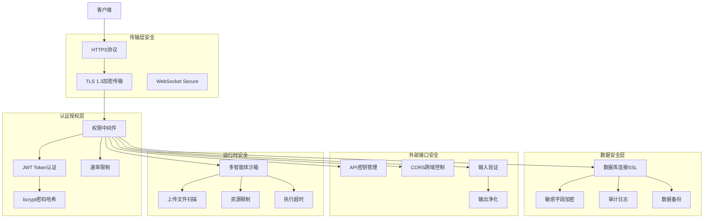
```mermaid
flowchart TB
    subgraph 传输层安全
        TLS[TLS 1.3加密传输]
        HTTPS[HTTPS协议]
        WSS[WebSocket Secure]
    end

    subgraph 认证授权层
        JWT[JWT Token认证]
        BCrypt[bcrypt密码哈希]
        AUTH[权限中间件]
        RATE[速率限制]
    end

    subgraph 数据安全层
        DB_ENC[数据库连接SSL]
        SENSITIVE[敏感字段加密]
        AUDIT[审计日志]
        BACKUP[数据备份]
    end

    subgraph 外部接口安全
        API_KEY[API密钥管理]
        CORS[CORS跨域控制]
        INPUT[输入验证]
        SANITIZE[输出净化]
    end

    subgraph 运行时安全
        SANDBOX[多智能体沙箱]
        FILE_SCAN[上传文件扫描]
        RESOURCE[资源限制]
        TIMEOUT[执行超时]
    end

    CLIENT[客户端] --> HTTPS
    HTTPS --> TLS
    TLS --> AUTH
    AUTH --> JWT
    JWT --> BCrypt
    AUTH --> RATE
    
    AUTH --> API_KEY
    AUTH --> CORS
    AUTH --> INPUT
    INPUT --> SANITIZE
    
    AUTH --> DB_ENC
    DB_ENC --> SENSITIVE
    DB_ENC --> AUDIT
    DB_ENC --> BACKUP
    
    AUTH --> SANDBOX
    SANDBOX --> FILE_SCAN
    SANDBOX --> RESOURCE
    SANDBOX --> TIMEOUT
```

### 8.5 数据流图

```mermaid
flowchart LR
    subgraph 输入数据流
        USER[用户输入]
        GIT[Git仓库]
        ZIP[ZIP上传]
        LLM_IN[LLM响应]
    end

    subgraph 处理层
        PARSE[代码解析]
        ANALYZE[多智能体分析]
        STORE[数据存储]
    end

    subgraph 输出数据流
        REPORT[分析报告]
        DASH[仪表盘数据]
        EXPORT[报告导出]
        NEO[Neo4j图谱]
    end

    USER -->|登录/操作| STORE
    GIT -->|克隆| PARSE
    ZIP -->|解压| PARSE
    
    PARSE -->|AST| ANALYZE
    ANALYZE -->|调用| LLM_IN
    LLM_IN -->|结果| ANALYZE
    
    ANALYZE -->|分析发现| STORE
    ANALYZE -->|报告| REPORT
    ANALYZE -->|关系| NEO
    STORE -->|查询| DASH
    REPORT -->|下载| EXPORT
```

***

## 9. 软件界面设计

### 9.1 界面设计概述

本系统采用玻璃态（Glass Morphism）设计风格，具有现代感和科技感。

### 9.2 页面清单

| 页面     | 路径                | 说明             |
| ------ | ----------------- | -------------- |
| 首页     | /                 | 平台介绍、功能展示      |
| 登录页    | /login            | 用户登录           |
| 注册页    | /register         | 用户注册           |
| 仪表盘    | /dashboard        | 数据统计、快捷入口      |
| 项目列表   | /projects         | 项目管理           |
| 新建项目   | /projects/new     | 创建项目           |
| 项目详情   | /projects/:id     | 项目概览、启动分析、源码浏览 |
| 智能体集群  | /dashboard/agents | 智能体状态、运行批次     |
| 分析报告中心 | /reports          | 运行批次、分析统计      |
| 最终报告   | /reports/final    | 分析报告详情         |
| 智能对话   | /chat             | AI助手对话         |

### 9.3 多智能体架构组件图

```mermaid
graph TB
    subgraph 前端组件
        UI1[React组件]
        UI2[状态管理]
        UI3[API客户端]
    end

    subgraph API网关层
        API1[FastAPI路由]
        API2[认证中间件]
        API3[异常处理]
    end

    subgraph 业务逻辑层
        SVC1[项目服务]
        SVC2[任务服务]
        SVC3[多智能体服务]
        SVC4[报告服务]
    end

    subgraph 多智能体系统
        subgraph 编排层
            ORCH[EnhancedOrchestrator]
            ALLOC[智能体分配器]
            COLL[报告收集器]
        end

        subgraph 执行层
            FA1[FileAnalyzerAgent-1]
            FA2[FileAnalyzerAgent-2]
            FA3[FileAnalyzerAgent-N]
        end

        subgraph 核心服务
            MB[MessageBus]
            SS[SharedState]
            CM[CheckpointManager]
            LLM[LLMClient]
        end
    end

    subgraph 数据层
        DB1[PostgreSQL/SQLite]
        DB2[Neo4j]
        DB3[文件系统]
        DB4[Redis缓存]
    end

    UI1 --> UI3
    UI2 --> UI1
    UI3 --> API1

    API1 --> API2
    API2 --> SVC1
    API2 --> SVC2
    API2 --> SVC3
    API2 --> SVC4

    SVC3 --> ORCH
    ORCH --> ALLOC
    ORCH --> COLL
    ORCH --> CM

    ALLOC --> FA1
    ALLOC --> FA2
    ALLOC --> FA3

    FA1 --> MB
    FA2 --> MB
    FA3 --> MB
    FA1 --> SS
    FA2 --> SS
    FA3 --> SS
    FA1 --> LLM
    FA2 --> LLM
    FA3 --> LLM

    ORCH --> DB2
    SVC1 --> DB1
    SVC2 --> DB1
    SVC4 --> DB1
    CM --> DB3
    LLM --> DB4
```

### 9.4 系统部署图

```mermaid
graph TB
    subgraph 客户端层
        WEB[浏览器/Chrome/Firefox]
        MOBILE[移动端/PWA]
    end

    subgraph CDN层
        CDN[Cloudflare/阿里云CDN]
    end

    subgraph 负载均衡层
        LB[Nginx/HAProxy]
    end

    subgraph 应用服务层
        subgraph FrontendCluster
            FE1[Next.js实例-1]
            FE2[Next.js实例-2]
            FE3[Next.js实例-N]
        end

        subgraph BackendCluster
            BE1[FastAPI实例-1]
            BE2[FastAPI实例-2]
            BE3[FastAPI实例-N]
        end

        subgraph MultiAgentCluster
            MA1[MultiAgent-Worker-1]
            MA2[MultiAgent-Worker-2]
            MA3[MultiAgent-Worker-N]
        end
    end

    subgraph 消息队列层
        MQ[RabbitMQ/Kafka]
    end

    subgraph 数据存储层
        subgraph 关系数据库
            PG[(PostgreSQL主)]
            PG_SLAVE[(PostgreSQL从)]
        end

        subgraph 图数据库
            NEO[(Neo4j集群)]
        end

        subgraph 缓存与对象存储
            REDIS[(Redis集群)]
            MINIO[(MinIO对象存储)]
        end

        subgraph 检查点存储
            CHECKPOINT[本地SSD存储]
        end
    end

    subgraph 外部服务
        OPENAI[OpenAI API]
        GITHUB[GitHub API]
    end

    WEB --> CDN
    MOBILE --> CDN
    CDN --> LB
    LB --> FE1
    LB --> FE2
    LB --> FE3
    FE1 --> BE1
    FE2 --> BE2
    FE3 --> BE3
    BE1 --> MQ
    BE2 --> MQ
    BE3 --> MQ
    MQ --> MA1
    MQ --> MA2
    MQ --> MA3
    BE1 --> PG
    BE2 --> PG
    BE3 --> PG
    PG --> PG_SLAVE
    MA1 --> NEO
    MA1 --> REDIS
    MA1 --> OPENAI
    BE1 --> REDIS
    BE1 --> MINIO
    MA1 --> CHECKPOINT
    BE1 --> GITHUB
```

