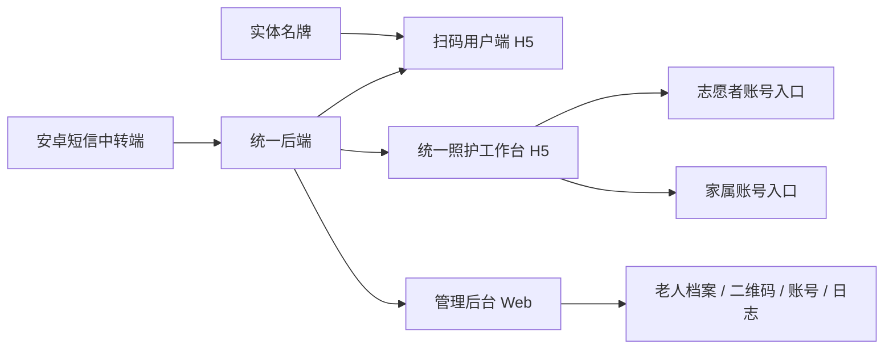

# 智联名牌项目需求说明书-甲方易读版

## 1. 一句话说明

这是一个围绕老年人实体名牌、扫码查看、统一照护工作台、管理后台和短信安全验证构成的服务系统。

## 2. 当前产品结构

项目现在对外可以理解为四部分：
- 实体名牌
- 扫码用户端
- 统一照护工作台
- 管理后台

其中“统一照护工作台”不是两套完全独立系统，而是一个前端工程、两类账号入口：
- 志愿者账号入口
- 家属账号入口

## 3. 为什么这样调整

原本家属端和志愿者端都有自己的老人列表、详情、用药页面。
这会带来两个问题：
- 重复开发
- 后续维护两套同类页面

现在已经改成：
- 共用同一套老人工作台页面骨架
- 只保留账号入口、权限和流程不同

这样更符合真实业务：
- 两类人最终都在管理“老人档案”
- 只是能做的事情不同

## 4. 甲方应如何理解

### 志愿者账号入口

用于社区随访和录入：
- 负责老人列表
- 基本信息
- 健康档案
- 主要用药
- 量表填写

### 家属账号入口

家属不再使用单独前端项目，而是在同一个照护工作台中进入家属权限页面，用于：
- 邀请码注册
- 登录
- 查看绑定老人
- 修改联系人
- 维护用药
- 查看二维码和名牌 PDF

### 共用部分

两边现在已经共用：
- 老人列表
- 老人详情
- 用药维护界面

## 5. 新的系统关系图

## 6. 当前安全方式

系统当前正式采用：

`固定号码短信回传验证 + 安卓短信中转端 + 后端校验`

用于：
- 扫码查看敏感健康档案
- 家属修改敏感联系人或用药信息

## 7. 当前开发口径

如果后续再提文档、汇报、答辩，建议统一使用下面这套说法：
- 不是“志愿者端和家属端两套独立工作台”
- 而是“统一照护工作台中的两类账号入口”

这样口径和源码现状一致，也更容易解释后续维护成本低、界面统一。
